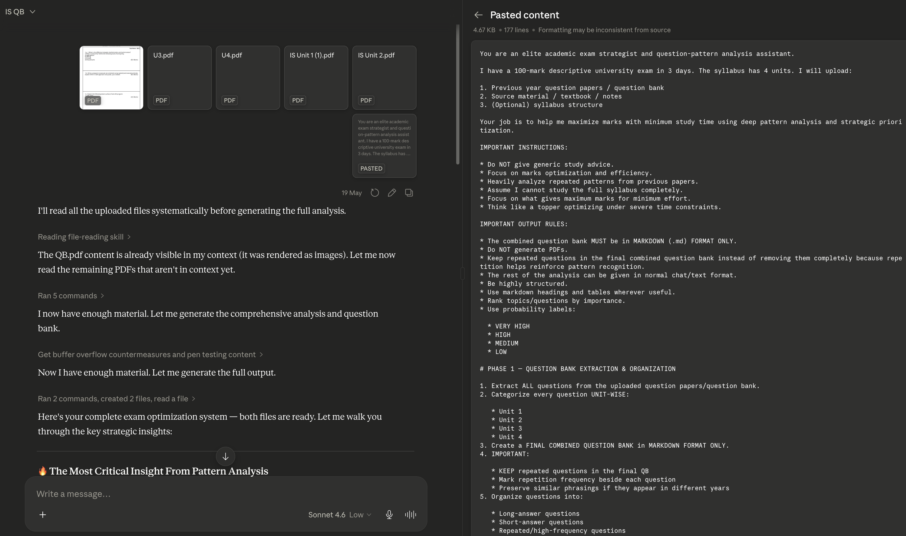

# AI Usage Guidelines

**Issue Number:** #11
**Milestone:** 0
**Date Completed:**2/6/26

---

## Goal
Understand how to responsibly and effectively use AI tools while maintaining data privacy and critical thinking.

---

## Relections

### When Should AI Be Used?
AI should be used as a tool for:
* Initial research
* Planing your tasks and prioritize them
* Automating repeated work
* Degugging and documentation 
* Unit testing 
### When Should I Rely on My Own Skills?
* Technical decisions 
* Reviewing code
* Evaluating security implications
* Validating info
### Avoiding Over-Reliance on AI
* Try to solve the problem on your own before asking AI 
* Use AI as a guide to learn
* Understand the generated code and verify it with testing
* Verify important info through additional sources
### Protecting Data Privacy
* Don't share user/confidential company info with AI
* Passwords, API keys, authentication tokens should never be shared
* Remove sensitive info before sharing

---

## Screenshot

Used AI to analyze previous-year university question papers and create a study strategy focused on maximizing marks

## What I Learned
I found that AI has tremendous potential to enhance productivity, but it can't replace human judgment and critical thinking. The best strategy is to use AI as a research, learning, and a drafting tool while also keeping a critical eye on what it produces.The best way to use AI is to view it as an assistant to help you conduct research, learn new things, and draft content, but also to be vigilant about what it generates and to verify the accuracy, privacy, and final decisions.

---
