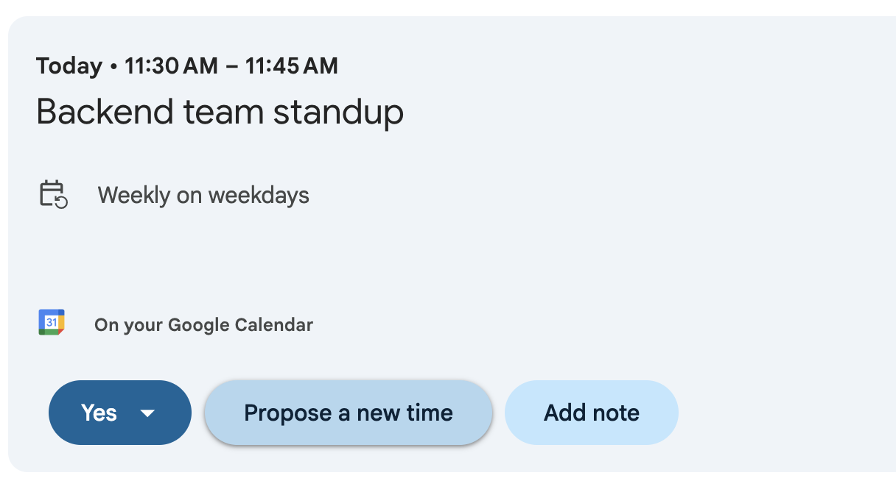

# Issue Title

**Issue Number:** #9
**Milestone:** 0
**Date Completed:**4/6/26

## Relections

### How do Agile ceremonies help with communication and alignment?

* Allows team members to share progress , blockers and clarify priorities
* This reducues misunderstandings
* Keeps everyone informed about its progress
* Ensures that the team is aligned on common goals

### Which ceremony do you think is most important for your role, and why?

* Daily standups are imp for my role
* It provides a quick way to communicate mine and the team's progress and identify the blockers early
* Stand ups help me stay aligned with the team 
* It also helps me to focus on the right priorities

---

## Stand-up Meeting Observation

* Participated in Backend team stand-up and noted that they shared updates on what they accomplished, what they are doing, and what is blocking them.
* Bug fixes, pull request reviews, and development in the near future were discussed. Team members kept each other updated on the status and indicated where there was still work to be done.
* The stand-up helped me to be able to understand how agile teams stay aligned, communicate progress and bring up blockers early.

## Retrospective Observation

* I have not done a Focus Bear retrospective, but I have experience in retrospectives that I have attended in a college software engineering project where we had followed Agile practices and I was the Scrum Master of the project.
* In retrospectives, the team talked about the successful aspects, challenges, and how we can make our next sprint smoother. 
* An important lesson learned was that it is important to identify road blocks at an early stage and discuss them with the rest of the team. This facilitated better working together and resolution of issues more effectively.
* Scrum Master role taught me about retrospectives as a tool to make continuous improvement and how it helps for open discussion, reflection, and future improvement.

## One Change I Can Make to Improve Team Collaboration

I will seek clarification early if I am not sure of requirements or how they will be implemented. Instead of taking undue time to deal with the uncertainties alone, I can contact teammates early. This will avoid miscommunication, delays and keep my work on track within the team's expectations.

## What I Learned

I discovered that Agile ceremonies do not only take place as meetings, but as structured opportunities for communication, planning and continuous improvement. In remote and distributed teams, regular updates, transparency and reflection ensure that everyone is on the same page.

---
