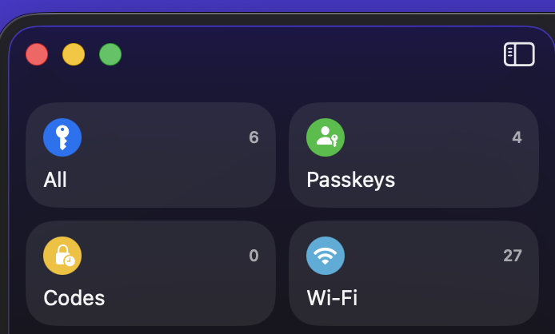
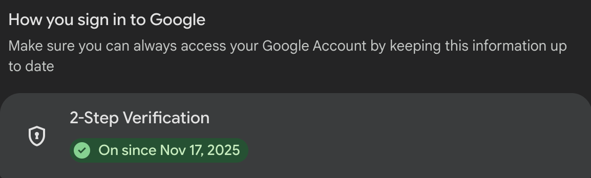
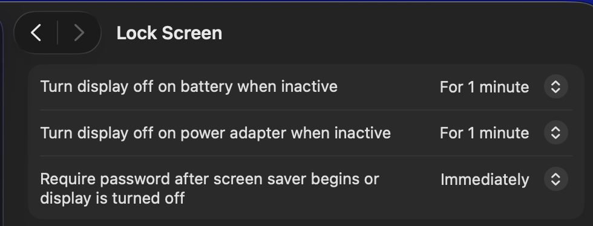

# Cybersecurity Guidelines

**Issue Number:** #10
**Milestone:** 0
**Date Completed:**2/6/26

---

## Goal

Understand how to keep company and user data secure by following cyber security best practices.

---

## Reflections

### What security measures do you currently follow, and where can you improve?

* I use strong unique passwords for imp accounts
* I enabled MFA wherever available and use Microsoft Authenticator
* I updated my devices with latest security patches
* Have regularly backed up imp data on my laptop to reduce risk of data loss
* Cautious when opening links or documents received by verifying the sender

#### Improvement

* Incorporating password manager for all accounts
* Reviewing security setting regularly rather than only creating a new account

### How can you make secure behaviour a habit rather than an afterthought?

* By incorporating security practices into my daily workflow
* So locking devices when I step away
* Verifying links before clicking them
* Regularly updating software
* Regularly backing up your device

### What steps will you take to ensure your passwords and accounts are secure?

* Using strong, unique passwords for every account
* Use a trusted password manager to store them
* Enable MFA whenever available
* Avoid reusing passwords
* Regularly review account security settings and login activity

### What would you do if you suspected a security breach or suspicious activity on your account?

* I would immediately change my password
* Revoke any active sessions 
* Enable MFA and verify it
* Review recent account activity to find any unauthorised access
* Document the incident
* Notify the appropriate security contact
* Follow company procedures for reporting security incidents

### New Cyber Security Habit

* Verify links and sender information before opening attachments or clicking links in emails and messages.
* This reduceS the risk of phishing attacks and credential theft.

---

## Screenshot

## What I Learned

I learned that cyber security is not just for the security professionals. Simple and everyday measures like robust passwords, two-factor authentication, device locking, and awareness of phishing attacks are crucial to safeguarding company and user data. Following all of these practices on a regular basis can greatly decrease security issues.

---
