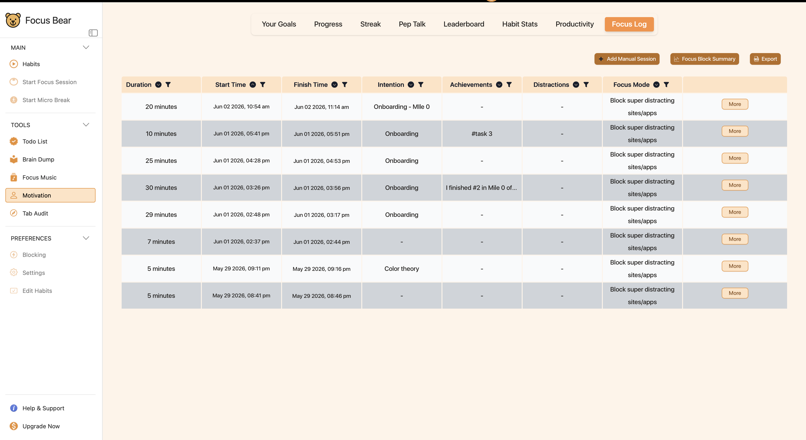

# Inclusive Design

**Issue Number:** #13
**Milestone:** 0
**Date Completed:**1/6/26

---

## Goal

Understand how to interact respectfully and responsibly when working with or designing for vulnerable populations, including neurodivergent individuals.

---

## Reflections

### How Can I Adjust My Communication Style?

Being more inclusive by:
1. Being clear, direct and respectful
2. Avoiding vague instructions and providing context when assigning tasks
3. Ensuring that expectations are communicated clearly
4. Being patient while discussing complex topics
5. Understanding that everyone has a different way to process info

### Common UX and Communication Pitfalls
1. Confusing navigation 
2. Creating workflows that require excessive memory or attention.
3. Heavy usage of notifications may be overwhelming for the user 
4. Using vague instructions 
5. Overloading users with too much info

### One Practical Change I Can Make
1. Breaking the tasks into smaller cleared steps
2. Self-explanatory interface
3. Bring up focus log in a different tab rather than it being hidden under motivation
* This would lead to reduction in cognitive load and makes it easier to comprehend info.
* It would also increase motivation since it gives a sense of progress

---

## Tasks

### First-Person Account

As a person having ADHD, I have used quite a few productivity tools that help with focus, time and tasks completed. In my experience, I've seen that there are a few recurring issues:
* There are too many features, settings or notifications in many productivity apps making them overwhelming. 
    * I tend to ignore notifications once it's been a while.
* Most of the productivity tools appear to be aimed at the user in his prime. 
    * If I'm feeling low-energy or struggling, it can be difficult to follow complex systems.
* When I felt overwhelmed, I would like to be given a gentle prompt to do something rather than to do it all, to do it for just 5 minutes.
* At times I am so involved in something that I forget to take breaks, and when I come back later, I am mentally drained.
* I like intuitive workflows a lot because it means that I can start up tasks without spending a lot of time figuring out how it works.
* I find it helpful to get supportive reminders rather than many or intrusive reminders.
* Things that save me from making too many decisions are beneficial because I like to work on many different things at once.
* Sometimes, I get discouraged and stop using the system because of failing to complete a few tasks or falling behind.

### Design Improvement

* One possible enhancement to make Focus Bear easier to use would be to make features more discoverable and navigable.

* There may be some features that will require time to find. For instance, it is under Motivation and I had to dig for a while to find the Focus Log.
* Navigation should be intuitive, and all key features should be easily accessible, this will decrease cognitive overload and enhance the user experience.
* There is a lot of unused space in some screens that may be used better.
* Having a uniform visual design, layout, and theme throughout the app can help create a more cohesive and predictable user experience.

### Supportive Response

Don't feel compelled to complete the task all at once. Let's take the smallest possible next step and concentrate on that one. The first step can be the most difficult and even just a few minutes of improvement is a victory.

## Screenshot

## What I Learned
I learned that accessibility is not only about making things accessible for disabled people, but making things accessible for more people. There are many subtle details in the design and communication that can make a major difference in the feeling of supported, comfortable and successful users. Clear communication, minimization of cognitive load, and an appreciation of diverse thinking and working styles can contribute to a more inclusive experience for users and teammates alike.

---
