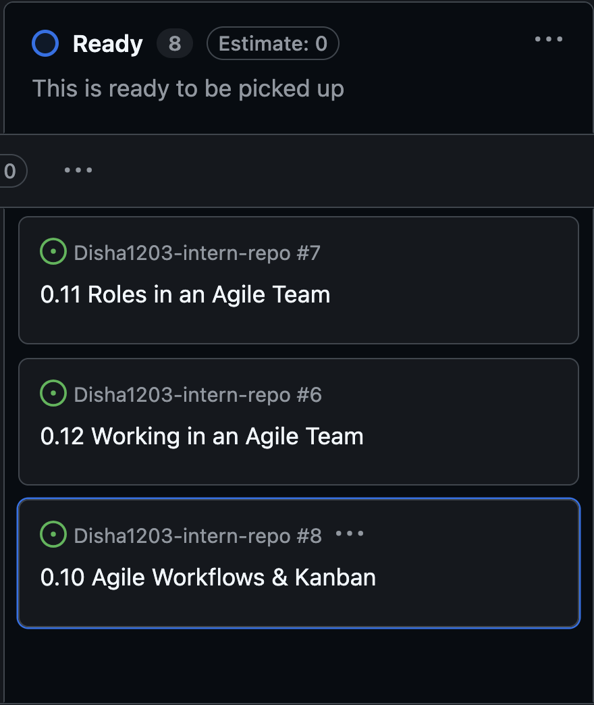
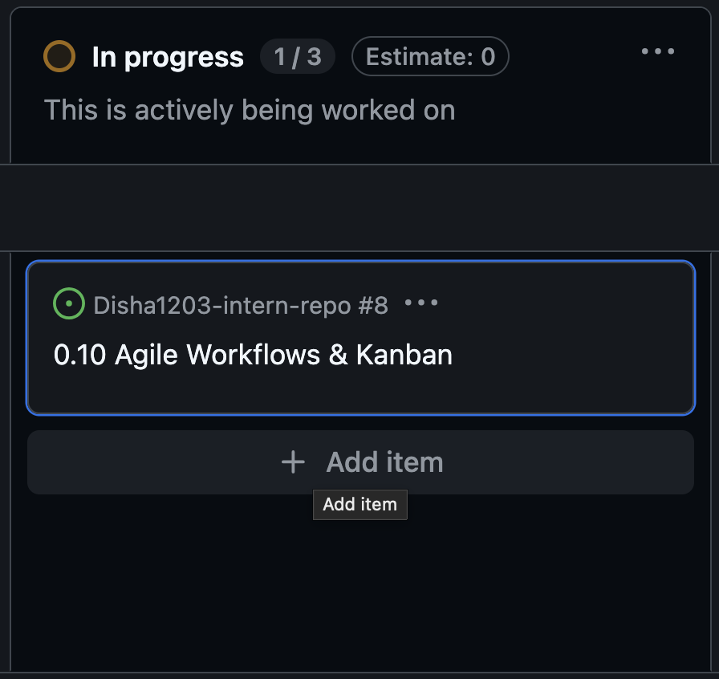
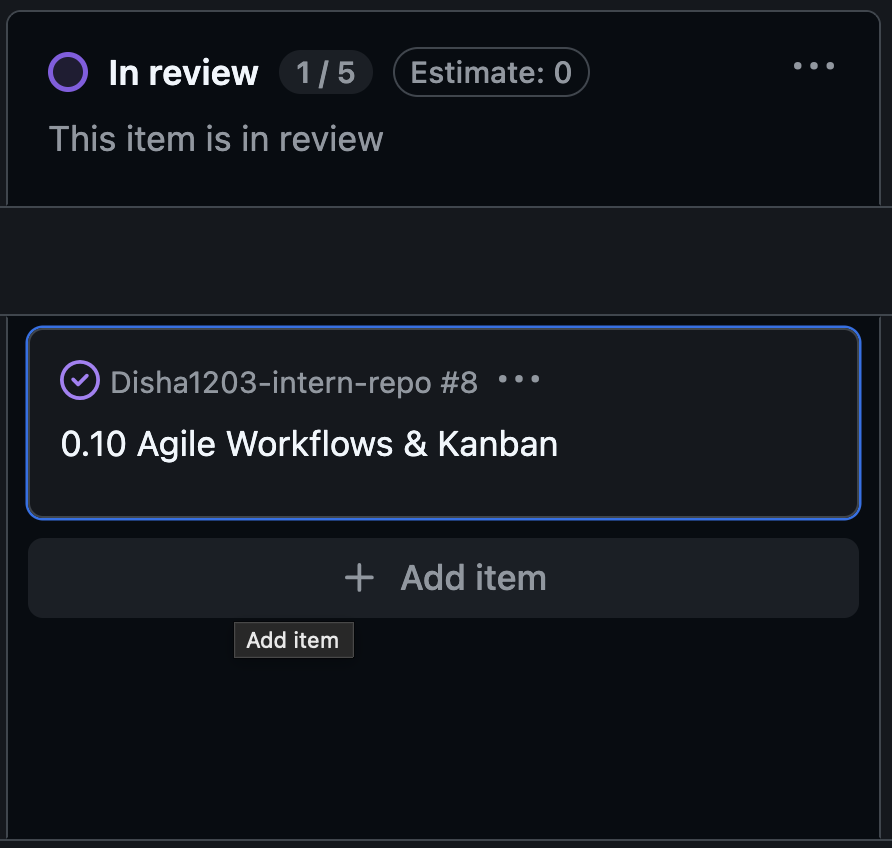
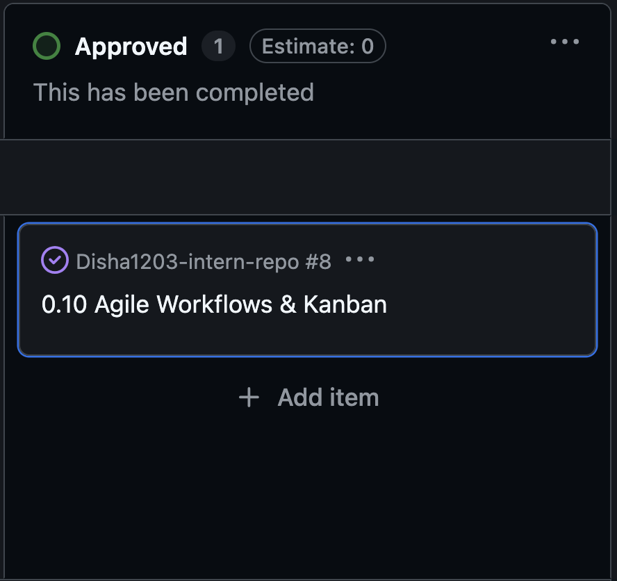

# Kanban Workflow

**Issue Number:** #8
**Milestone:** 0
**Date Completed:**4/6/26

---

## Reflections

### How does Kanban help manage priorities and avoid overload?

* Provides clear view of the task and their current status
* Limits work in progress so the team can focus on completing current tasks before starting new ones
* Thus prevents overload and improves prioritization

### How can you improve your workflow using Kanban principles?

* Limiting the number of tasks to work on makes sure that I'm not overwhelmed
* Uploading task statues regularly 
* Prioritizing high-impact tasks before starting lower-priority work.
---

## Screenshot

Moving through the issues using Kanban board

## Moving a Task Through the Workflow

* Move Issue #8 (Agile Workflows & Kanban) to Kanban.
* Before I started work on the task, it was in the Ready column.
* After I started studying Kanban principles and started the reflection document, I changed the status to In Progress.
* I moved the task to In Review after creating the markdown file, adding screenshots and creating the pull request.
* Then I changed the status to Approved after doing the review process.
* This workflow assistance helped me to clearly track my progress and to see at a glance what the tasks are doing.

## Personal Experience
This is the personal experience with using the Kanban board.
I had a better overview of what was done, what was in progress and what was yet to be done as a result of using the Kanban board. Helped me a lot as I can see my progress at a single glance without flipping through multiple issues.
One thing I found was forgetting to keep task statuses up-to-date. In the beginning I would finish working and leave the card in the same column. The more time I spent on the board, the more it became a part of my workflow to update my statuses.

## One Improvement for Task Tracking

An improvement I can make is to break down the larger onboarding tasks into smaller subtasks. For instance, rather than the entire "Working with Vulnerable Populations" issue being a task, I could have subtasks such as "Research", "Reflection Writing", "Screenshots" and "Pull Request Creation". Easier to monitor progress and identify early issues.

---
