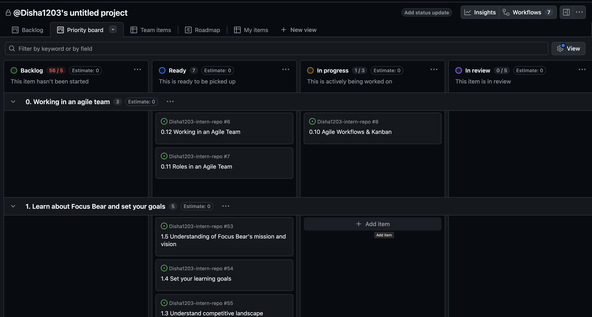

# Issue Title

**Issue Number:** #8
**Milestone:** 0
**Date Completed:**4/6/26

---

## Relections

### How does Kanban help manage priorities and avoid overload?

* Provides clear view of the task and their current status
* Limits work in progress so the team can focus on completing current tasks before startign new ones
* Thus prevents overload and improves prioritization

### How can you improve your workflow using Kanban principles?

* Limiting the number of tasks to work on makes sure that I'm not overwhlemed
* Uploading task statues regularly 
* Prioritizing high-impact tasks before starting lower-priority work.
---

## Screenshot

## What I Learned

---
