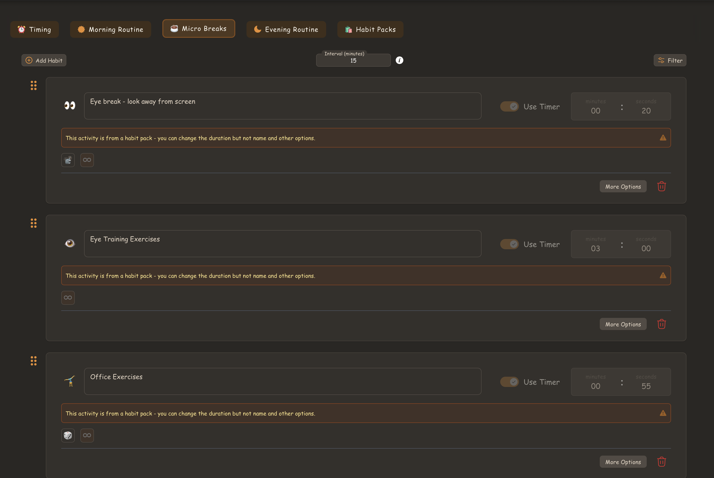

# Occupational Health & Safety (OHS) for Desk-Based Work

**Issue Number:** #16 **Milestone:** 0 **Date Completed:** 27/05/26

---

# Goal

Understand how to set up a safe and ergonomic workspace, especially when using a laptop, and develop habits to prevent strain and discomfort.

---

# Reflections

## Equipment Changes made

1. Kept my laptop arm's length away from me
2. Adjusted the display height to my eye level
3. Used an external keyboard to ease wrist usage
4. Used a footrest to keep my knees aligned comfortably with my hips
5. Adjusted arm rests

## Behavioural Changes

1. Sitting upright more consistently
2. Avoiding slouching
3. Taking short standing/stretch breaks
4. Checking posture periodically throughout the day

# Reminders for this

To help maintain better posture and movement habits, I used breaks during the pomodoro sessions throughout the workday to:

- Stand up regularly
- Stretch
- Reposition posture
- Rest my eyes briefly These reminders helped improve awareness and reduced long periods of sitting without movement.

---

# What I Learned

I learned that small ergonomic adjustments and regular movement breaks can significantly improve comfort during long work sessions. Maintaining posture awareness and taking short breaks helped reduce strain and improve focus.
