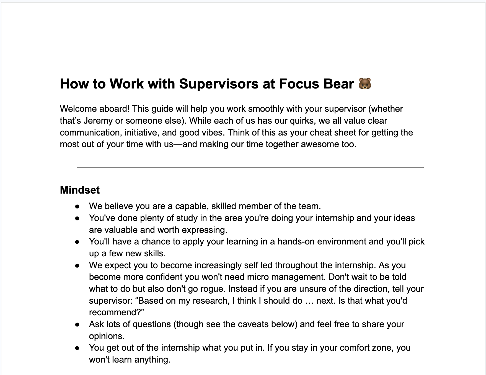

# Professionalism

**Issue Number:** #14
**Milestone:** 0
**Date Completed:**1/6/26

---

## Goal

Understand professional expectations at Focus Bear and how to communicate effectively while maintaining a positive and inclusive work environment.

---

## Reflections

### Have You Ever Experienced Great Teamwork and Professionalism?

I have experienced  great teamwork and professionalism.
What made it effective was that:
* Everyone was accountable for their responsibilities
* We worked towards solving together rather than assigning the blame
* We shared progress regularly 
* Helped each other whenever the other members had any doubts or issues that they couldn't solve

### Steps taken to Ensure My Communication Is Clear, Respectful, and Inclusive

1. Using clear and professional language in msgs and meetings
2. Asking questions rather than making assumptions
3. Responding to msgs in a timely manner
4. Being respectful of different background, experiences and perspectives

### How to Help Create a Positive, Fun, and Professional Work Environment

1. Treating everyone with kindness and respect
2. Being approachable and willing to help
3. By encouraging collaboration and celebrating team achievements

### How to Prepare Effectively for Meetings

1. Review project brief and research on Focus Bear 
2. Prepare updates on completed work, current progress and blockers
3. Create list of questions and discussion points

### What Being Proactive Looks Like During My Internship

1. Give regular updates 
2. If stuck search online ask your teammate or reach out to your supervisor if still blocked

### Following Up and Escalating Communication

If I need information or action from a colleague or supervisor, I would first send a polite message through the appropriate communication channel.

* Email: General requests (allow up to 48 hours for a response).
* Discord/Teams: Medium-priority matters for a quicker response.
* SMS: Urgent matters requiring attention within a few hours.
* Phone Call: Emergencies or critical situations.

If I do not receive a response within a reasonable timeframe, I would send a polite follow-up. For urgent matters, I would escalate to a higher-priority communication channel as recommended in the Focus Bear supervisor guide.

### Things I Won't Do

1. Waiting for instructions : if unsure i'll explore or ask a teammate
2. Coming to meeting unprepared : I'll read the brief and bring up questions or blockers
3. Not taking notes
4. Ignoring feedback or action items
5. Relying only on one form of communication: I'll escalate if it's urgent
6. Sending calendar invites with vague subject
---

## Screenshot

## What I Learned

I learned that working professionally isn't about being formal at all times and about being respectful, reliable, accountable and collaborative. Trust within a team and a positive working environment is fostered through communication, preparation and proactive behaviour. In addition, I have come to understand the need to communicate effectively at the appropriate level; take responsibility for my own contributions; manage feedback and criticism in a constructive way to develop myself and my team.

---
