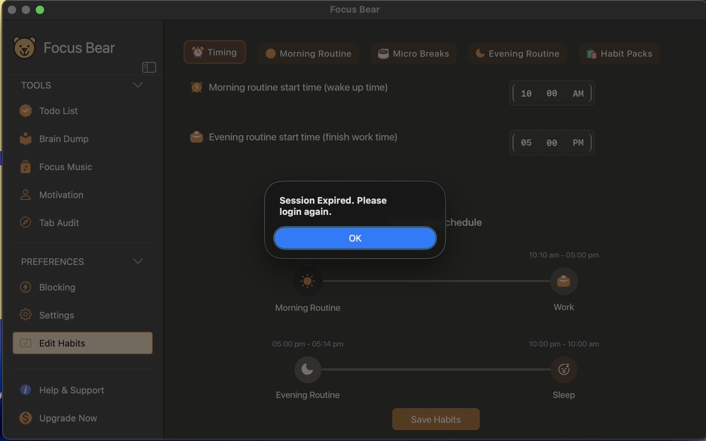
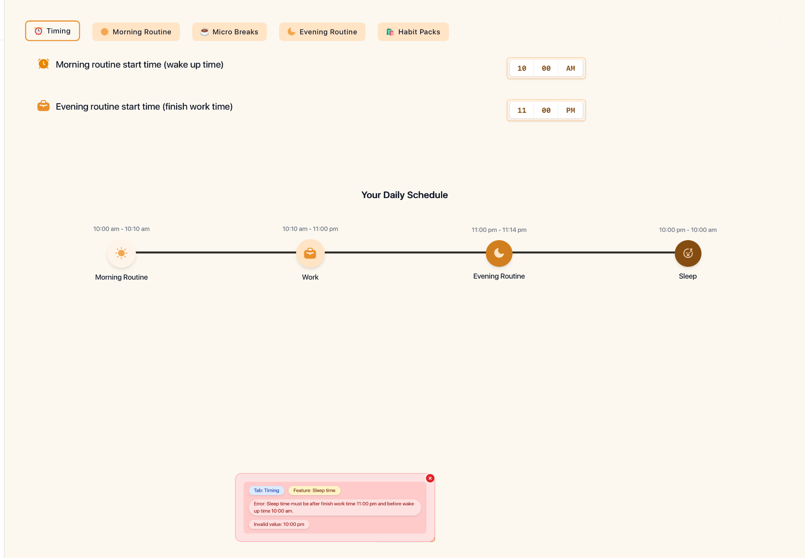

# Focus Bear First-Time User Experience Report

## Platform

* macOS Desktop
* Android Mobile

## Overview

I approached Focus Bear as a brand-new user and explored the onboarding process, routines, blocking features, planner, and mobile experience. Below are the main areas that felt confusing, frustrating, or unclear during my first-time use.

---

## Observation 1: Difficult to Find the "Save Later" Feature

### What was confusing?

While exploring tasks and planning-related features, I repeatedly looked for the "Save Later" functionality but could not determine where it was located.

### Why this matters

As a new user, I expected an important productivity feature to be discoverable through navigation or search.

### Screenshot

### Suggested Improvement

* Add a global search bar.
* Mention the feature during onboarding.
* Add a tooltip or onboarding hint.

---

## Observation 2: Routine Updates Failed With Errors

### What happened?

When attempting to modify routines, I encountered errors such as session expiration messages and 400 errors, this happened in mac and android respectively
* The apps closes automatically in mac when this is error is encountered
* The issue repeated even after i logged in again using google accounts on mac

### Screenshot

### Suggested Improvement

Provide clearer error messages and recovery instructions.

---

## Observation 3: Mobile Experience Appears Inconsistent

### What happened?

Some features available on desktop were difficult to find or unavailable on Android.

Examples:

* Break habits not visible.
* Routine updates failed.
* Certain features appeared different between platforms.
* Eisenhower matrix view is missing

### Why this matters

Users expect a consistent experience across devices.

### Screenshot

### Suggested Improvement

Provide clearer platform-specific guidance and improve feature consistency.

---

## Observation 4: Blocking Setup Feels Complicated

### What happened?

Configuring blocked applications and websites required several steps and was not immediately intuitive.

### Why this matters

Blocking distractions is one of Focus Bear's key features. New users should be able to configure it quickly.

### Screenshot

### Suggested Improvement

* Simplify the setup process.
* Provide recommended block presets.
* Autocomplete for popular websites

---

## Observation 5: Habit Marketplace Discovery

### What happened?

I was unable to easily locate or browse additional habit packs through the marketplace.

### Why this matters

A new user may not realize additional content exists.

### Screenshot

## Observation 6 : Incompleted Eisenhower matrix

### What happened?

I can view the Eisenhower tower in the tasks but i'm unable to move the tasks to the appropriate section

### Why this matters

Defeats the purpose of this features if all the tasks are on the urgent - important section 

### Screenshot

### Suggested Improvement

* Either the app decides according to the score allocated to the task or allow the user to determine that by moving the tasks the appropriate section

---

# Onboarding Improvement Ideas

## Idea 1: Global Search

Add a search bar that allows users to search for:

* Features
* Settings
* Routines
* Planner Functions

This would significantly improve discoverability and reduce confusion.
* Though a search bar for the settings exist, it would be much more useful to add features to it as well

### Idea 2: Improve Error Visibility and Guidance

When I entered an invalid schedule configuration, an error message appeared in a floating box at the bottom of the screen. As a first-time user, it was not immediately obvious which setting needed to be changed or where I should go to fix the issue.

Create a more guided error handling system that:

* Highlights the field causing the error directly.
* Explains the issue in simple, user-friendly language.
* Suggests the exact action needed to fix the problem.
* Places error messages closer to the affected setting instead of displaying them in a separate floating panel.
* Provides a "Take me to the problem" option for complex configuration issues.

This would reduce confusion for new users and make troubleshooting much more intuitive. Instead of feeling like they need to investigate the problem themselves, users would be guided directly to the setting that requires attention.

---

