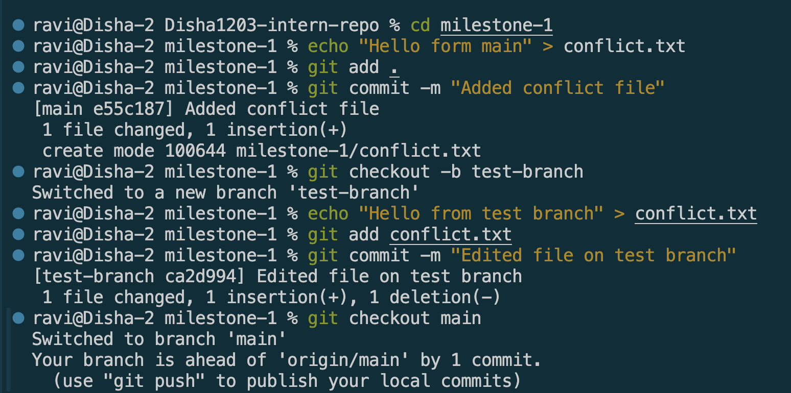
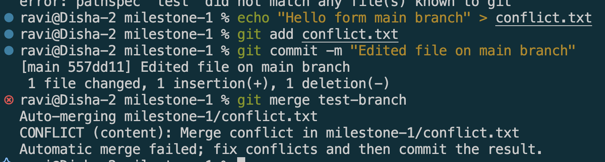
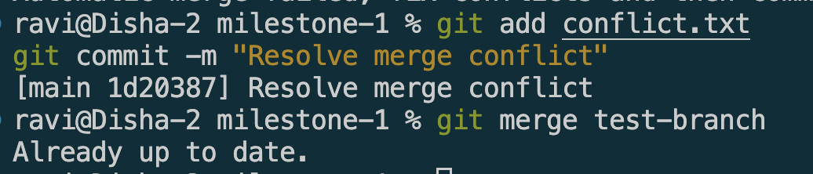
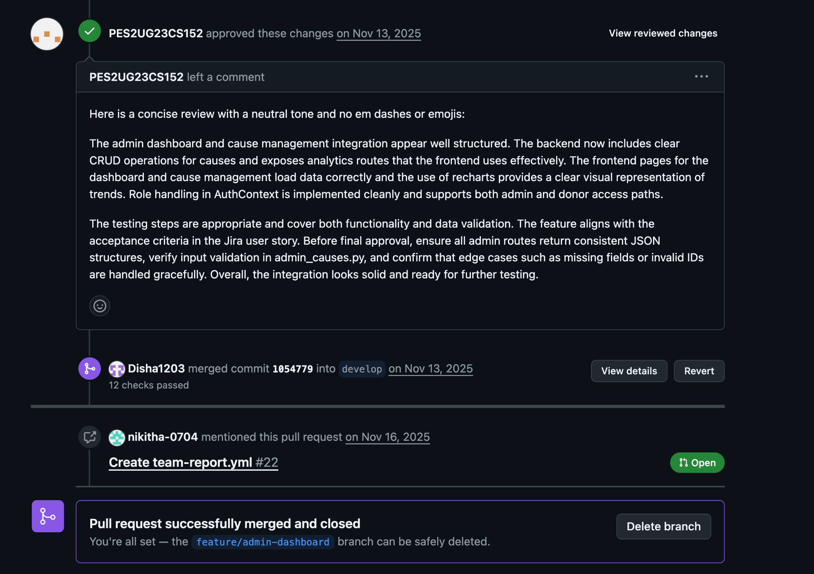
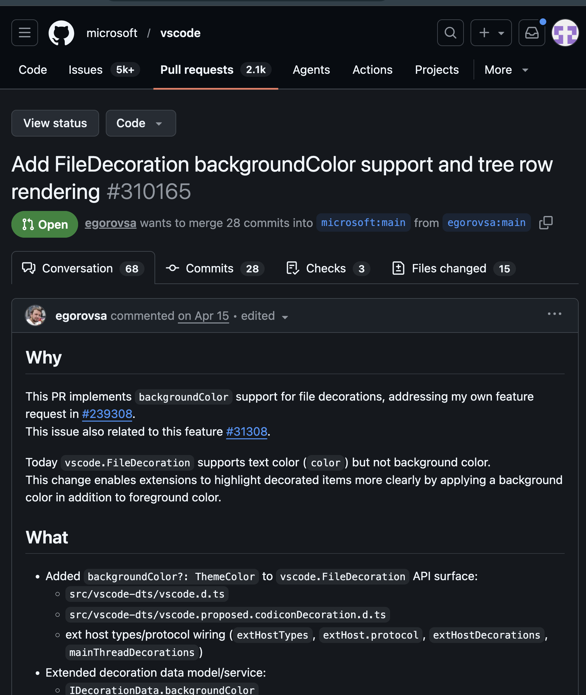

# Git Understanding 

# Merge Conflicts

## Goal

Understand what merge conflicts are, why they happen, and how to resolve them.

---

## Reflections

### What caused the conflict?

This merge conflict was caused by the same line in the same file being changed in two different branches. Git was unable to determine which version should be kept when attempting to merge the branches.

For this exercise, I made a branch and edited a file. Then, I went back to the main branch and edited the same line in the same file. I tried to merge the branch into main and Git found conflicting changes and asked me for help.

### How did you resolve it?

I used the merge tools available in VS Code to review both versions of the conflicting code. After comparing the changes, I selected the appropriate resolution and removed the conflict markers.

After the conflict, I did a staged file and made a new commit to complete the merge.

### What did you learn?

This exercise helped me understand how conflicts can be created and how Git resolves conflicts.
Key lessons learned:
* Conflicts occur when two or more branches edit the same section of a file.
* In certain cases, Git is unable to automatically decide which changes should be retained.
* The use of conflict markers allows for pinpointing exactly where the conflicting changes occurred.
* Conflict resolution is easier in editors like VS Code, where you can merge tools.
* Frequent commits, smaller PRs and regularly pulling changes from the main branch can minimize the risk of merge conflicts.

Merge conflicts are typically part of collaborative software development and version control processes, so it is crucial to understand them.

## Screenshots

---

# PR Reviews

## Goal

Learn how to create, review, and collaborate on Pull Requests (PRs) in GitHub.

## Relections

### Why are PRs important in a team workflow?

PRs provide a structured way for devs to review code before it is merged into the main branch. They are used to find bugs, enhance code quality, promote knowledge sharing, and keep the project to a standard. PRs also serve as a history of conversations and decisions about coding changes.

### What makes a well-structured PR?

A good structured Pull Request contains:
* A clear descriptive title.
* A summary of changes made.
* The purpose of the changes.
* Any related issues/tickets.
* Testing information.
* Small and focused changes rather than large unrelated modifications.

These features help reviewers to better understand and consider the proposed changes.

### What did you learn from reviewing an open-source PR?

While reviewing an open-source PR, I observed that maintainers carefully examine code quality, readability, and edge cases before approving changes. Reviewers often suggest improvements, ask questions, and request modifications when necessary. I also learned that constructive discussions and automated tests play an important role in ensuring reliable software development.

## Screenshots 

### PR Request and approval 

### PR from open src
