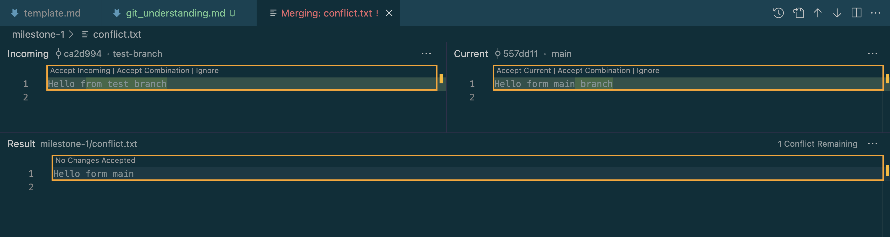
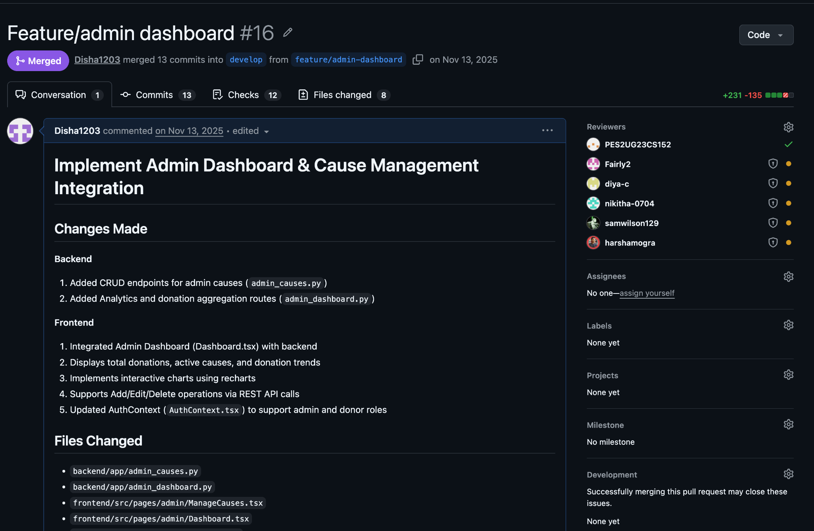
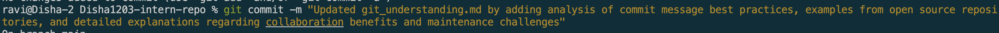
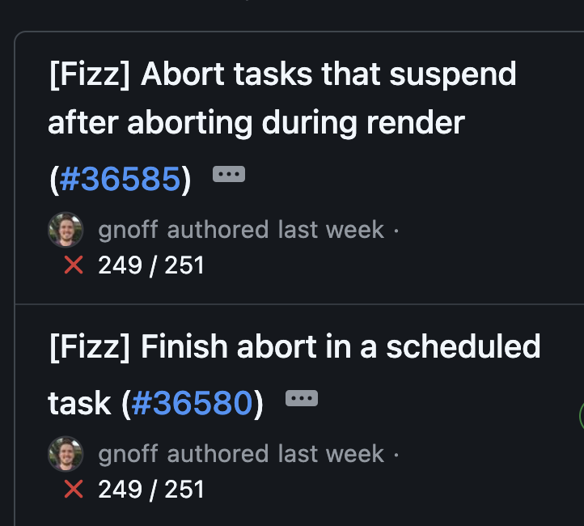
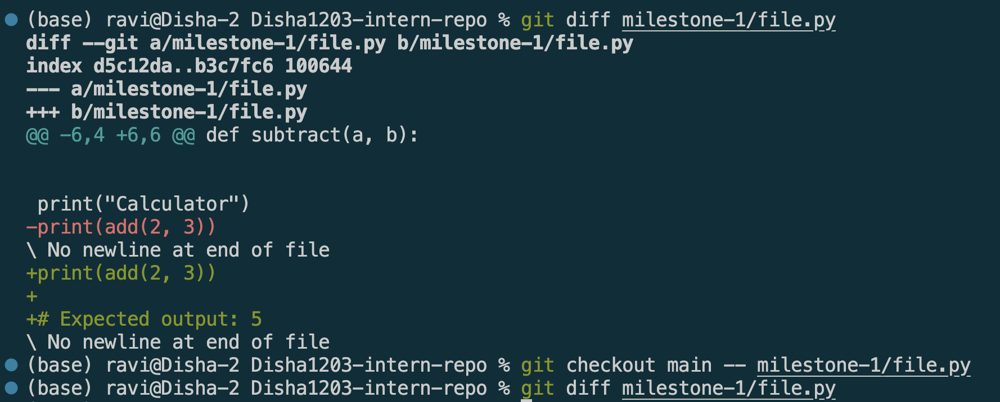
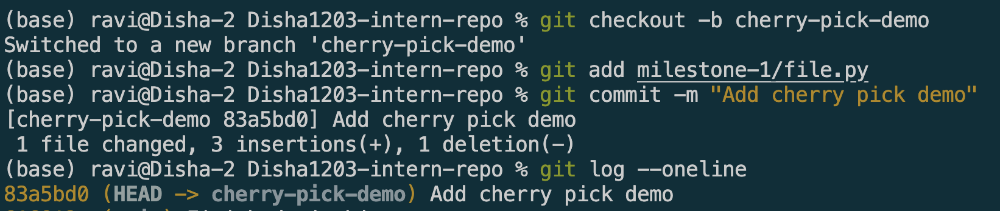
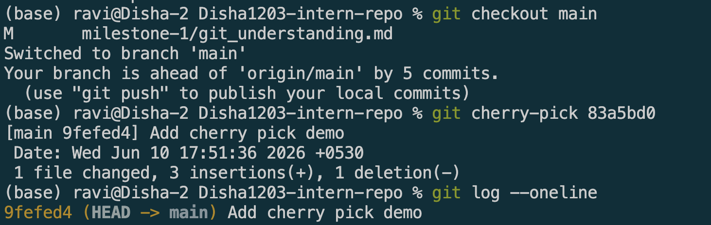
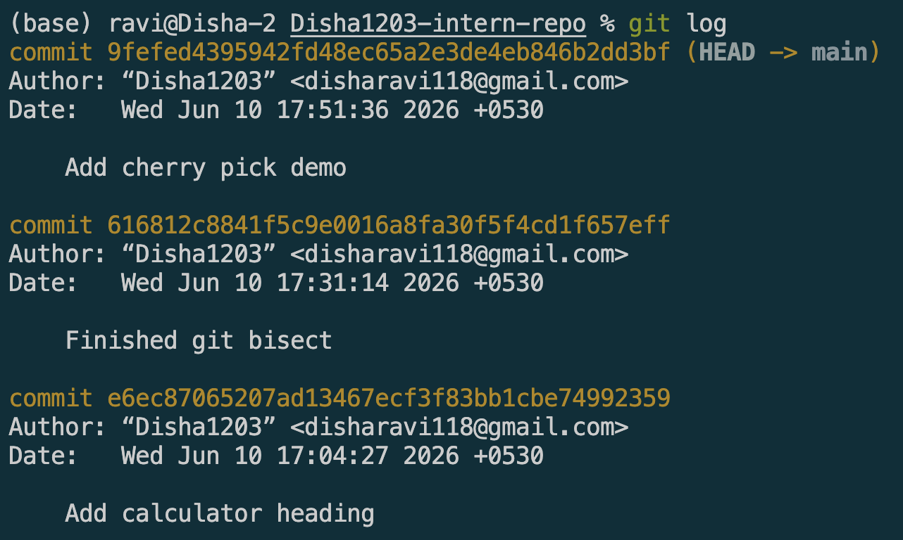
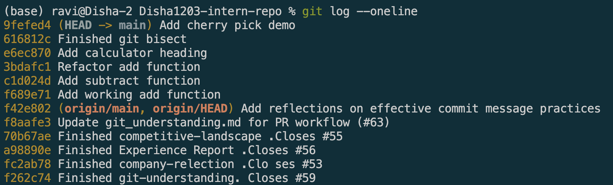
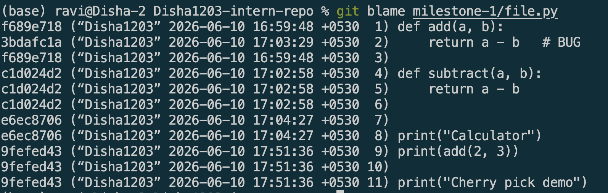

# Git Understanding 

# Merge Conflicts

## Goal

Understand what merge conflicts are, why they happen, and how to resolve them.

---

## Reflections

### What caused the conflict?

This merge conflict was caused by the same line in the same file being changed in two different branches. Git was unable to determine which version should be kept when attempting to merge the branches.

For this exercise, I made a branch and edited a file. Then, I went back to the main branch and edited the same line in the same file. I tried to merge the branch into main and Git found conflicting changes and asked me for help.

### How did you resolve it?

I used the merge tools available in VS Code to review both versions of the conflicting code. After comparing the changes, I selected the appropriate resolution and removed the conflict markers.

After the conflict, I did a staged file and made a new commit to complete the merge.

### What did you learn?

This exercise helped me understand how conflicts can be created and how Git resolves conflicts.
Key lessons learned:
* Conflicts occur when two or more branches edit the same section of a file.
* In certain cases, Git is unable to automatically decide which changes should be retained.
* The use of conflict markers allows for pinpointing exactly where the conflicting changes occurred.
* Conflict resolution is easier in editors like VS Code, where you can merge tools.
* Frequent commits, smaller PRs and regularly pulling changes from the main branch can minimize the risk of merge conflicts.

Merge conflicts are typically part of collaborative software development and version control processes, so it is crucial to understand them.

## Screenshots

---

# PR Reviews

## Goal

Learn how to create, review, and collaborate on Pull Requests (PRs) in GitHub.

## Relections

### Why are PRs important in a team workflow?

PRs provide a structured way for devs to review code before it is merged into the main branch. They are used to find bugs, enhance code quality, promote knowledge sharing, and keep the project to a standard. PRs also serve as a history of conversations and decisions about coding changes.

### What makes a well-structured PR?

A good structured Pull Request contains:
* A clear descriptive title.
* A summary of changes made.
* The purpose of the changes.
* Any related issues/tickets.
* Testing information.
* Small and focused changes rather than large unrelated modifications.

These features help reviewers to better understand and consider the proposed changes.

### What did you learn from reviewing an open-source PR?

While reviewing an open-source PR, I observed that maintainers carefully examine code quality, readability, and edge cases before approving changes. Reviewers often suggest improvements, ask questions, and request modifications when necessary. I also learned that constructive discussions and automated tests play an important role in ensuring reliable software development.

## Screenshots 

### PR Request and approval 

### PR from open src

---

# Writing Meaningful Commit Messages

## Goal 

Learn how to write clear, meaningful commit messages that improve collaboration and code history readability.

## Reflections

### What makes a good commit message?

A good commit message explains purpose of change. It should be detailed enough to allow the members of the team to understand what changes were made, but without having to read the code at that moment.

Characteristics include:
* Specific and descriptive
* Concise
* Action-oriented
* Consistent formatting

### How does a clear commit message help in team collaboration?

Clear commit messages improve communication among team members by making project history easier to understand. They help reviewers quickly identify changes, simplify debugging, and make it easier to track when and why modifications were introduced.

Benefits include:
* Faster code reviews
* Easier troubleshooting
* Better project documentation
* Revised guide to onboarding new contributors.

### What are the potential problems with poor commit messages?

The purpose of past changes is hard to understand with bad commit messages. Vague messages give little context and can be time consuming when debugging or looking back at project history.

### How can poor commit messages cause issues later?

The purpose of past changes is hard to understand with bad commit messages. Vague messages give little context and can be time consuming when debugging or looking back at project history.

Problems caused by poor commit messages:
* Harder debugging
* Confusing project history
* Slower code reviews
* Increased maintenance effort
* Reduced team productivity

## Commits in your repo with different commit message styles

### A vague commit message

### An overly detailed commit message.

### A well-structured commit message.

## Explore commit histories in an open-source GitHub project

---

# Debugging with git bisect

## Goal

Learn how to use git bisect to identify which commit introduced a bug in a project.

## Reflections

### What does git bisect do?

It's a debugging tool that uses binary search to find the commit that introducted a bug
* By marking known good and bad commit, git checks commits in the middle of the range and narrows down the serach until the problematic commit is found

### When would you use it in a real-world debugging situation?

Useful when a bug is seen after many commits have been made and it's unclear on which caused the problem.
Used when:
* debugging application crashes
* failing tests
* performance regressions
* unexpected behaviour occured during development

### How does it compare to manually reviewing commits?

Manually reviewing commits is time consuming especially when there's large commit histories.
* Since git bisect uses binary search , it reduces the no. of commits that needed to be tested
* Thus making debugging much faster and efficient

## Test Scenario

I created a small test project with multiple commits:
1. Added a working add function.
2. Added a subtract function.
3. Introduced a bug by changing the add function to perform subtraction.
4. Added an unrelated output message.
After noticing the incorrect output, I used git bisect to identify which commit introduced the bug. Git successfully located the commit containing the faulty implementation.

## Screenshots

---

# Advanced Git Commands

## Goal

Understand and experiment with advanced Git commands using your preferred Git desktop client.

## Reflections

### What does each command do?

#### git checkout main --<file>
This command returns a particular file from the main branch, without changing other files or changes in the repository. It can be helpful when a file has been modified incorrectly and is needed to be reverted back to a known good version.

* Real-World Usage: In collaborative projects, developers often experiment with changes. If a particular file becomes problematic, it can be restored without discarding other work in progress.

### git cherry-pick <commit>
This command applies a specific commit from another branch onto the current branch without merging the entire branch

* Real-World Usage: useful when only one bug fix or feature from another branch is needed. Instead of merging unrelated work, developers can selectively apply the required commit.

#### git log
This command displays commit history, including commit messages, authors, and 
timestamps.

* Real-World Usage: helps developers understand how a project evolved over time, locate important changes, investigate bugs, and review previous work.

#### git blame <file>
This command shows who last modified each line of a file and identifies the commit responsible for that change.

* Real-World Usage: Git blame is commonly used during debugging to determine when a problematic line was introduced and who made the change. It provides valuable context when investigating issues.

### What surprised you while testing these commands?

As I went through these commands, I was amazed at the accuracy that Git can be. The checkout command can restore a single file without undoing other changes, cherry-pick can move individual commits between branches and git blame can tell you which exact commit added/removed a specific line of code. These are helpful tools in large projects to facilitate debugging and collaboration.

## Screenshots

### git checkout main --<file>

### git cherry-pick <commit>

### git log

### git blame
