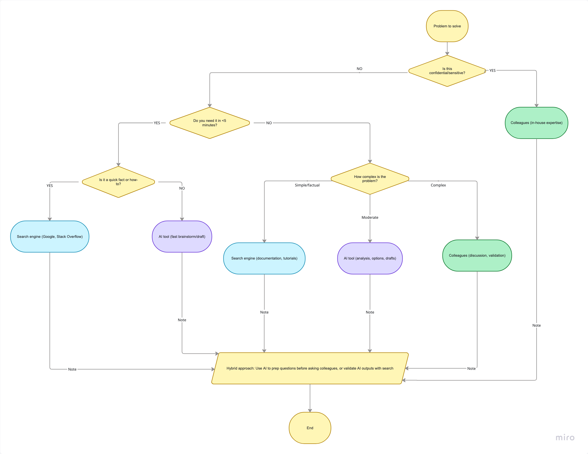

# 

## Goal

## Reflections

### When do you prefer using AI vs searching Google?

* I prefer AI when learning new concepts, understanding unfamiliar technologies, brainstorming solutions, and reviewing code.
* I prefer Google and official documentation when I need authoritative information, version-specific behavior, or exact framework syntax.

### How do you decide when to ask a colleague instead?

* I first attempt to understand the problem independently.
* I gather logs, error messages, and document what I have already tried.
* If the issue is company-specific, high-risk, or I remain blocked after a reasonable investigation, I ask a colleague for guidance.

### What challenges do developers face when troubleshooting alone?

* Tunnel vision and incorrect assumptions.
* Spending excessive time investigating the wrong area.
* Lack of knowledge about internal systems.
* Difficulty identifying root causes without external perspectives.
* Risk of introducing fixes that solve symptoms rather than underlying problems.

## Flowchart 

