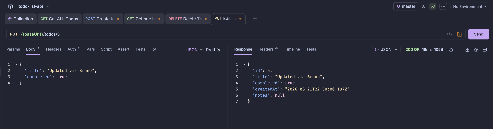

# API Debugging with Bruno
 

## Goal

Bruno is an open-source API client used to test NestJS endpoints. It provides a lightweight alternative to Postman for making REST and GraphQL requests, saving and organizing API collections efficiently.

## Reflections

### How does Bruno help with API testing compared to Postman or cURL?

* Bruno provides a graphical interface for creating, organizing, and executing API requests.
* Unlike cURL, Bruno does not require remembering command-line syntax for every request.
* Bruno stores collections as plain text files that can be committed to version control.
* It is lightweight and open-source compared to some commercial API testing tools.
* Bruno makes it easy to inspect request headers, payloads, status codes, and responses.
* It simplifies debugging and testing of REST and GraphQL APIs during development.

### What are the advantages of organizing API requests in collections?

* Collections group related API requests in a structured manner.
* Developers can quickly find and reuse frequently used requests.
* Teams can share collections for consistent API testing.
* Collections improve documentation and onboarding for new developers.
* Environment variables can be reused across multiple requests.
* Organizing requests reduces duplication and improves maintainability.

### What are the advantages of organizing API requests in collections?

* Collections group related API requests in a structured manner.
* Developers can quickly find and reuse frequently used requests.
* Teams can share collections for consistent API testing.
* Collections improve documentation and onboarding for new developers.
* Environment variables can be reused across multiple requests.
* Organizing requests reduces duplication and improves maintainability.

### How would you structure a Bruno collection for a NestJS backend project?

* Create separate folders for each major feature or module.
* Group authentication-related requests into an Auth folder.
* Organize API endpoints by resource (e.g., Users, Tasks, Analytics).
* Include environment variables for base URLs and authentication tokens.
* Separate public and protected endpoints when appropriate.
* Maintain clear naming conventions for requests to improve navigation and collaboration.

## Screenshots

