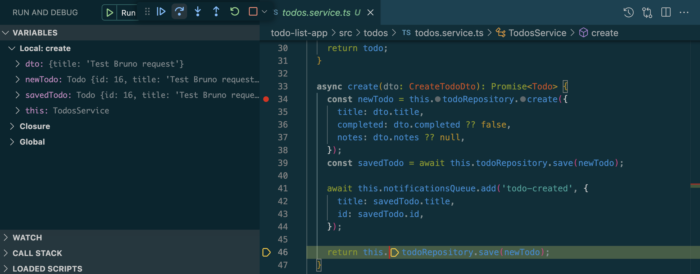
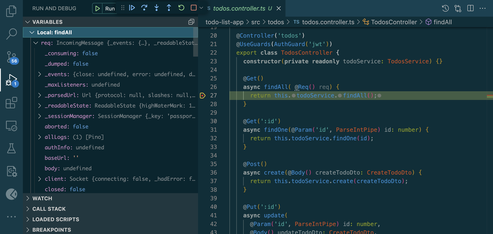

# Debugging with VS Code & Breakpoints

## Goal

Learn how to use VS Code’s debugger to step through NestJS code and inspect application state.

## Reflections

### How do breakpoints help in debugging compared to console logs?

* Breakpoints pause program execution at specific lines of code, allowing developers to inspect application state in real time.
* Variables, function arguments, and object properties can be examined without modifying code.
* Developers can step through execution line by line to understand program flow.
* Breakpoints eliminate the need to repeatedly add and remove temporary console logs.
* Conditional breakpoints can pause execution only when specific conditions are met.
* They provide a more interactive and efficient debugging experience than console logging alone

### What is the purpose of launch.json, and how does it configure debugging?

* launch.json defines how VS Code starts or attaches a debugger to an application.
* It specifies the runtime environment, entry point, and debugging options.
* The file can configure Node.js debugging for NestJS applications.
* Developers can define multiple debugging configurations for different scenarios.
* Environment variables and command-line arguments can be included in the configuration.
* It ensures a consistent debugging setup across development sessions.

### How can you inspect request parameters and responses while debugging?

* Place breakpoints inside controller methods or service functions.
* Send a request to the API using Bruno, Postman, or a browser.
* When execution pauses, inspect method parameters in the Variables panel.
* Examine request objects, DTOs, headers, and authenticated user information.
* Step through the code to observe how data changes during execution.
* Inspect returned values before the response is sent to the client.

### How can you debug background jobs that don’t run in a typical request-response cycle?

* Place breakpoints inside the background job or scheduled task handler.
* Start the application using the VS Code debugger.
* Trigger the job manually or wait for the scheduled execution.
* Use breakpoints to inspect job payloads and intermediate state.
* Monitor asynchronous operations and error handling within the job.
* Logging and debugger attachment can help diagnose issues in long-running processes.

## Screenshot

