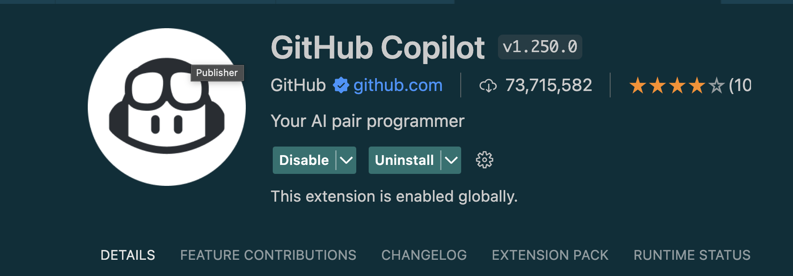
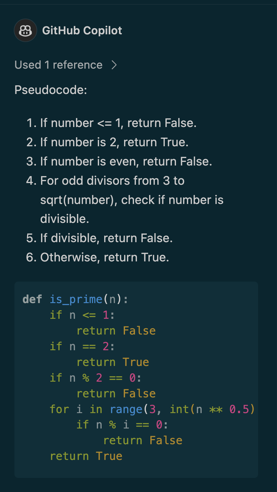
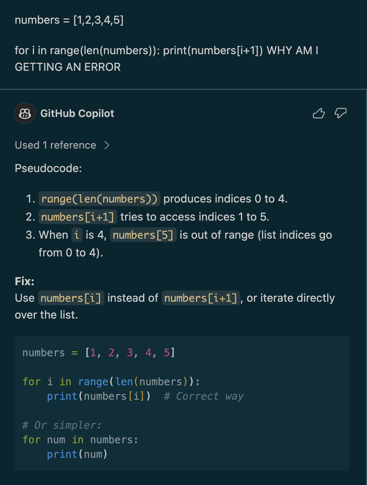
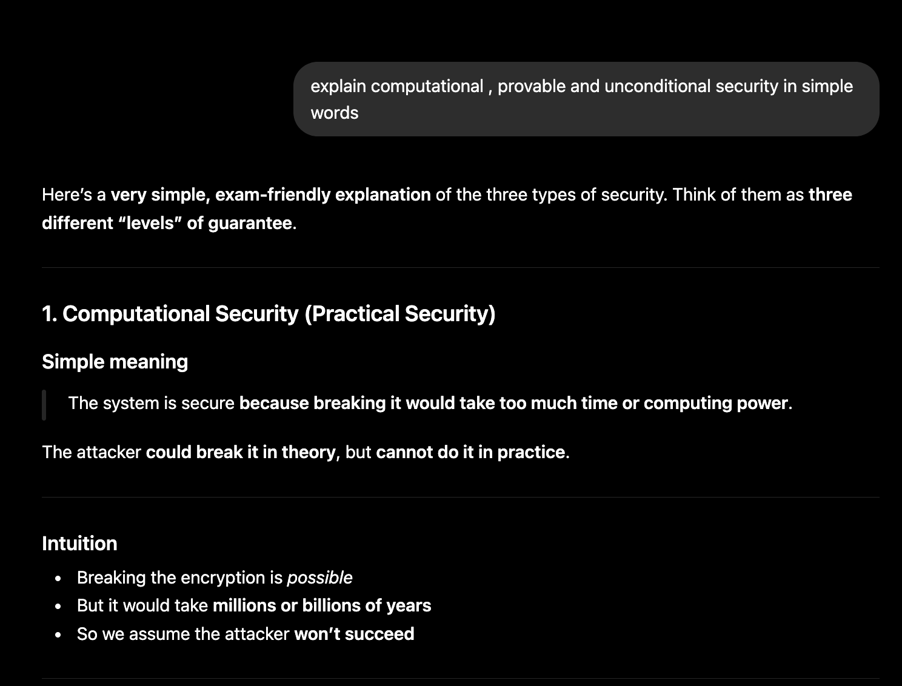

# Issue Title

**Issue Number:** #52
**Milestone:** 2
**Date Completed:**5/6/26

---

## Goal
Enhance your coding workflow by exploring AI-powered tools that assist with development.

---

## Tasks

### Research and install an AI coding assistant

### Experiment with using AI for development

### Analysis of Generated Code

The code snippets generated by GitHub Copilot were mostly accurate and functional. They helped reduce development time for simple tasks. However, I still needed to review the generated code for efficiency, correctness, and security before using it.

--- 

## Reflections

### Which AI tools did you try?

I tried Copilot, claude and chatgpt
* Copilot was used to generated code snippets and help with debugging
* ChatGPT was used to explain concepts 
* Claude helped me review larger codebases and assisted with project development.

### What worked well?

* Generating code snippets quickly, which saves time when creating simple functions
* I used Copilot for coding and it provided useful coding suggestions.
* AI was used to identify and correct programming errors by providing explanations for errors.
* Explanations and examples helped make complex concepts easier to understand.
* AI helped to learn new programming subjects and improving productivity.

### What didn’t?
* Some suggestions in the code was not optimized and needed manual checking.
* At times, AI misinterprets the specific problem.
* Solutions generated were sometimes without context to overall project.
* It is still necessary to test and verify AI-generated code before using it.
* May overlook security practices

### When do you think AI is most useful for coding?
* Creating boilerplate code and repetitive code structures.
* Debugging common errors.
* Describing algorithms and programming concepts.
* Learning new languages, frameworks and technologies.
* Refactoring and optimisation of existing code.
* Writing documentation/comments.

## What I Learned
AI can serve as a valuable development assistant, but it's important for developers to also know the code, check the output, and make their own decisions.

---
