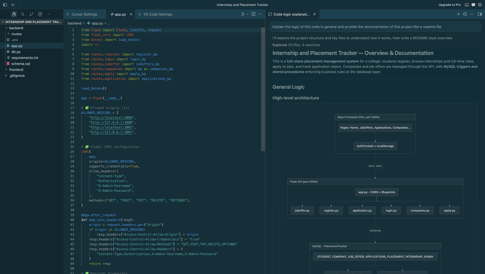
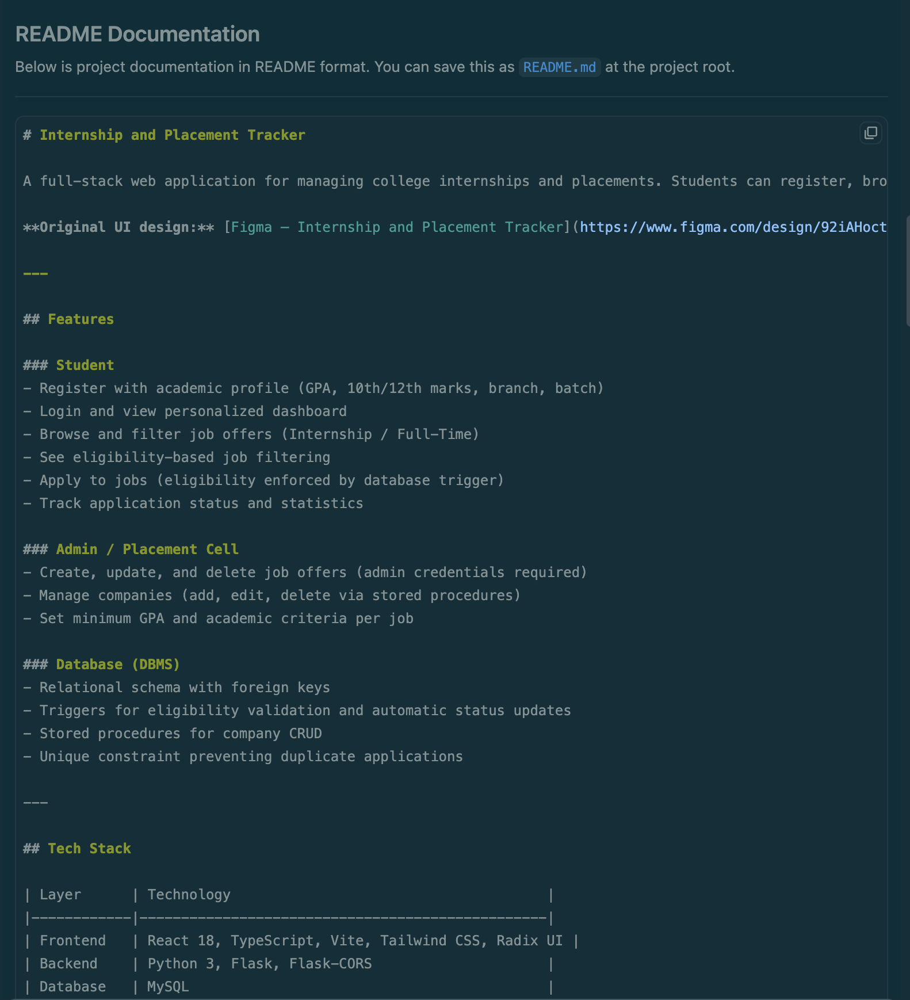

# Learning AI Coding Tools

**Issue Number:** #51
**Milestone:** 2
**Date Completed:**5/6/26

---

## Goal

Learn how to use modern AI-assisted development tools responsibly and effectively in real development workflows.

---

## Reflections

### Which tool you used
I used Cursor AI

### What you used it for

1. In Task 1, the ai explains logic and understand existing code.

* The project that I analysed was Internship and Placement Tracker using Cursor.
* The tool analyzed the structure of a project, the routes on the back-end, the components of the front-end, and the design of the database, and created a general overview of how the system operates.

#### What It Helped With
* Quickly understanding the overall architecture of the application.
* Describe how the various modules are linked to one another.
* Finding out what they do in the back end and what are the database elements.
* Creating project diagrams and explanations with generated diagrams.
* What it had to overcome.
* Several explanations were very high level and needed follow-up questions.

2. Task 2: Writing Documentation

* I have created a README file documentation using Cursor. 
* The project features, overview of architecture, technology stack and database functionality were a part of the documentation generated.

#### What It Helped With

* Producing documentation at a much quicker rate than manually.
* Structuring information into a professional README.
* Clearly summarizing project function.
* Saving time on recording project features and architecture.

### What it struggled with

* Manual corrections were made to improve some parts in terms of accuracy.
* Documentation generated was sometimes short on information specific to a project.
* There was still documentation to be reviewed prior to publication.

---

## Screenshot

---

## What I Learned

AI coding tools are best used to aid in coding, not to replace it. While they can do much to interpret codebases, produce documentation, provide explanations of logic, and boost developer productivity, human review and testing are still crucial.