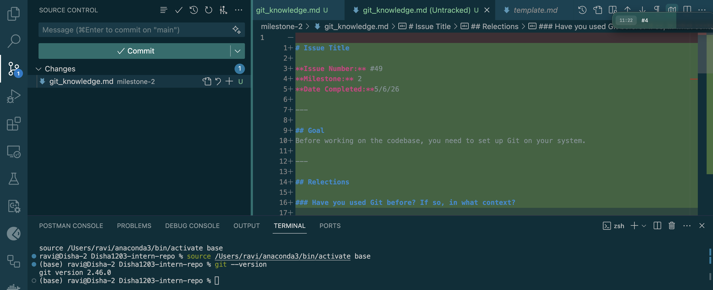

# Git knowledge

**Issue Number:** #49
**Milestone:** 2
**Date Completed:**5/6/26

---

## Goal
Before working on the codebase, you need to set up Git on your system.

---

## Reflections

### Have you used Git before? If so, in what context?

Yes, I have used Git before for personal and collaborative projects .
* I have used it to track changes and manage different versions of my code
* It helped me to collaborate efficiently for projects
* Some of the common Git operations I have used include:
    * Cloning repositories
    * Creating and switching branches
    * Committing changes
    * Pulling and pushing updates
    * Merging branches
    * Resolving merge conflicts 
    * Creating pull requests (PRs)
    * Reviewing pull requests submitted by teammates
    * Approving pull requests before merging changes into the main branch

This experience helped me understand collaborative development practices, code review processes, and maintaining code quality within a team.

Git has become an important part of my development workflow because it helps maintain project history, supports collaboration, and enables structured code reviews through pull requests.

### Which Git client (if any) did you choose? Why?

I use Git in VS Code since it provides a built-in git integration as well as making it convenient to perform common git operations
* The Source Control panel allows me to view changes, stage files, create commits, and manage branches in a simple interface while still having access to the Git command line when needed.
* It helps streamline my workflow and keeps development and version control in the same environment.

### What was the most interesting thing you learned about Git today?
The branch is just a pointer to a commit rather than separate copies of code
* Thus making branch creation nearly instantaneous
* Allows devs to create and switch between branches effieciently
* Helps git remain fast for large repos as well

---

## Screenshot

Source control in VS Code and git version

---
