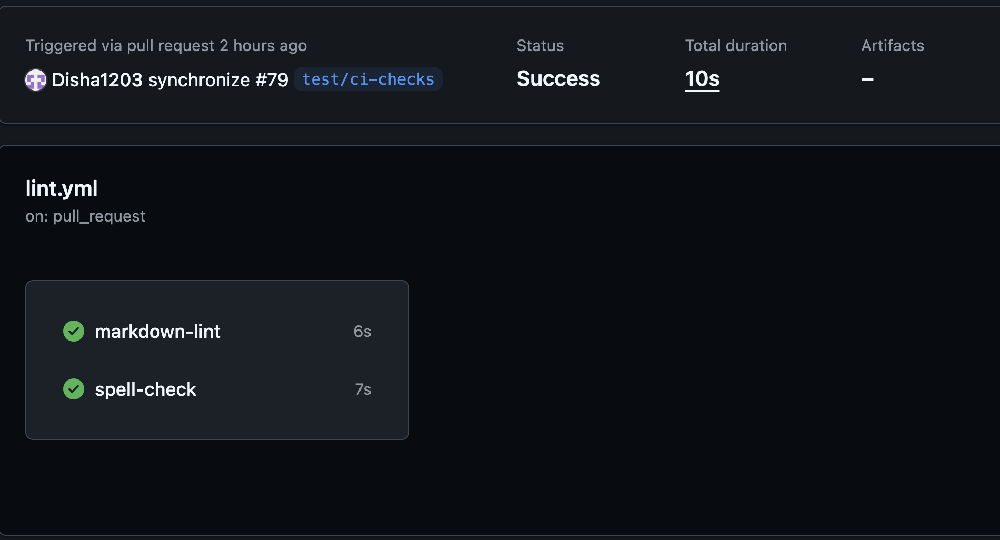

# Static Analysis Checks in CI/CD

## Goal
Understand the purpose of Continuous Integration (CI) and Continuous Deployment (CD) and learn how to enforce Markdown linting and spell checks automatically in a project.

## Reflection

### What is the purpose of CI/CD?

* CI/CD stands for Continuous Integration and Continuous Deployment.
* CI automatically runs checks, tests, and builds every time code is pushed or a PR is opened, catching issues before they reach the main branch.
* CD takes it further by automatically deploying code that passes all checks.
* The purpose is to reduce manual effort, catch bugs early, and ensure the codebase stays stable as multiple people contribute to it.

### How does automating style checks improve project quality?

* Automated style checks ensure every PR is held to the same standard regardless of who wrote it.
* In this project, every PR automatically runs markdownlint and cspell, meaning formatting issues and spelling mistakes are caught before anyone even reviews the code.
* This removes the burden from reviewers, keeps the codebase consistent, and means style enforcement happens without relying on anyone remembering to run the tools manually.

### What are some challenges with enforcing checks in CI/CD?

- **False positives** — the spell checker flagged valid technical words like `eslint`, `pytest`, and `hyberfocus` as errors, requiring a custom whitelist
- **Legacy files** — older files in milestone-0 and milestone-1 had many pre-existing issues that the linter flagged, making it hard to enforce rules retroactively without a large cleanup effort
- **Node modules** — both markdownlint and cspell scanned `node_modules` by default, producing thousands of irrelevant errors until ignore configs were set up
- **Strict rules blocking commits** — Husky blocked a commit due to a markdown error in an old file, which required fixing before any new work could be pushed

### How do CI/CD pipelines differ between small projects and large teams?

* In small projects like this one, a CI pipeline might just run a linter and spell check on PRs, taking a few seconds. 
* In large teams, pipelines can include unit tests, integration tests, security scans, performance benchmarks, code coverage checks, and deployment steps across multiple environments.
* Large teams also use branch protection rules that require CI to pass before merging, have separate staging and production pipelines, and may run checks in parallel across many machines to keep build times manageable.

## Screenshots

This is a delibrately misspelled word.