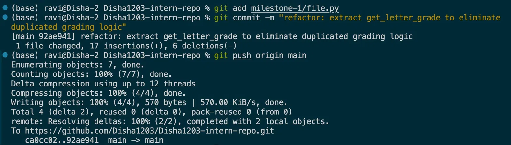
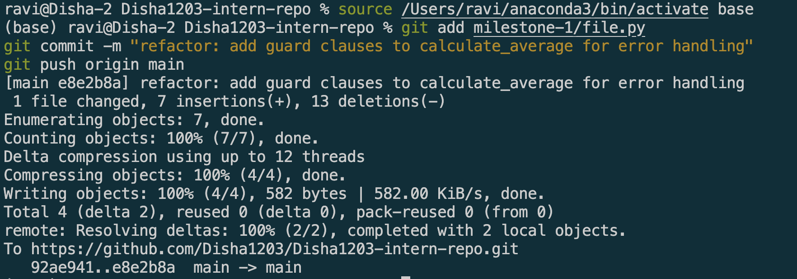
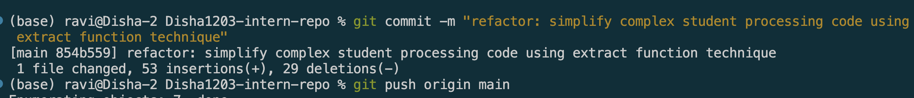
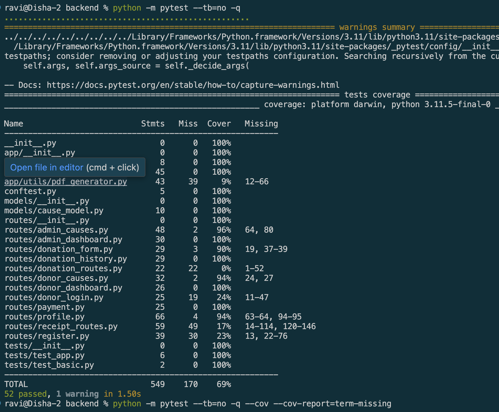

# Clean code principles

## Goal
Understand the core principles of clean code and why they matter in real-world development.

## Principles 

### Simplcity
Keeping code as straightforward as possible
It's easier to 
* understand 
* debug
* modify
- Devs should avoid unnecessary complexity and only implements what's needed to solve the problem

#### Example
Instead of creating multiple nested conditions to check if a user is an adult, use a simple condition:
```python
if age >= 18:
        print("Adult")
```

### Readability
Code written in a way that makes its purpose clear to other devs
Includes
* meaningful variable names
* proper formatting 
* clear logic
It's important since:
* Makes collaboration easier
* Reduces misunderstanding
* Improves code reviews

#### Example
Poor readability:
```python
x = 50000 
y = 0.08 
z = x * y
```
Better readability:
```python
salary = 50000 
tax_rate = 0.08 
tax_amount = salary * tax_rate
```

### Maintainability
Code can be modified, extended, and fixed without introducing new problems. Good structure and organization help future developers work on the code efficiently.
It's importance since:
* Easier to add new features
* Simplifies bug fixes
* Reduces technical debt

#### Example
Instead of repeating the same calculation in multiple places, create a reusable function:
```python
def calculate_discount(price, discount_percentage):
    return price - (price * discount_percentage / 100)
```
If the discount logic changes later, it only needs to be updated in one place

### Consistency
Following the same coding style, naming conventions, and project standards throughout the codebase.
It's importance since:
* Makes code predictable
* Improves teamwork
* Simplifies navigation through large projects

#### Example
Inconsistent naming:
```python
userName = "John" 
user_age = 25 
UserEmail = "john@example.com"
```
Consistent naming:
```python
user_name = "John" 
user_age = 25
user_email = "john@example.com"
```
Using the same naming convention throughout the project makes the code easier to follow.

### Efficiency
Writing code that performs well and uses resources effectively. However, devs should avoid premature optimization and focus on writing clear code first.
It's importance since:
* Better performance
* Improved user experience
* Efficient use of system resources
#### Example
Inefficient approach:
```python
numbers = [1, 2, 3, 4, 5] 
count = 0 
for number in numbers: 
    count += 1
```

Efficient approach:
```python
numbers = [1, 2, 3, 4, 5] 
count = len(numbers)
```
Using built-in functions when appropriate can improve performance and make code easier to understand.

## Example

### Messy code
```python
def f(a):
    x = 0 
    for i in a: 
        if i > 50: 
            x += i 
    print(x)

```
#### Problems with this code
* The function name `f` is not descriptive.
* Variable names such as `a` and `x` do not explain their purpose.
* There are no comments or documentation.
* The function prints the result instead of returning it, making it harder to reuse.
* The intent of the code is not immediately obvious.

### Cleaner Version

```python
def calculate_sum_of_large_numbers(numbers):
    total = 0
    for number in numbers: 
        if number > 50: 
            total += number 
    return total
```

#### Why This Version Is Better
* Uses descriptive function and variable names.
* Clearly communicates its purpose.
* Returns a value instead of printing directly.
* Easier to test and reuse.
* Follows clean code principles of readability and maintainability.

---

# Naming Variables & Functions

## Goal 
Learn how to choose clear and meaningful names for variables and functions.

## Best Practices
* Use descriptive and meaningful names.
* Prefer nouns for variables and classes.
* Prefer verbs for functions and methods.
* Follow the naming conventions of the programming language.
* Avoid single-letter names except for common loop counters such as `i` and `j`.
* Avoid misleading abbreviations.
* Keep names searchable and easy to pronounce.
* Be consistent throughout the project.

## Example

### Poorly Named Code
```python
def f(a): 
    t = 0
    for x in a: 
        if x > 50: 
            t += x 
    return t
```

#### Problems
* The function name `f` provides no indication of its purpose.
* The parameter name `a` does not describe the data being passed.
* The variable `t` does not explain what value is being stored.
* Developers must read the entire function to understand what it does.

### Refactored Version
```python
def calculate_sum_of_large_numbers(numbers):
    total_sum = 0 
    
    for number in numbers: 
        if number > 50: 
            total_sum += number 
            
    return total_sum
```
#### Improvements
* `calculate_sum_of_large_numbers` clearly describes the function's purpose.
* `numbers` indicates that the input is a collection of numbers.
* `total_sum` explains what value is being accumulated.
* The code becomes self-documenting and easier to maintain.

## Reflections

### What makes a good variable or function name?
A good variable or function name is 
* descriptive
* meaningful
* easy to understand. 

-It should clearly communicate the purpose of the variable or the action performed by the function. 
It reduces the need for comments since the code itself is self explanatory

### What issues can arise from poorly named variables?

Poorly named variables can make code:
* difficult to understand
* maintain
* debug. 
- Developers may misunderstand the purpose of a variable, leading to mistakes and bugs. Unclear names also increase the time required to review and modify code.

### How did refactoring improve code readability?
Refactoring improved readability by replacing vague names with descriptive ones. 
* The updated names clearly explain the purpose of the function and variables, allowing developers to understand the code quickly without analyzing every line.
* This makes the code easier to maintain and reduces confusion during future development.

---

#  Writing Small, Focused Functions

## Goal
Learn how to break down large functions into smaller, more maintainable units.

## Best Practices
* Follow the Single Responsibility Principle (SRP).
* Keep functions short and focused.
* Use descriptive function names.
* Avoid deep nesting when possible.
* Break complex logic into helper functions.
* Make functions reusable.
* Keep parameters to a reasonable number.
* Ensure each function has a clear purpose.

## Example

### Original Code
I wrote this function myself while practicing a user authentication flow scenario. It simulates code I've seen in beginner projects.
```python
def handle_user_login(username, password, users_db):
    u = None
    for user in users_db:
        if user['username'] == username:
            u = user
            break
    if u is None:
        print("Error: user not found")
        return False
    h = hashlib.sha256(password.encode()).hexdigest()
    if h != u['password_hash']:
        print("Error: wrong password")
        return False
    if u['is_banned']:
        print("Error: account banned")
        return False
    token = str(uuid.uuid4())
    u['session_token'] = token
    u['last_login'] = datetime.now().isoformat()
    print("Login successful. Token:", token)
    return token

```

#### Problem
 This single function finds a user, validates a password, checks account status, creates a session, and updates login metadata .Five distinct responsibilities crammed together.

### Refactored Code
```python
def find_user_by_username(username, users_db):
    for user in users_db:
        if user['username'] == username:
            return user
    return None

def is_password_valid(password, stored_hash):
    return hashlib.sha256(password.encode()).hexdigest() == stored_hash

def create_session(user):
    user['session_token'] = str(uuid.uuid4())
    user['last_login'] = datetime.now().isoformat()
    return user['session_token']

def handle_user_login(username, password, users_db):
    user = find_user_by_username(username, users_db)
    if user is None:
        print("Error: user not found")
        return False
    if not is_password_valid(password, user['password_hash']):
        print("Error: wrong password")
        return False
    if user['is_banned']:
        print("Error: account banned")
        return False
    token = create_session(user)
    print("Login successful. Token:", token)
    return token
```

## Reflections

### Why is breaking down functions beneficial?

* Breaking down functions improves readability, maintainability, and reusability.
* Small functions are easier to understand because each one focuses on a single task. 
* They are also easier to test and debug since problems can be isolated to specific parts of the code.
### How did refactoring improve the structure of the code?

* Refactoring separated the different responsibilities into dedicated functions.
* Instead of one large function handling calculations, grading, and performance evaluation, each task now has its own function. 
* This makes the code more organized, easier to modify, and simpler for other developers to understand.

# Avoiding Code Duplication

## Goal

Understand how to identify and eliminate unnecessary duplication in code.

## DRY Principle
The principle states that every piece of knowledge or logic should exist in only one place within a codebase.

Duplicated code increases maintenance effort because changes must be made in multiple locations. This can lead to inconsistencies and bugs if one copy is updated while others are forgotten.

## Example

### Origin code 
```python
scores = {
    'math': 95,
    'science': 73,
    'english': 61
}

math_score = scores['math']
if math_score >= 90:
    math_grade = "A"
elif math_score >= 70:
    math_grade = "B"
else:
    math_grade = "F"
print(f"Math: {math_grade}")

science_score = scores['science']
if science_score >= 90:
    science_grade = "A"
elif science_score >= 70:
    science_grade = "B"
else:
    science_grade = "F"
print(f"Science: {science_grade}")

english_score = scores['english']
if english_score >= 90:
    english_grade = "A"
elif english_score >= 70:
    english_grade = "B"
else:
    english_grade = "F"
print(f"English: {english_grade}")
```


### Refactored version
```python
scores = {
    'math': 95,
    'science': 73,
    'english': 61
}

def get_letter_grade(score):
    if score >= 90:
        return "A"
    elif score >= 70:
        return "B"
    else:
        return "F"

def print_subject_grades(scores):
    for subject, score in scores.items():
        grade = get_letter_grade(score)
        print(f"{subject.capitalize()}: {grade}")

print_subject_grades(scores)

```

## Refactored code in repo


## Reflections

### What were the issues with duplicated code?
* Duplicated code increases the amount of code that must be maintained. 
* When business requirements change, developers may need to update multiple locations, which increases the risk of introducing bugs. 
* It also makes the codebase harder to understand because the same logic appears repeatedly.

### How did refactoring improve maintainability?
* Refactoring removed the repeated logic and placed it into a single reusable function. 
* This reduced the amount of code, improved readability, and ensured that future changes only need to be made in one location. 
* The code became easier to maintain and less prone to inconsistencies.


# Commenting & Documentation

## Goal
Learn when and how to write helpful comments and documentation.

## Best Practices

* Write clear and concise comments.
* Explain the reasoning behind complex logic.
* Keep comments up to date when code changes.
* Use documentation strings (docstrings) for functions and classes.
* Avoid obvious comments that repeat the code.
* Prefer meaningful variable and function names over excessive comments.
* Document assumptions, limitations, and important business rules.


## Example of Poorly Commented Code

### Original Code

```python
@app.route('/login', methods=['POST'])
def login():
    info = json.loads(request.data)

    # Access the 'username' key from the info dictionary
    username = info.get('username')

    # Access the 'password' key from the info dictionary
    password = info.get('password')

    # Query the database for a matching user
    user = User.objects(name=username, password=password).first()

    if user:
        login_user(user)
        return jsonify(user.to_json())
    else:
        return jsonify({
            "status": 401,
            "reason": "Username or Password Error"
        })
```

### Problems

* The comments repeat what the code is already doing.
* They provide low-level details instead of explaining the purpose of the function.
* Excessive comments make the code harder to read and maintain.
* If the implementation changes, these comments can become outdated and misleading.

---

## Improved Version

```python
# Log in existing users or return a 401 error for invalid credentials
@app.route('/login', methods=['POST'])
def login():
    info = json.loads(request.data)
    username = info.get('username')
    password = info.get('password')

    # Retrieve a matching user record from the database
    user = User.objects(name=username, password=password).first()

    if user:
        login_user(user)
        return jsonify(user.to_json())
    else:
        return jsonify({
            "status": 401,
            "reason": "Username or Password Error"
        })
```

### Improvements

* Comments explain the intent of the code rather than describing each line.
* The comments provide a high-level overview of the login process.
* Unnecessary and repetitive comments have been removed.
* The code is easier to read because meaningful comments are used only where additional context is helpful.
* The comments are brief and less likely to become outdated.


## Reflection

### When should you add comments?

Comments should be added when the code requires additional context that is not obvious from the implementation. Examples include explaining complex algorithms, documenting business rules, clarifying assumptions, warning about side effects, or describing why a particular approach was chosen.

### When should you avoid comments and instead improve the code?

Comments should be avoided when they simply describe what the code is doing. In these situations, improving variable names, function names, or code structure is usually a better solution. Clean, self-explanatory code reduces the need for excessive comments and makes maintenance easier.

---

# Handling Errors & Edge Cases

## Goal
Learn how to write robust code that gracefully handles errors and unexpected inputs.

## Common Strategies

* Validate inputs before processing them.
* Use guard clauses to handle invalid cases early.
* Raise meaningful exceptions when errors occur.
* Return clear error messages when appropriate.
* Handle edge cases such as empty inputs, null values, and invalid data types.
* Avoid deeply nested conditional logic.
* Fail fast when required conditions are not met.

## What are Guard Clauses?

A guard clause is an early check that exits a function when invalid conditions are detected.

Instead of nesting logic inside multiple `if` statements, guard clauses immediately handle invalid inputs and keep the main logic easier to read.

### Example

#### Original code

```python 
def process_student_result(student):
    # Guard clauses handle all invalid cases early
    if student is None:
        raise ValueError("Student data cannot be None")

    if not isinstance(student, dict):
        raise TypeError("Student must be a dictionary")

    if "name" not in student or "scores" not in student:
        raise KeyError("Student must have both 'name' and 'scores'")

    if not isinstance(student["scores"], list):
        raise TypeError("Scores must be a list")

    if len(student["scores"]) == 0:
        raise ValueError("Scores list cannot be empty")

    # Main logic is clean and easy to read
    average = sum(student["scores"]) / len(student["scores"])

    if average >= 90:
        grade = "A"
    elif average >= 70:
        grade = "B"
    else:
        grade = "F"

    print(f"Student: {student['name']}")
    print(f"Average: {average:.2f}")
    print(f"Grade: {grade}")


# Test all cases
test_cases = [
    None,
    "John",
    {"name": "Alice"},
    {"name": "Bob", "scores": "95,88"},
    {"name": "Carol", "scores": []},
    {"name": "David", "scores": [92, 88, 95]},
]

for test in test_cases:
    try:
        process_student_result(test)
    except (ValueError, TypeError, KeyError) as e:
        print(f"Error caught: {e}")
    print("---")
```


#### Refactored code
```python
def process_student_result(student):
    # Guard clauses handle all invalid cases early
    if student is None:
        raise ValueError("Student data cannot be None")

    if not isinstance(student, dict):
        raise TypeError("Student must be a dictionary")

    if "name" not in student or "scores" not in student:
        raise KeyError("Student must have both 'name' and 'scores'")

    if not isinstance(student["scores"], list):
        raise TypeError("Scores must be a list")

    if len(student["scores"]) == 0:
        raise ValueError("Scores list cannot be empty")

    # Main logic is clean and easy to read
    average = sum(student["scores"]) / len(student["scores"])

    if average >= 90:
        grade = "A"
    elif average >= 70:
        grade = "B"
    else:
        grade = "F"

    print(f"Student: {student['name']}")
    print(f"Average: {average:.2f}")
    print(f"Grade: {grade}")


# Test all cases
test_cases = [
    None,
    "John",
    {"name": "Alice"},
    {"name": "Bob", "scores": "95,88"},
    {"name": "Carol", "scores": []},
    {"name": "David", "scores": [92, 88, 95]},
]

for test in test_cases:
    try:
        process_student_result(test)
    except (ValueError, TypeError, KeyError) as e:
        print(f"Error caught: {e}")
    print("---")
```
---

## Example of Code Without Proper Error Handling

### Original Code

```python 
scores = {
    'math': 95,
    'science': 73,
    'english': 61
}

def calculate_average(numbers):
    total = sum(numbers)
    return total / len(numbers)

# These will crash without proper error handling
print(calculate_average([85, 90, 78]))   # Works fine
print(calculate_average([]))             # ZeroDivisionError
print(calculate_average(None))           # TypeError
```

### Problems

* Fails when the list is empty.
* Assumes the input is always a valid list.
* Can raise unexpected exceptions.
* Does not provide meaningful error messages.

### Edge Cases

```python 
calculate_average([])
calculate_average(None)
```

These cases can cause runtime errors.

---

## Refactored Version

```python 
scores = {
    'math': 95,
    'science': 73,
    'english': 61
}

def calculate_average(numbers):
    if numbers is None:
        raise ValueError("Input cannot be None")

    if not isinstance(numbers, list):
        raise TypeError("Input must be a list")

    if len(numbers) == 0:
        raise ValueError("List cannot be empty")

    return sum(numbers) / len(numbers)

# Testing all cases
test_cases = [
    [85, 90, 78],   # Valid input
    [],              # Empty list
    None,            # None input
    "hello",         # Wrong type
]

for test in test_cases:
    try:
        result = calculate_average(test)
        print(f"Average: {result}")
    except (ValueError, TypeError) as e:
        print(f"Error caught: {e}")
```

### Improvements

* Uses guard clauses to validate inputs early.
* Provides clear error messages.
* Handles edge cases explicitly.
* Prevents unexpected runtime failures.
* Makes the function more reliable and predictable.

## Refactored code in repo


## Reflection

### What was the issue with the original code?

The original function assumed that valid input would always be provided. It did not handle empty lists, null values, or invalid data types. As a result, the function could fail unexpectedly and produce confusing error messages.

### How does handling errors improve reliability?

Error handling makes software more robust by preventing unexpected failures and providing meaningful feedback when something goes wrong. By validating inputs and handling edge cases, developers can ensure that functions behave predictably even when they receive invalid or unexpected data.

---

# Refactoring Code for Simplicity

## Goal
Learn how to simplify complex or overly engineered code without losing functionality.

## Common Refactoring Techniques

* **Extract Function** — move a block of logic into its own named function
* **Rename Variables** — replace vague names with descriptive ones
* **Replace Nested Conditionals with Guard Clauses** — flatten deep nesting
* **Remove Dead Code** — delete unused variables and functions
* **Consolidate Duplicate Logic** — combine repeated patterns into one place
* **Single Responsibility** — ensure each function does exactly one thing

## Example

### Original Code
```python
students = [
    {"name": "Alice", "scores": [92, 88, 95]},
    {"name": "Bob", "scores": [60, 55, 58]},
    {"name": "Carol", "scores": [78, 82, 74]},
    {"name": "David", "scores": [95, 98, 100]},
    {"name": "Eve", "scores": [40, 45, 38]},
]

def process(s):
    r = []
    for x in s:
        t = 0
        for n in x["scores"]:
            t += n
        a = t / len(x["scores"])
        if a >= 90:
            g = "A"
        elif a >= 80:
            g = "B"
        elif a >= 70:
            g = "C"
        elif a >= 60:
            g = "D"
        else:
            g = "F"
        if g == "F":
            st = "Fail"
        else:
            st = "Pass"
        r.append({"name": x["name"], "average": a, "grade": g, "status": st})
    return r

def show(r):
    for x in r:
        print(x["name"] + " | Avg: " + str(round(x["average"], 2)) + " | Grade: " + x["grade"] + " | " + x["status"])

show(process(students))
```

### Refactored code
```python
students = [
    {"name": "Alice", "scores": [92, 88, 95]},
    {"name": "Bob", "scores": [60, 55, 58]},
    {"name": "Carol", "scores": [78, 82, 74]},
    {"name": "David", "scores": [95, 98, 100]},
    {"name": "Eve", "scores": [40, 45, 38]},
]


def calculate_average(scores):
    return sum(scores) / len(scores)


def determine_grade(average):
    if average >= 90:
        return "A"
    elif average >= 80:
        return "B"
    elif average >= 70:
        return "C"
    elif average >= 60:
        return "D"
    else:
        return "F"


def determine_status(grade):
    if grade == "F":
        return "Fail"
    return "Pass"


def build_student_result(student):
    average = calculate_average(student["scores"])
    grade = determine_grade(average)
    status = determine_status(grade)

    return {
        "name": student["name"],
        "average": average,
        "grade": grade,
        "status": status
    }


def print_result(result):
    print(
        f"{result['name']} | "
        f"Avg: {result['average']:.2f} | "
        f"Grade: {result['grade']} | "
        f"{result['status']}"
    )


def process_students(students):
    for student in students:
        result = build_student_result(student)
        print_result(result)


process_students(students)
```
## Refactored code in repo

## Reflections

### What made the original code complex?

* Function and variable names like `process`, `show`, `r`, `x`, `t`, `a`, `g`, `st`
  gave no indication of their purpose.
* A single function handled calculating averages, assigning grades,
  determining pass/fail status, and collecting results — all at once.
* Manual loops replaced built-in functions like `sum()`.
* String concatenation made the print output harder to read.
* Reading the code required tracing every variable to understand what was happening.

### How did refactoring improve it?

* Each responsibility was extracted into its own clearly named function:
  `calculate_average`, `determine_grade`, `determine_status`, `print_result`.
* Descriptive names make the code self-documenting — no comments needed.
* `build_student_result` acts as a clean coordinator, combining results
  without doing any calculations itself.
* `f-strings` replaced messy string concatenation.
* Any single function can now be tested, modified, or reused independently.

# Identifying & Fixing Code Smells

## Goal

Learn how to recognize common code smells and refactor them for better readability, maintainability, and performance.

## Code Smells Found and Refactored

### 1. Magic Numbers & Strings
**Problem:** Hardcoded values like `0.10`, `0.20`, `"student"` scattered
throughout the code make it unclear what they represent and hard to update.

**Fix:** Replaced with a named constant `DISCOUNT_RATES` dictionary.
Changing a discount rate now requires editing one place only.


### 2. Long Functions
**Problem:** `process_order` handled validation, calculation, discounting,
tax, and printing — five responsibilities in one function. It was hard to
read and impossible to test individual steps.

**Fix:** Extracted into focused helpers: `validate_order`,
`calculate_order_subtotal`, `apply_customer_discount`, `apply_tax`,
and `print_receipt`. Each does exactly one thing.


### 3. Duplicate Code
**Problem:** `print_math_result`, `print_science_result`, and
`print_english_result` contained identical logic copy-pasted three times.
A bug fix or change needed to be applied in all three places.

**Fix:** Extracted shared logic into `calculate_average`, `determine_grade`,
and a single `print_subject_result(subject, scores)` function.


### 4. Large Class (God Object)
**Problem:** The `School` class managed students, teachers, courses, fees,
and report cards. It had too many responsibilities and would grow endlessly
as the project expanded.

**Fix:** Split into `StudentManager`, `TeacherManager`, `FeeManager`, and
`ReportManager`. Each class has a single clear responsibility.


### 5. Deeply Nested Conditionals
**Problem:** `get_student_status` had 6 levels of nesting. Following the
logic required tracking every indentation level to understand the flow.

**Fix:** Replaced with guard clauses that exit early on invalid conditions.
The main logic now sits at the top level with no nesting.


### 6. Commented-Out Code
**Problem:** `calculate_final_score` contained large blocks of old code
in comments. This clutters the file and confuses developers about whether
the code is still needed.

**Fix:** Deleted all commented-out code. Version control (Git) preserves
history, so old code is never truly lost.


### 7. Inconsistent Naming
**Problem:** `Calc`, `Res`, `AVG`, `itm`, `disc`, `FinalVal` — a mix of
capitalisation styles, abbreviations, and vague names that gave no clue
about their purpose.

**Fix:** Renamed to `calculate_discounted_average`, `average`,
`discount_rate`, `discounted` — consistent snake_case throughout.


## Reflections

### What code smells did you find in your code?
All seven smells were present: magic numbers, a long function, duplicate logic, a god object class, deeply nested conditionals, commented-out code,
and inconsistent naming.

### How did refactoring improve readability and maintainability?
* Each refactored function and class now has a single responsibility with a descriptive name. 
* A developer reading the code for the first time can understand what each part does without tracing through the entire file.
* Changes to one part of the system no longer risk breaking unrelated parts.

### How can avoiding code smells make future debugging easier?
* When each function does one thing and is named clearly, bugs are easier to locate because the problem can be traced to a specific, isolated unit.
* Duplicate code means a bug appears in multiple places — eliminating duplication ensures a fix only needs to happen once. 
* Named constants mean a misused value is immediately visible rather than hidden as a raw number.

# Writing Unit Tests for Clean Code

## Goal
Learn how writing unit tests helps maintain clean and reliable code.

## Framework Chosen
PyTest (Python)

## What I Did
As part of a collaborative project (Online Donation Splitter), I wrote unit tests and integration tests using PyTest. The test suite covered routes like DB connection, donation history, donor dashboard, payment, profile, and admin causes. In total, 52 tests were written and run, achieving 69% code coverage.

### Repository Reference

The tests referenced in this reflection were written as part of a collaborative project hosted at:
https://github.com/pestechnology/PESU_EC_CSE_C_P54_Online_Donation_Splitter_Devpool
Relevant test files I authored:
* `backend/tests/Unit_tests/test_db_connection.py`
* `backend/tests/Unit_tests/test_donation_history.py`
* `backend/tests/Unit_tests/test_donor_dashboard.py`
* `backend/tests/Unit_tests/test_payment.py`
* `backend/tests/Unit_tests/test_profile.py`



## Reflection

### How Do Unit Tests Help Keep Code Clean?
* Catch bugs early: While testing the DB connection route, I discovered that the monkeypatch target `app.main.get_db_connection` didn't match the actual `import path backend.app.db`, which meant the mock wasn't intercepting the function at all. The test failure immediately pointed to this.
* Coverage reports highlight risky code: The coverage report revealed that `donation_routes.py` had 0% coverage and `donor_login.py` had only 24%, meaning those files could be modified without any safety net. This signals where the codebase needs more attention.
* Encourages separation of concerns: Organizing tests into `Unit_tests/` and `Integration_tests/` folders made it clear which parts of the code were being tested in isolation vs end-to-end, making the codebase easier to navigate and maintain.
* Acts as living documentation : Reading the tests gives a clear picture of what each function is supposed to do, without reading the implementation itself.


### What Issues Did I Find While Testing?

* Incorrect monkeypatch target : `test_testdb_route_failure` initially failed because the mock was patching the wrong import path. Fixing the target from `app.main.get_db_connection` to the correct path resolved the issue and the test passed.
* Low coverage on key routes : `donor_login.py`, `register.py`, and `receipt_routes.py` had very low coverage (24%, 23%, and 17% respectively), indicating that login and registration flows were largely untested and potentially fragile.
* Deprecated Flask config warning : `FLASK_ENV` was flagged as deprecated in Flask 2.3, which was caught during test runs and flagged for cleanup.