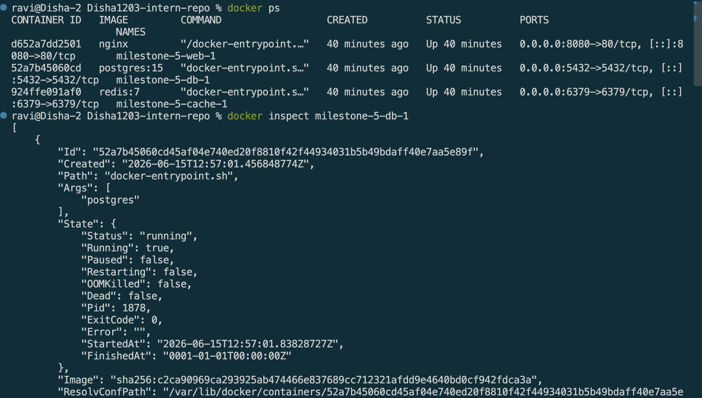
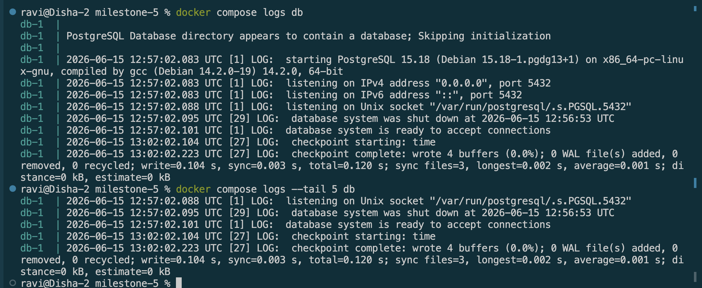
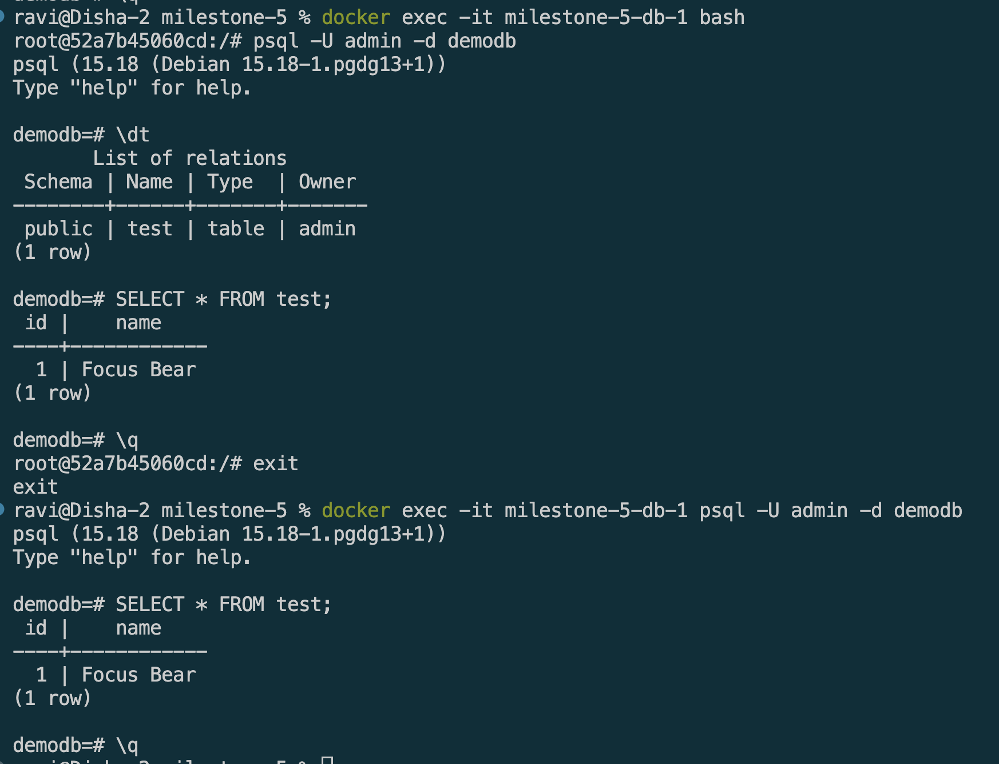
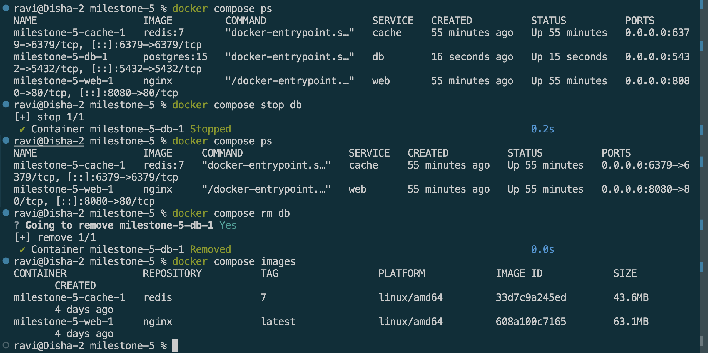

# Debugging & Managing Docker Containers

## Goal
Learn how to inspect, debug, and manage running Docker containers effectively.

## Reflections

### How can you check logs from a running container?
* `docker logs <container-name>` shows all past logs.
*  Add `-f` to stream live logs, `--tail 5` to see only the last 5 lines, and `--since 10m` to see logs from the last 10 minutes. 
* With Compose, `docker compose logs -f db` does the same scoped to a service name.

### What is the difference between docker exec and docker attach?
* `docker exec` runs a new process inside the container — most commonly used as `docker exec -it <name> bash` to open a shell without affecting what the container is already doing. 
* `docker attach` connects your terminal to the container's main process (PID 1), so you see its output directly — but if you press `Ctrl+C` you'll kill that main process and stop the container.
* For debugging, always use exec, not attach.


### How do you restart a container without losing data?

```bash
docker compose restart db
# or
docker compose down && docker compose up -d
```
* Both are safe as long as you don't add `-v` to the down command. 
* The named volume `pg_data` is never touched by a restart — only `docker compose down -v` deletes it.

### How can you troubleshoot database connection issues inside a containerized NestJS app?

```bash
# Check all containers are actually running
docker compose ps

# Check db logs for errors (wrong password, port conflicts etc.)
docker compose logs db

# Shell into the API container and try to ping the db by service name
docker exec -it <api-container-name> sh
ping db           # should resolve — if not, they're on different networks
curl db:5432      # check port is reachable

# Check env variables the API is using
docker exec -it <api-container-name> printenv | grep DB

```
Common issues to look for:
* API using `localhost` instead of the service name `db` as the host — inside Docker, services find each other by name, not localhost
* `depends_on` missing in compose, so the API starts before Postgres is ready
* Wrong credentials in the API's environment variables vs what's set in the db service


## Screenshots

### Inspection


### Check logs


### Enter running container


### Stop, remove, rebuild

