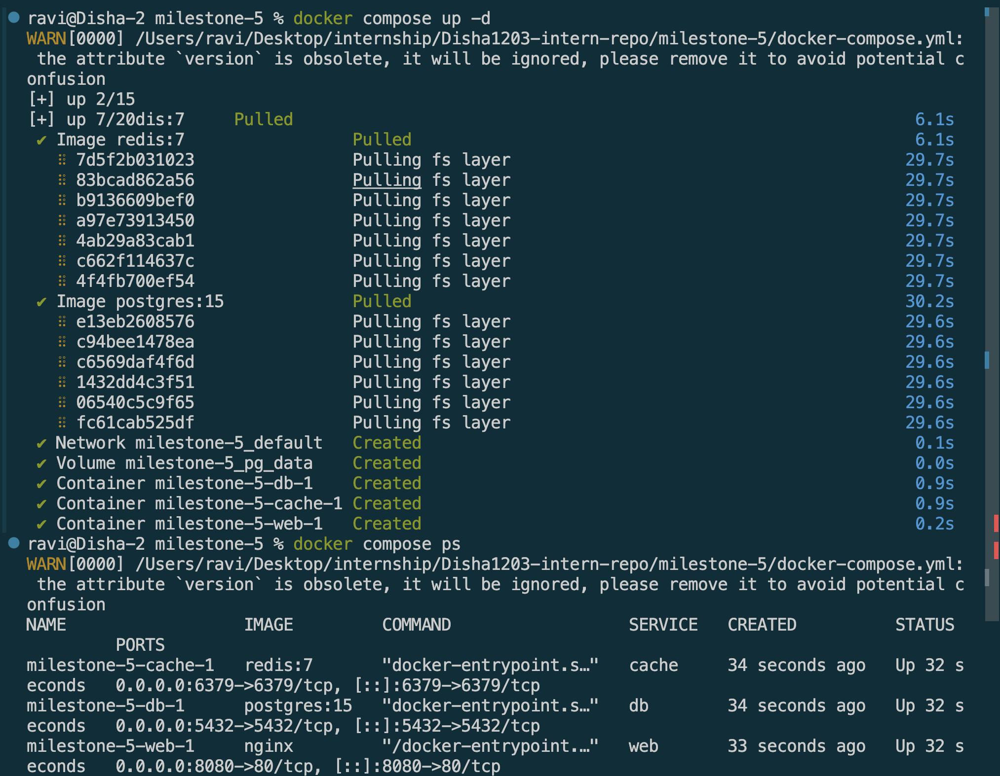
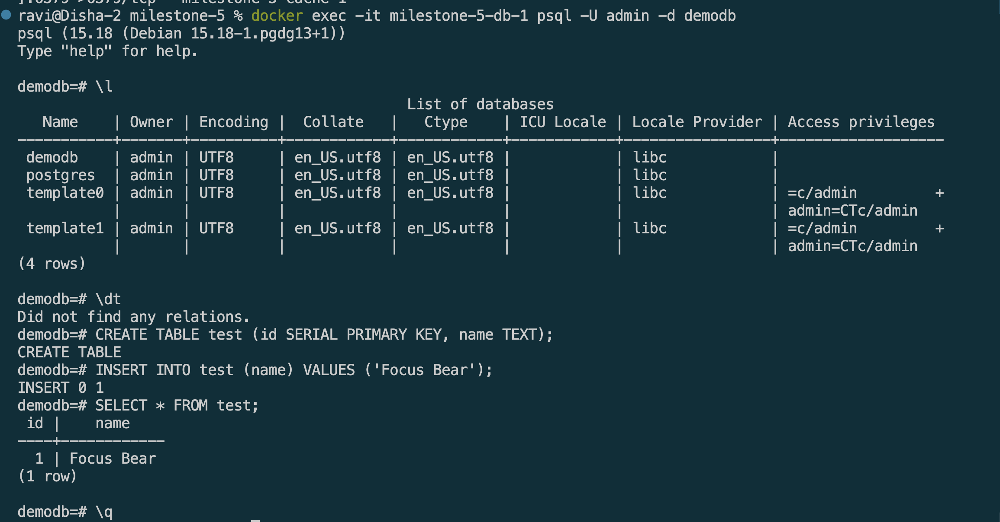
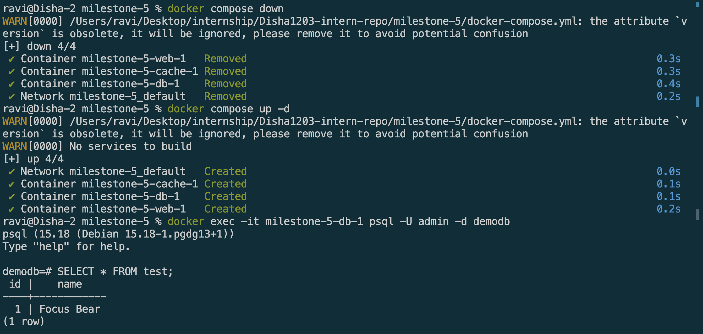
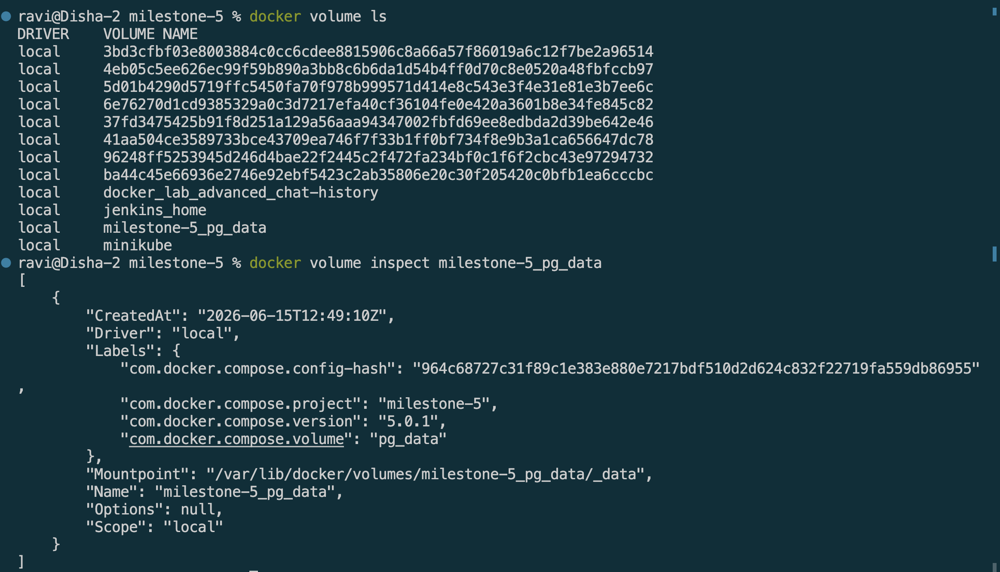

# Running PostgreSQL in Docker

## Goal
Set up and run a PostgreSQL database in Docker for local development.

## Reflection

### What are the benefits of running PostgreSQL in a Docker container?
* We don't have to install PostreSQL into our systems. So no version conflicts and system clutter
* Every developer on the team runs the exact same Postgres version and config, eliminating "works on my machine" issues
* Easy to reset: if something breaks, docker compose down -v && docker compose up -d gives you a clean database in seconds
* Keeps your local machine clean: uninstalling is just docker compose down, no leftover system files

### How do Docker volumes help persist PostgreSQL data?

* Data inside a container is lost when the container is removed. 
* The named volume `pg_data` in the compose file maps PostgreSQL's internal data directory (`/var/lib/postgresql/data`) to a volume managed by Docker on your host machine.
* So when you `run docker compose down`, the containers are removed but the volume survives. * When you `docker compose up -d again`, Postgres finds the same volume and all your data is intact. 
* Only `docker compose down -v` deletes the volume and wipes the data.

### How can you connect to a running PostgreSQL container?
Two ways:
* *Terminal (psql)* — `docker exec -it <container-name> psql -U admin -d demodb` drops directly into a SQL shell inside the container, no local Postgres install needed
* *GUI client (pgAdmin / DBeaver)* — since port `5432` is mapped to my host, any database client can connect to `localhost:5432` with the credentials from the compose file as if Postgres were running natively on my machine

## Screenshots

Docker compose

Connect to the running PostgreSQL instance using a database client

Volume persistance

Inspect volumes