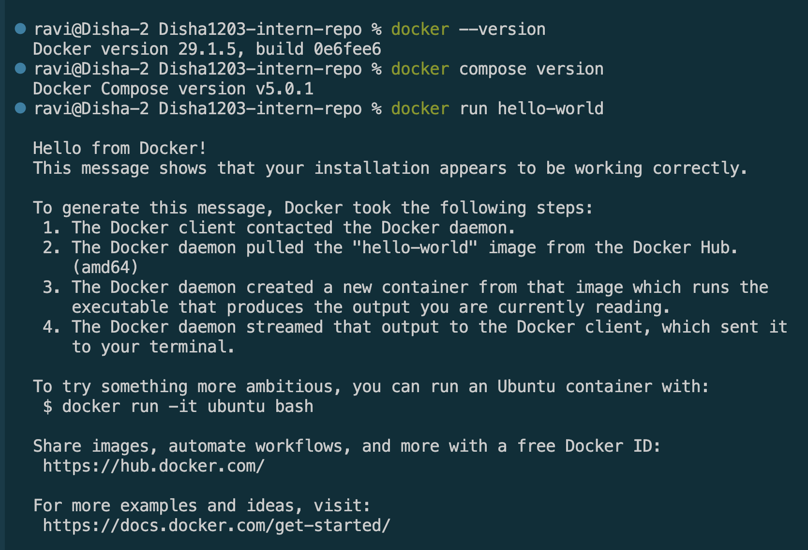
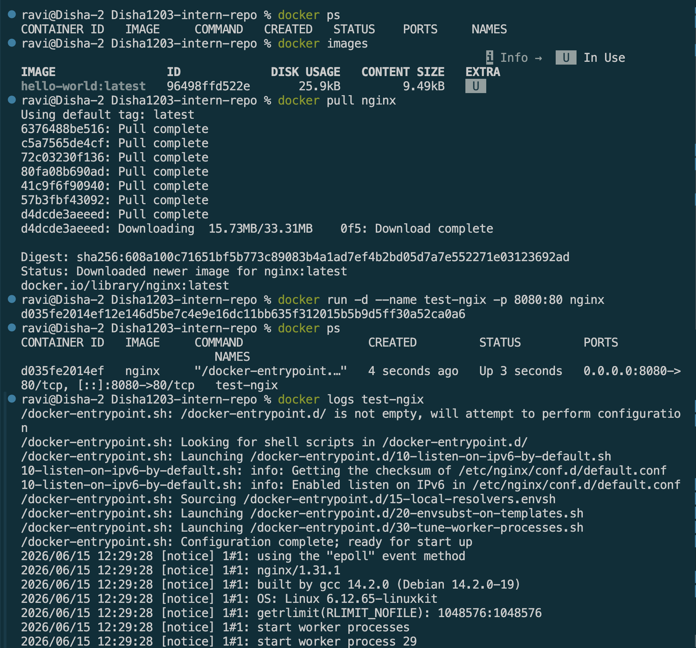
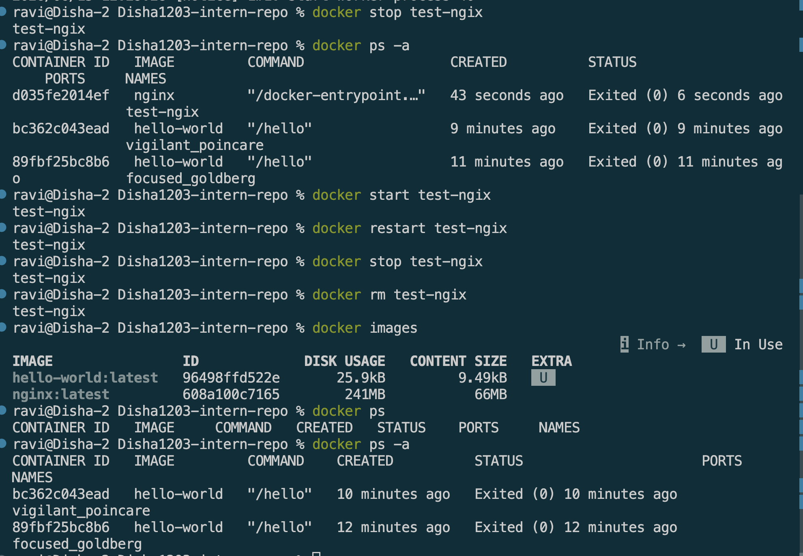
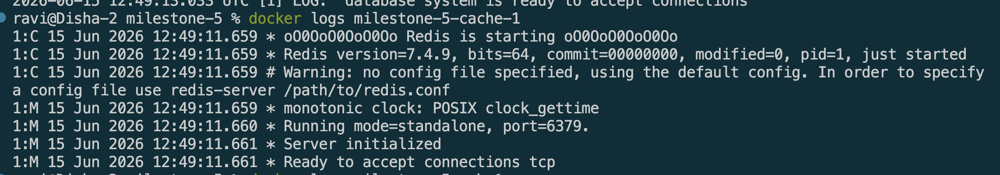

# Docker Setup and Basic Commands


## Goal
Install Docker and Docker Compose and learn basic commands to manage containers


## Reflection Questions

### 1. What is the difference between `docker run` and `docker compose up`?

`docker run` starts a single container from an image and requires configuration through command-line options.
* You specify everything on the command line such as ports, volumes,network,etc.
    * So it's useful for quick one time tasks but not ideal for multi-service setups

Example:

```bash
docker run postgres
```

`docker compose up` starts multiple related containers using settings defined in `docker-compose.yml` file.
* It is designed for applications that consist of several interconnected services.
* This can start an API, database, and Redis server simultaneously.

Example:

```bash
docker compose up
```


### 2. How does Docker Compose help when working with multiple services?

Docker Compose manages all services from a single configuration file. It automatically creates networks, starts containers in the correct order, applies environment variables, and simplifies running complex applications with a single command.


### 3. What commands can you use to check logs from a running container?

```bash
#For an individual container:
docker logs <container_name>
docker logs -f <container_name>                 # Live/streaming logs (Ctrl+C to exit)
docker logs --tail 50 <container_name>          # Last 50 lines only
docker logs --since 10m <container_name>        # Logs from the last 10 minutes
docker logs --timestamps <container_name>       # Include timestamps


# For Docker Compose services:
docker compose logs <service_name>            # All logs for the api service
docker compose logs -f <service_name>         # Follow logs for api
docker compose logs -f <service_name>         # Follow logs for ALL services
```


### 4. What happens when you restart a container? Does data persist?

* Restarting a container stops and starts the container process. 
* Restarting a container does not normally remove its data. The container's filesystem remains intact unless the container is deleted.
* However, if the container is removed and recreated, data stored inside the container may be lost.
* To persist data reliably, Docker volumes should be used.
*  Volumes store data outside the container lifecycle, allowing databases and other services to retain data even when containers are recreated.


## Screenshot


Verifying installation




Key commands


docker compose

doker logs
