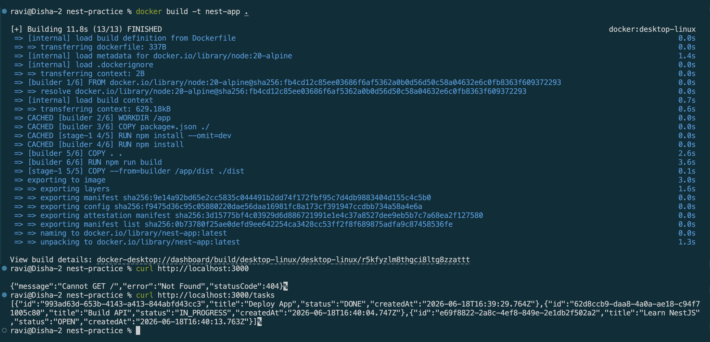
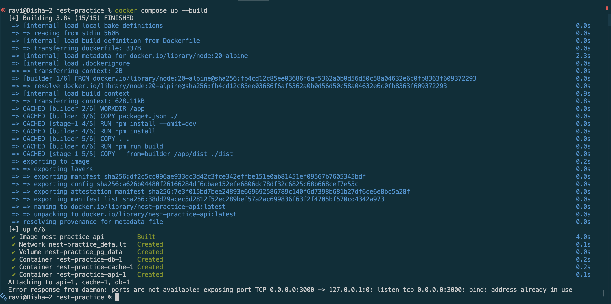
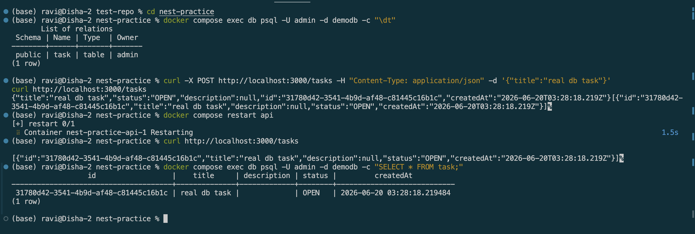

# Using Docker for NestJS Development

## Goal 

Learn how to containerize a NestJS application using Docker and run it alongside PostgreSQL.

## Reflection 

### How does a Dockerfile define a containerized NestJS application?

A Dockerfile is a text file that contains instructions for building a Docker image. For a NestJS application, it specifies:
* The base Node.js image to use.
* The working directory inside the container.
* Dependencies to install.
* Application source code to copy.
* The build process.
* The command to start the application.

### What is the purpose of a multi-stage build in Docker?
A multi-stage build uses multiple FROM statements to separate the build environment from the final runtime environment.
* Benefits:
    * Produces smaller images.
    * Removes unnecessary build tools and source files.
    * Improves security by reducing the attack surface.
    * Speeds up deployment and image downloads.
* The first stage compiles the NestJS application.
* The second stage contains only the compiled code and production dependencies.
* The final image is much smaller than including the entire source code and build tools.

### How does Docker Compose simplify running multiple services together?

Docker Compose allows you to define and manage multiple containers using a  docker-compose.yml
* For a NestJS application, you might run:
    * NestJS API
    * PostgreSQL database
    * Redis cache
* Advantages:
    * Starts all services with one command:
    * `docker compose up`
    * Automatically creates a shared network.
    * Simplifies service discovery (e.g., API can connect to postgres by hostname).
    * Keeps environment configuration in a single file.
    * Makes local development and testing easier.

### How can you expose API logs and debug a running container?

- Use `docker logs <container_id>` to view container logs.
- Use `docker logs -f <container_id>` to stream logs in real time.
- Use `docker compose logs` to view logs from all services in a Docker Compose setup.
- Use `docker compose logs -f <service_name>` to continuously monitor logs for a specific service.
- Access a running container using `docker exec -it <container_id> sh` (or `bash`) for debugging.
- Inspect container configuration and metadata with `docker inspect <container_id>`.
- Monitor CPU, memory, and network usage using `docker stats`.
- Enable NestJS debug logging by configuring the logger with `log`, `error`, `warn`, `debug`, and `verbose` levels.
- Use the collected logs and debugging tools to identify runtime errors, network issues, and service connectivity problems.

## Screenshots

### Dockerfile

### docker-compose.yml to run NestJS alongside PostgreSQL

### Connected with PostgreSQL
