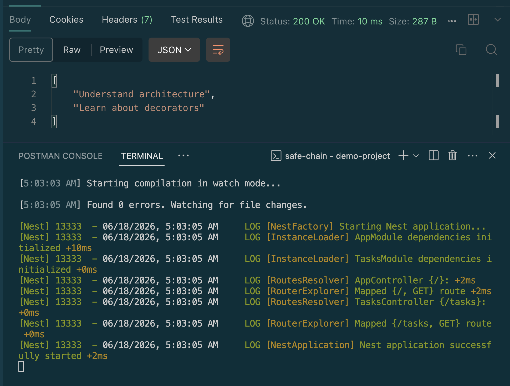

# Understanding Modules, Controllers, and Providers in NestJS

## Goal
Learn how NestJS organizes applications using modules, controllers, and providers.

## Example


### tasks.module.js
```typescript
import { Module } from '@nestjs/common';
import { TasksController } from './tasks.controller';
import { TasksService } from './tasks.service';

@Module({
  controllers: [TasksController],
  providers: [TasksService]
})
export class TasksModule {}

```

### tasks.controller.js
```typescript
import { Get, Controller } from '@nestjs/common';
import { TasksService } from './tasks.service';

@Controller('tasks')
export class TasksController {
    constructor(private readonly tasksService: TasksService) {}

    @Get()
    findAll(): string[] {
        return this.tasksService.findAll();
    }
}

```

### tasks.service.js
```typescript
import { Injectable } from '@nestjs/common';

@Injectable()
export class TasksService {

    private tasks = ['Understand architecture', 'Learn about decorators'];

    findAll(): string[] {
        return this.tasks;
    }

}

```


## Reflections

### What is the purpose of a module in NestJS?
* A module is an organizational container, declared with `@Module()`, that groups a related set of controllers and providers and declares what it imports from elsewhere and exports to other parts of the app.
    * `TasksModule` bundles `TasksController` and `TasksService` so they register as one unit inside AppModule.
    * Without modules, every controller and service in a growing app would have to be wired up manually in one giant root file.
    * With them, each feature stays self-contained — it can be added, removed, or even extracted into its own library later without disturbing unrelated code.


### How does a controller differ from a provider?
* Job — A controller defines routes and handles reading requests and returning responses; a provider holds the actual business logic.
* Content — Controllers should contain as little logic as possible; providers handle data fetching, calculations, database calls, and similar work.
* Knowledge of HTTP — Controllers deal directly with requests, responses, params, and headers; providers have no concept of HTTP at all, just plain methods and return values.
* Registration — Controllers are registered in a module's controllers array and instantiated by Nest to handle matching routes; providers are registered in a module's providers array and injected wherever they're declared as a dependency.
* Reusability — A controller is tied to a specific route path and isn't really reused outside the HTTP layer; a provider can be injected into multiple controllers, other services, guards, or interceptors.
* Testing — Controllers are usually tested by mocking the provider they depend on; providers are usually tested in isolation, since there's no HTTP layer involved.
### Why is dependency injection useful in NestJS?
Instead of a controller creating its own instance with `new TasksService()`, it declares the service as a constructor parameter, and Nest's DI container supplies a ready-made instance automatically. 
This is useful for a few reasons:
* Decoupling — TasksService could later be swapped for a database-backed version, or a mock, without changing the controller at all.
* Testability — you can inject a fake service instead of the real one in unit tests.
* Centralized lifecycle management — Nest creates a single shared instance of each provider by default, rather than every part of the app instantiating its own copies.


### How does NestJS ensure modularity and separation of concerns?

Nest enforces this structurally, not just by convention:
* *Decorators* (`@Module()`, `@Controller()`, `@Injectable()`) make each class's role explicit in the code itself, so it's hard to accidentally blur the lines.
* *Modules act as boundaries* — a feature's internals stay private unless explicitly exported, so other modules can only use what's deliberately shared.
* Dependency injection means classes ask for what they need rather than reaching out and constructing it themselves, so controllers, services, and modules can each change independently as long as their public interface stays the same.

## Screenshots

### Creating a simple module with a controller and a service


### Result
