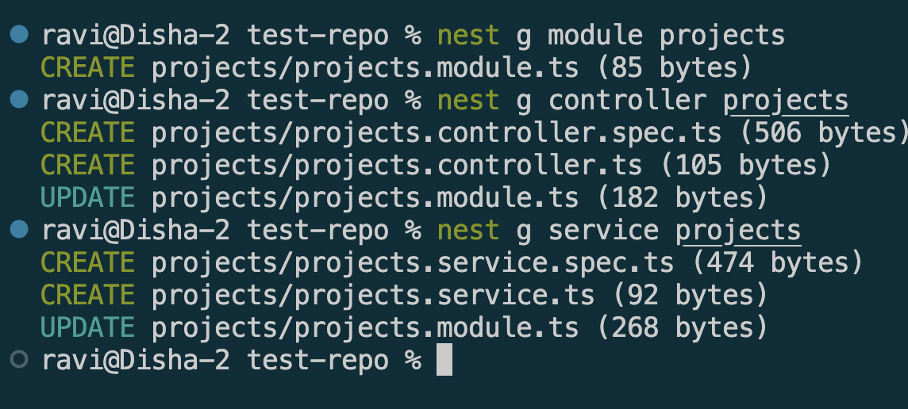
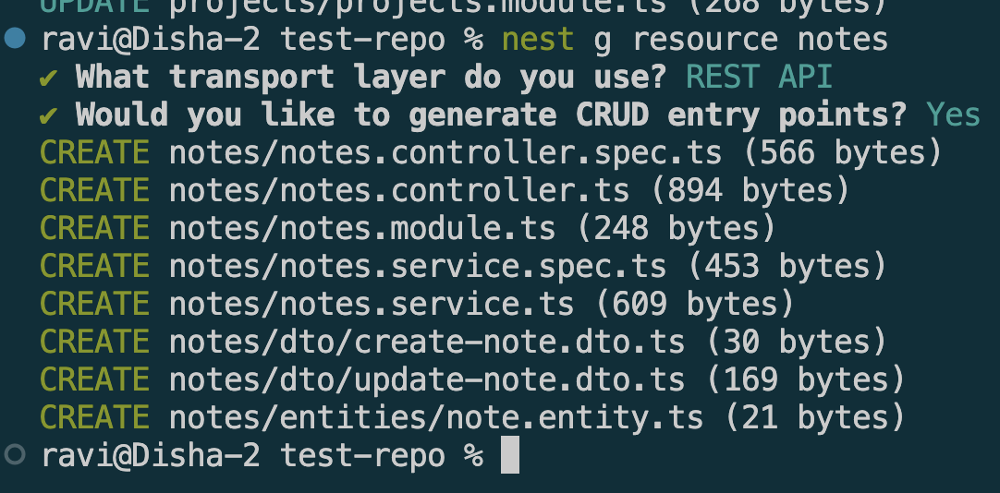

# Using NestJS CLI for Scaffolding

## Goal
Learn how to use the NestJS CLI to scaffold different parts of the application such as controllers, services, and modules.

## Reflection

### How does the NestJS CLI help streamline development?
* NestJS CLI automates repetitive setup by generating modules, controllers, services, DTOs, and other boilerplate with a single command.
*  It also wires everything together automatically, reducing manual configuration and import errors.
*  This speeds up feature development and simplifies the build and watch workflow.
* It also handles compilation (`nest build`) and incremental rebuilds (`--watch`), so the day-to-day dev loop of generate  code → build → run is all covered by one tool.

### What is the purpose of nest generate?

* `nest generate` (nest g) is NestJS's code scaffolding tool that creates common components such as modules, controllers, and services with the correct structure and decorators already in place. 
* It can also automatically register them in modules. Commands like `nest g resource <name>` can generate an entire CRUD feature, including a module, controller, service, DTOs, and entity, in a single step.

### How does using the CLI ensure consistency across the codebase?
Using the NestJS CLI ensures a consistent project structure across the team. Modules, controllers, and services follow the same naming conventions, decorators, and folder organization, making the codebase easier to navigate, maintain, and understand for both existing team members and new developers.

### What types of files and templates does the CLI create by default?

* For a basic `nest g module/controller/service <name>`, it creates a `.module.ts`, `.controller.ts`, and `.service.ts` file respectively, plus a matching `.spec.ts` test file for controllers and services.
* For the broader `nest g resource <name>` schematic, it generates all of the above together, plus a `dto/` folder with `create-<name>.dto.ts` and `update-<name>.dto.ts` stubs, an `entities/` folder with a basic entity class, and pre-wired CRUD route handlers (`GET`, `POST`, `PATCH`, `DELETE`) already calling matching methods on the generated service.

## Screenshot

