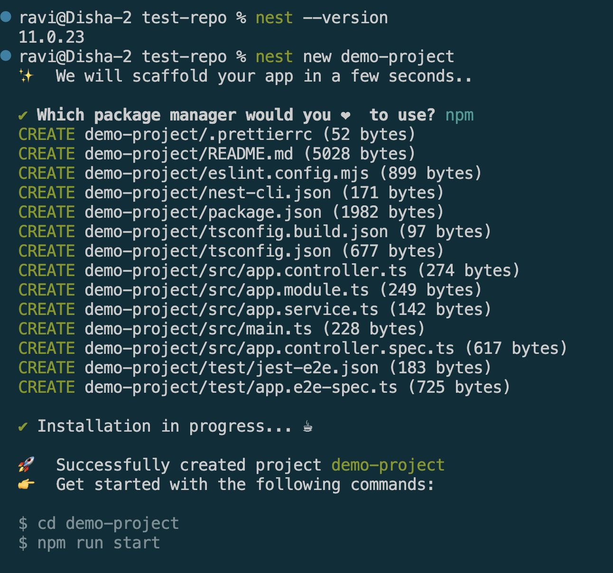
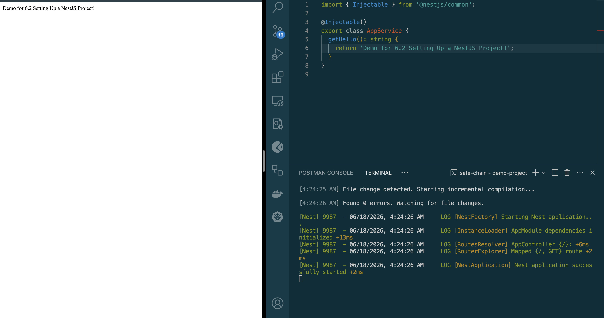

# Setting Up a NestJS Project

## Goal
Set up a NestJS development environment, understand its project structure, and run a basic application.

### Reflections

### What files are included in a default NestJS project?

A default NestJS project contains source files, configuration files, and testing files. The main files inside the src folder are:
* `main.ts` - Entry point of the application.
* `app.module.ts` – Root module that organizes the application.
* `app.controller.ts` – Handles incoming HTTP requests.
* `app.service.ts` – Contains business logic used by controllers.

Other important files include:

* `package.json` - Project dependencies and scripts.
* `tsconfig.json` - TypeScript configuration.
* `nest-cli.json` – NestJS CLI configuration.
* `test/` folder Contains testing-related files.

These files provide a basic structure for building scalable applications.


### How does main.ts bootstrap a NestJS application?
* `main.ts` is the starting point of a NestJS application. 
* It creates an application instance using `NestFactory.create(AppModule)` and loads the root module. 
* After creating the application, it starts listening for incoming requests on a specified port, usually port 3000.
* The bootstrap process initializes all modules, controllers, services, and dependencies before the application begins handling requests.

```typescript
import { NestFactory } from '@nestjs/core';
import { AppModule } from './app.module';

async function bootstrap() {
  const app = await NestFactory.create(AppModule);
  await app.listen(process.env.PORT ?? 3000);
}
bootstrap();
```

### What is the role of AppModule in the project?
AppModule is the root module of the application. It acts as the central place where NestJS starts building the application's dependency graph.
It is responsible for:
* Registering controllers that handle requests.
* Registering providers (services) that contain business logic.
* Importing other modules when the application grows. 
Every NestJS application requires at least one root module, and AppModule serves that purpose.

```typescript
import { Module } from '@nestjs/common';
import { AppController } from './app.controller';
import { AppService } from './app.service';

@Module({
  imports: [],
  controllers: [AppController],
  providers: [AppService],
})
export class AppModule {}

```

### How does NestJS structure help with scalability?
* NestJS improves scalability by organizing code into modules, controllers, and services.
    * Modules group related functionality together.
    * Controllers handle incoming requests.
    * Services contain reusable business logic.
* This separation makes the codebase easier to understand, maintain, and extend. 
* As the application grows, new features can be added as separate modules without affecting existing functionality. 
* It also allows multiple developers to work on different parts of the application simultaneously, making large projects easier to manage.

## Screenshots

### NestJS Installation and project creation


### Demo



