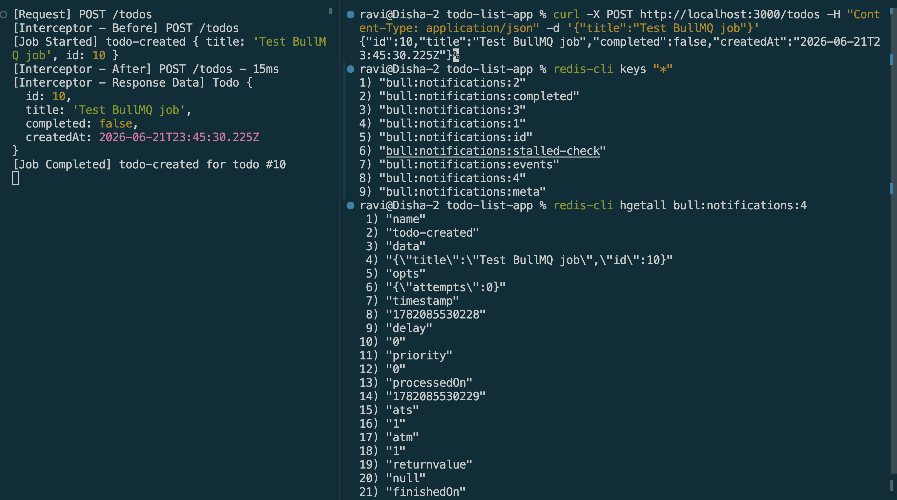

# Background Jobs with BullMQ & Redis in NestJS

## Goal
Learn how to handle background tasks asynchronously in a NestJS backend using BullMQ & Redis.


## Reflections

### Why is BullMQ used instead of handling tasks directly in API requests?

* If a request handler performs slow tasks itself, the client has to wait for those tasks to finish before receiving a response.
* With BullMQ, the API can respond immediately and let background workers handle the slow tasks separately, resulting in a faster and more responsive user experience.


### How does Redis help manage job queues in BullMQ?

* Redis serves as the underlying storage layer for BullMQ, where queued jobs are stored and managed. 
* BullMQ leverages Redis data structures to maintain job data, execution order, and job states such as waiting, active, completed, and failed, typically under keys prefixed with `bull:<queue-name>:`. 
* Because Redis operates primarily in memory, it provides extremely fast enqueue and dequeue operations, making it well-suited for high-throughput job processing.
* Additionally, Redis runs as a separate process from the NestJS application, so queued jobs persist independently of the application lifecycle.
* As a result, jobs remain available even if the NestJS server restarts, similar to how data stored in Postgres persists across application restarts.

### What happens if a job fails? How can failed jobs be retried?

* If process() throws an error, BullMQ marks the job as failed rather than losing it silently, it stays recorded in Redis.
* BullMQ supports configurable automatic retries with backoff strategies (e.g. `attempts: 3, backoff: { type: 'exponential', delay: 1000` } when calling `.add()`), so a transient failure (like a flaky third-party notification API) can be retried automatically a set number of times before being marked permanently failed.

### How does Focus Bear use BullMQ for background tasks?

* Focus Bear uses BullMQ to offload time-consuming tasks—such as notifications, analytics processing, and data synchronization—to background workers. 
* When a task is needed, the API enqueues a job in Redis and returns a response immediately. 
* Separate BullMQ workers process the jobs asynchronously, keeping the API responsive while providing reliable execution, retries, and failure handling.

## Task



```Typescript
@Processor('notifications')
export class NotificationsProcessor extends WorkerHost {
  async process(job: Job): Promise<void> {
    console.log(`[Job Started] ${job.name}`, job.data);

    // Simulate slow work (e.g. calling a push notification service)
    await new Promise((resolve) => setTimeout(resolve, 2000));

    console.log(`[Job Completed] ${job.name} for todo #${job.data.id}`);
  }
}
```