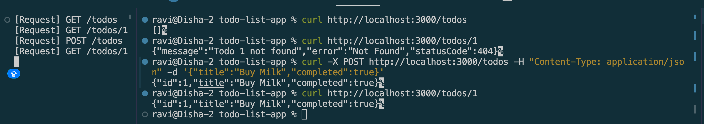
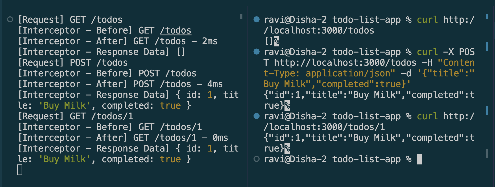

# Using Interceptors & Middleware in NestJS

## Goal

Learn how to use interceptors and middleware in NestJS to modify requests, responses, and handle cross-cutting concerns.

## Reflections

### What is the difference between an interceptor and middleware in NestJS?

* Middleware runs once, very early in the request lifecycle, before Nest even resolves which controller/handler will process the request 
    * it only has access to the raw `req`/`res` objects. 
* Interceptors run later, with full context about which handler is about to execute, and wrap both sides of it 
    * they can run code before and after the handler, including inspecting the actual response data, since they tap into an `RxJS Observable` returned by `next.handle()`.


### When would you use an interceptor instead of middleware?

Whenever I need to see or transform the response, not just the request — e.g. logging response time, reshaping returned data, or wrapping responses in a standard envelope.

### How does LoggerErrorInterceptor help?
A built-in interceptor like `ClassSerializerInterceptor` automatically applies class-transformer's serialization rules (e.g. `@Exclude()` on a sensitive field like a password hash) to outgoing response data, without needing manual logic in every controller method. It's an example of using the "after handler" side of an interceptor's power for a built-in, reusable purpose, rather than writing custom logging like I just did.


## Screenshots

### Middleware


```Typescript
@Injectable()
export class LoggerMiddleware implements NestMiddleware {
  use(req: Request, res: Response, next: NextFunction) {
    console.log(`[Request] ${req.method} ${req.originalUrl}`);
    next();
  }
}
```

### Interceptor


```Typescript
@Injectable()
export class LoggerInterceptor implements NestInterceptor {
  intercept(context: ExecutionContext, next: CallHandler): Observable<any> {
    const request = context.switchToHttp().getRequest();
    const { method, originalUrl } = request;
    const now = Date.now();

    console.log(`[Interceptor - Before] ${method} ${originalUrl}`);

    return next.handle().pipe(
      tap((responseData) => {
        const elapsed = Date.now() - now;
        console.log(
          `[Interceptor - After] ${method} ${originalUrl} - ${elapsed}ms`,
        );
        console.log(`[Interceptor - Response Data]`, responseData);
      }),
    );
  }
}

```