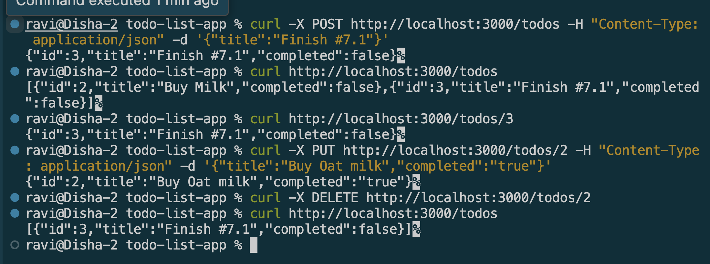

# Creating REST APIs with NestJS

## Goal

Learn how to build RESTful APIs using NestJS controllers and services.

## Reflections

### What is the role of a controller in NestJS?

* A controller handles the HTTP layer only 
    * Receiving requests, mapping them to routes, and returning responses.
* It delegates the actual logic to a service rather than handling it directly.
* In my TodosController, each method (`findAll`, `findOne`, `create`, etc.) corresponds to a route, but the real work happens in TodosService.

### How should business logic be separated from the controller?

* Business logic lives in the service, injected into the controller via the constructor. 
* The controller calls service methods but never manipulates data itself.

### Why is it important to use services instead of handling logic inside controllers?

* **Reusability** — the same service logic could be reused by other parts of the app , not just this one controller
* **Testability** — services can be unit tested independently of HTTP, without needing to mock requests/responses
* **Single Responsibility** — controllers stay thin and focused only on routing; debugging is easier because you know exactly where to look

### How does NestJS automatically map request methods (GET, POST, etc.) to handlers?

* Nest uses decorators (`@Get()`, `@Post()`, `@Put()`, `@Delete()`) combined with the `@Controller('todos')` base path to build full routes.
* At startup, Nest's `RouterExplorer` scans these decorators and logs the mapped routes (e.g. Mapped `{/todos, POST} route`) 

## Screenshots

