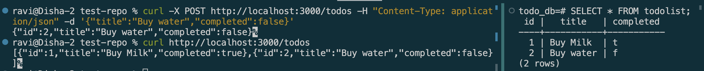

# Connecting to PostgreSQL with TypeORM in NestJS

## Goal

Learn how to connect a NestJS application to a PostgreSQL database using TypeORM.

## Reflections

### How does @nestjs/typeorm simplify database interactions?

* It bridges TypeORM (a general-purpose ORM) into Nest's dependency injection system, so no need to write raw SQL or manually manage connections. 
* `TypeOrmModule.forRootAsync()` handles the connection setup once globally, and `@InjectRepository(Todo)` gives a fully-featured `Repository<Todo>` injected straight into  service — with methods like `.find()`, `.save()`, and `.delete()` already built in.

### What is the difference between an entity and a repository in TypeORM?

* An entity defines the shape of a table — its columns and types — and represents a single row. 
* A repository is the object that actually does database work — querying, inserting, updating, deleting rows of that entity. 
* The entity is the blueprint; the repository is the tool that operates on it.


### How does TypeORM handle migrations in a NestJS project?

In this task we used synchronize: true, which auto-syncs the database schema to match entities on every startup — convenient for development, but TypeORM explicitly warns against this in production, since it can silently alter or drop columns based on entity changes, risking real data loss. For production, TypeORM instead supports migration files — versioned, explicit SQL scripts (generated via the TypeORM CLI, e.g. typeorm migration:generate) that get reviewed and run deliberately, giving full control over schema changes instead of automatic, implicit ones.


### What are the advantages of using PostgreSQL over other databases in a NestJS app?

* PostgreSQL is a mature, open-source relational database with strong support for complex queries, joins, and data integrity via constraints.
* It also has strong JSON support , is well-supported by TypeORM specifically, and is free/open-source with a large ecosystem — unlike paid options, and more feature-rich than lighter alternatives like SQLite for production multi-user workloads.


## Screenshots


```Typescript
import { IsOptional } from "class-validator";
import { Column, Entity, PrimaryGeneratedColumn } from "typeorm";

@Entity('todolist')
export class Todo{
    @PrimaryGeneratedColumn()
    id:number;

    @Column()
    title:string;

    @Column()
    completed:boolean

}
```