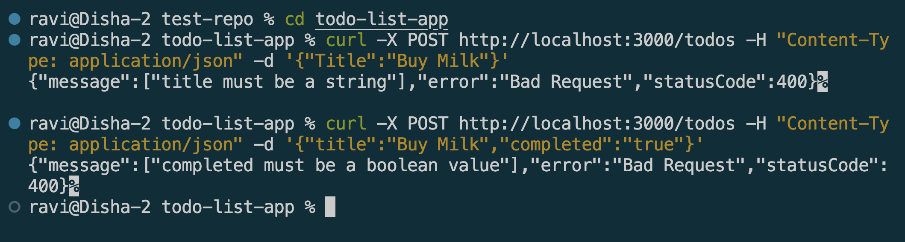
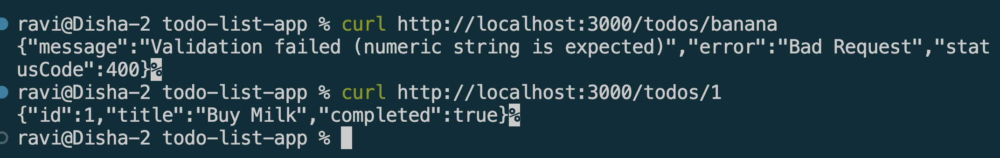

# Validating Requests with Pipes in NestJS

## Goal
Understand how pipes work in NestJS and how to use them for data validation and transformation.


## Reflections

### What is the purpose of pipes in NestJS?
Pipes run before a route handler executes, and do one of two things: 
* transform incoming data into the expected type (e.g. `ParseIntPipe` converting a URL param string into a number)
* validate that data meets certain rules, throwing a `400 Bad Request` automatically if it doesn't

### How does ValidationPipe improve API security and data integrity?

* Without it, TypeScript's types only exist at compile time  
* At runtime, Nest will accept anything shaped like JSON, even with wrong field names or wrong types 
* ValidationPipe enforces the DTO's rules at runtime via class-validator decorators, rejecting malformed requests before they ever reach the service or get stored — closing the gap between compile-time types and runtime reality.


### What is the difference between built-in and custom pipes?

* Built-in pipes (like `ValidationPipe`, `ParseIntPipe`) ship with Nest and cover common cases
    *  validating DTOs, converting route params to numbers/booleans, etc. 
*  Custom pipes are ones you write yourself by implementing the `PipeTransform` interface, for app-specific logic that built-ins don't cover 
*  e.g. a custom pipe to sanitize/trim string input, or validate a domain-specific format.

### How do decorators like @IsString() and @IsNumber() work with DTOs?

* They're attached directly above a DTO property and registered via class-validator's metadata system. 
* When ValidationPipe processes an incoming request, class-transformer first converts the plain JSON object into an actual instance of the DTO class, then class-validator reads each property's decorators and checks the corresponding value against that rule — collecting all failures into one combined error response (e.g. ["title must be a string"]).

## Screenshots

### Validation pipe



```Typescript
export class CreateTodoDto {
    @IsString()
    title: string;

    @IsOptional()
    @IsBoolean()
    completed?: boolean; // '?':optional in compile time while @IsOptional() is optional in runtime

}
```
```Typescript
import { NestFactory } from '@nestjs/core';
import { ValidationPipe } from '@nestjs/common';
import { AppModule } from './app.module';

async function bootstrap() {
  const app = await NestFactory.create(AppModule);
  app.useGlobalPipes(new ValidationPipe());
  await app.listen(process.env.PORT ?? 3000);
}
bootstrap();
```
### Transformation pipe



```Typescript
 @Get(':id')
    findOne(@Param('id', ParseIntPipe) id: number){
        return this.todoService.findOne(id);
    }
```