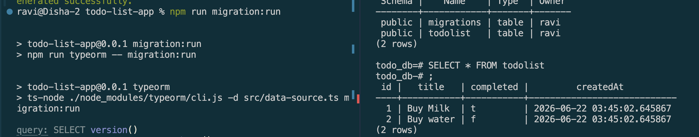
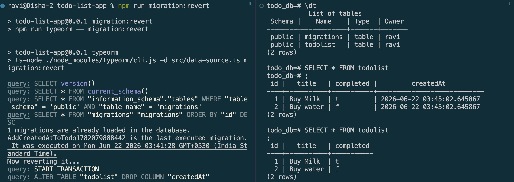
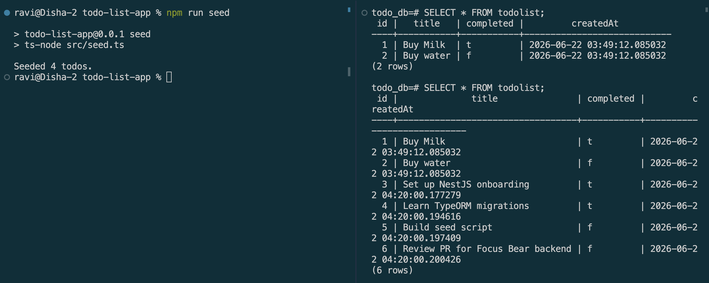

# Seeding & Migrations in TypeORM

## Goal
Learn how to manage database schema changes and seed initial data using TypeORM migrations.


## Reflections

### What is the purpose of database migrations in TypeORM?

* Migrations provide version-controlled, explicit, reviewable schema changes 
* Instead of relying on `synchronize: true` to auto-guess and silently apply schema differences on every startup (risky in production, since it can drop or alter columns unexpectedly). 
* Each migration is a timestamped file with paired `up()`/`down()` methods, giving a clear, auditable history of exactly how the schema evolved over time.


### How do migrations differ from seeding?

* Migrations change the structure of the database 
    * adding/removing/updating tables or columns 
* Seeding inserts data into an already-existing structure 
    * sample rows for testing or initial setup 
* They're complementary but separate concerns


### Why is it important to version-control database schema changes?

* Migration files live in source control alongside the code that depends on them, so the database schema's history is traceable, reviewable in PRs, and reproducible across every environment (local, staging, production) 
* everyone runs the same `up()` steps in the same order, rather than each developer's local database silently drifting out of sync via `synchronize: true`.


### How can you roll back a migration if an issue occurs?

* Every migration's `down()` method contains the exact inverse SQL of its `up()` method, written automatically by TypeORM's diff at generation time.
* Running `npm run migration:revert` looks up the most recently applied migration and executes its `down()` to reverse the `up()` method.


## Tasks

### Migration 


Migration

Reverse Migration

```Typescript
import { MigrationInterface, QueryRunner } from "typeorm";

export class AddCreatedAtToTodo1782079888442 implements MigrationInterface {
    name = 'AddCreatedAtToTodo1782079888442'

    public async up(queryRunner: QueryRunner): Promise<void> {
        await queryRunner.query(`ALTER TABLE "todolist" ADD "createdAt" TIMESTAMP NOT NULL DEFAULT now()`);
    }

    public async down(queryRunner: QueryRunner): Promise<void> {
        await queryRunner.query(`ALTER TABLE "todolist" DROP COLUMN "createdAt"`);
    }

}
```


### Seeding


Seeding

```Typescript
import { AppDataSource } from './data-source';
import { Todo } from './todos/todo.entity';

async function seed() {
  await AppDataSource.initialize();

  const todoRepository = AppDataSource.getRepository(Todo);

  const sampleTodos = [
    { title: 'Set up NestJS onboarding', completed: true },
    { title: 'Learn TypeORM migrations', completed: true },
    { title: 'Build seed script', completed: false },
    { title: 'Review PR for Focus Bear backend', completed: false },
  ];

  for (const data of sampleTodos) {
    const todo = todoRepository.create(data);
    await todoRepository.save(todo);
  }

  console.log(`Seeded ${sampleTodos.length} todos.`);
  await AppDataSource.destroy();
}

seed().catch((error) => {
  console.error('Seeding failed:', error);
  process.exit(1);
});
```