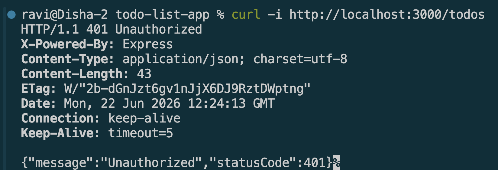
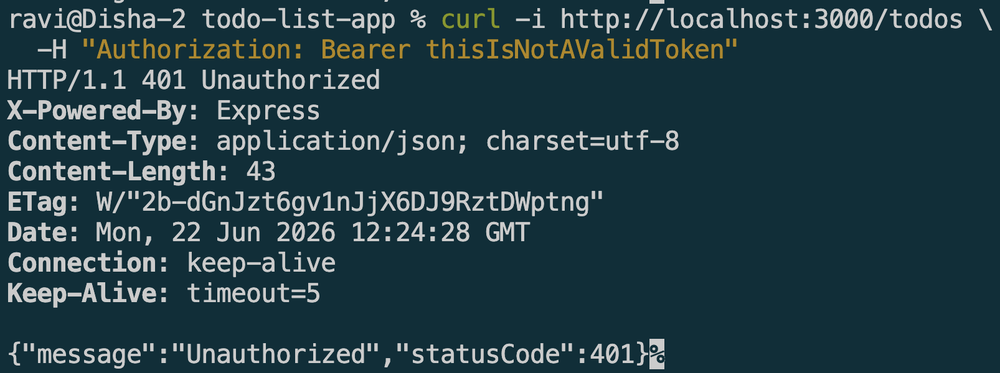
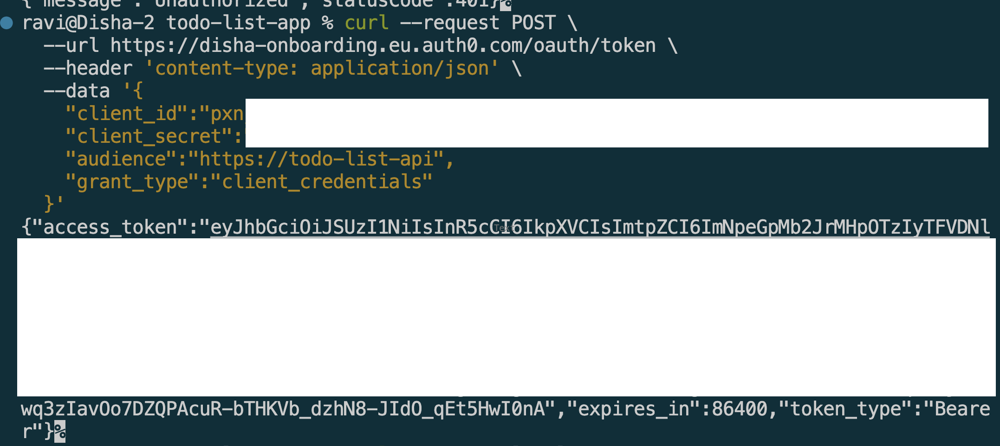
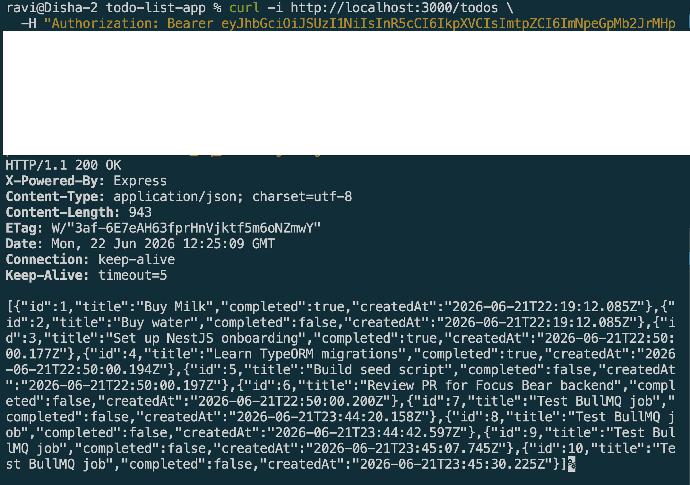

# Authentication in NestJS with Auth0 & JWT

## Goal

Learn how authentication works in NestJS using Auth0 and JWT.

## Reflections

### How does Auth0 handle authentication compared to traditional username/password auth?

* Auth0 acts as a centralized identity provider, so applications do not need to store or manage user passwords directly.
* Users authenticate through Auth0's hosted login page instead of the application's backend.
* Auth0 supports multiple login methods such as email/password, Google, GitHub, and enterprise SSO.
* Password hashing, account recovery, MFA, and security policies are managed by Auth0.
* This reduces security risks and development effort compared to implementing authentication from scratch.
* The application only verifies Auth0-issued tokens and trusts Auth0 to confirm user identity.

### What is the role of JWT in API authentication?

* JWT (JSON Web Token) is used to securely represent a user's identity and permissions.
* After a successful login, Auth0 issues a signed JWT access token.
* The client sends this token in the `Authorization: Bearer <token>` header with API requests.
* The NestJS backend validates the token before processing the request.
* JWTs contain claims such as user ID, email, roles, and expiration time.
* Because JWTs are self-contained, the API does not need to store session data on the server.

### How do jwks-rsa and public/private key verification work in Auth0?

* Auth0 signs JWTs using a private key that only Auth0 possesses.
* The corresponding public key is published through Auth0's JWKS (JSON Web Key Set) endpoint.
* The `jwks-rsa` library automatically retrieves and caches these public keys.
* When a JWT arrives, NestJS uses the public key to verify the token signature.
* If the signature is valid, the API can trust that the token was issued by Auth0 and has not been modified.
* This asymmetric cryptography approach is more secure than sharing a secret key across services.

### How would you protect an API route so that only authenticated users can access it?

* Configure a JWT authentication strategy using Passport and Auth0's JWKS endpoint.
* Create an authentication guard (e.g., `JwtAuthGuard`) in NestJS.
* Apply the guard to routes using `@UseGuards`(`JwtAuthGuard`).
* The guard checks for a valid JWT in the Authorization header.
* Requests with missing, expired, or invalid tokens are rejected with a 401 Unauthorized response.
* Only users with successfully verified Auth0 tokens can access the protected endpoint.

## Screenshots

### No Token

### Invalid/fake token

### Fetch a real token from Auth0:

### Valid token
