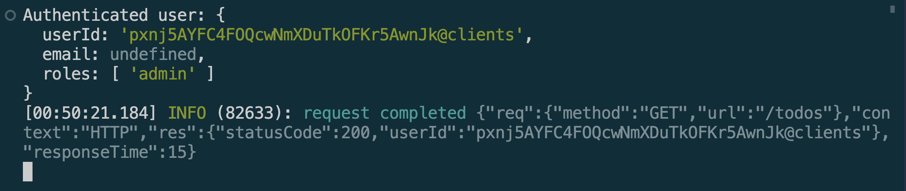
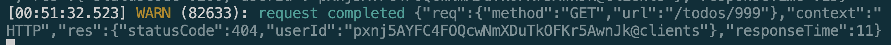
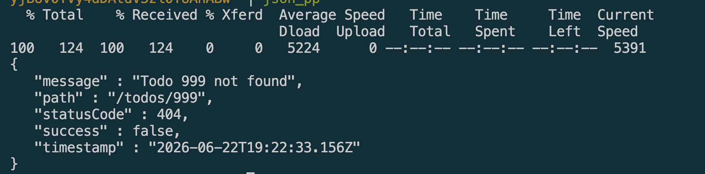

# Logging & Error Handling in NestJS

## Goal

Learn how to log application events and handle errors effectively in NestJS.

## Reflections

### What are the benefits of using nestjs-pino for logging?

* `nestjs-pino` provides structured JSON logging that is easier to parse and analyze.
* It is built on top of Pino, one of the fastest logging libraries in the Node.js ecosystem.
* It automatically logs HTTP request and response information.
* Logs can be integrated with monitoring and log aggregation tools such as ELK, Datadog, or Splunk.
* It supports different log levels (debug, info, warn, error) for better log management.
* Structured logs make troubleshooting and production monitoring more efficient.

### How does global exception handling improve API consistency?

* A global exception handler catches errors from all application routes in a central location.
* It ensures that API errors follow a consistent response format.
* Clients receive predictable error responses regardless of where the error occurs.
* It reduces duplicate error-handling code across controllers and services.
* Error details can be logged while exposing only safe information to users.
* Centralized exception handling improves maintainability and debugging.

### What is the difference between a logging interceptor and an exception filter?

* A logging interceptor monitors and logs request and response activity during normal execution.
* Interceptors can measure execution time and record request metadata.
* Exception filters specifically handle errors and exceptions thrown during request processing.
* Filters transform exceptions into standardized HTTP responses.
* Interceptors focus on observability and monitoring.
* Exception filters focus on error handling and response formatting.

### How can logs be structured to provide useful debugging information?

* Include timestamps for every log entry.
* Record log levels such as INFO, WARN, and ERROR.
* Include request identifiers to trace related events across services.
* Log important request details such as method, endpoint, and status code.
* Capture error messages and stack traces for failures.
* Store logs in a structured format (e.g., JSON) to enable searching and filtering.

## Screenshots

### Succesful log req

### Failed log req

### Error response shape
