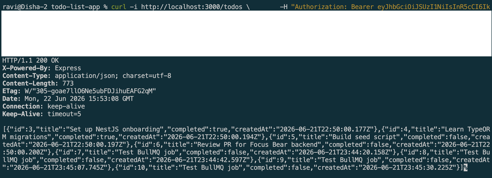
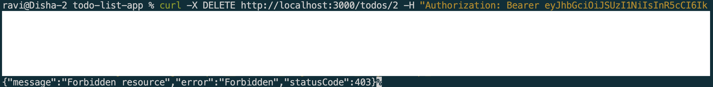
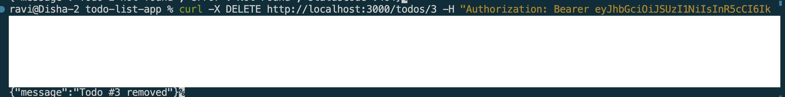

# Role-Based Authorization (RBAC) in NestJS

## Goal

Learn how to implement role-based access control (RBAC) in NestJS using Auth0.

## Reflections

### How does Auth0 store and manage user roles?

* Auth0 provides an RBAC system for managing permissions.
* Roles (e.g., Admin, User, Moderator) can be created and assigned to users through the Auth0 dashboard.
* Each role can contain one or more permissions that define allowed actions.
* When configured, Auth0 includes user roles and permissions in the access token as claims.
* Applications can read these claims to determine what a user is allowed to do.
* This centralizes authorization management instead of implementing role handling separately in each application.

### What is the purpose of a guard in NestJS?

* A guard determines whether a request should be allowed to reach a route handler.
* Guards run before the controller method executes.
* They can validate authentication, roles, permissions, or other access rules.
* A guard returns `true` to allow access and `false` (or throws an exception) to deny access.
* NestJS provides built-in support for creating custom guards.
* RBAC is commonly implemented using guards that check user roles from the JWT.

### How would you restrict access to an API endpoint based on user roles?

* Create a custom decorator such as `@Roles('admin')` to define required roles.
* Implement a `RolesGuard` that reads the required roles from the decorator.
* Extract the user's roles from the validated JWT access token.
* Compare the user's roles with the roles required by the endpoint.
* Allow access if the user has the required role.
* Return a `403 Forbidden` response if the user lacks sufficient privileges.

### What are the security risks of improper authorization, and how can they be mitigated?

* Unauthorized users may gain access to sensitive data or administrative functions.
* Users could modify, delete, or view information they should not access.
* Privilege escalation attacks may allow normal users to obtain admin capabilities.
* Missing role checks can expose internal APIs and business logic.
* Authorization checks should be enforced on the backend, not only in the frontend.
* Regular security reviews, least-privilege access, and thorough testing help prevent authorization vulnerabilities.

## Screenshots

