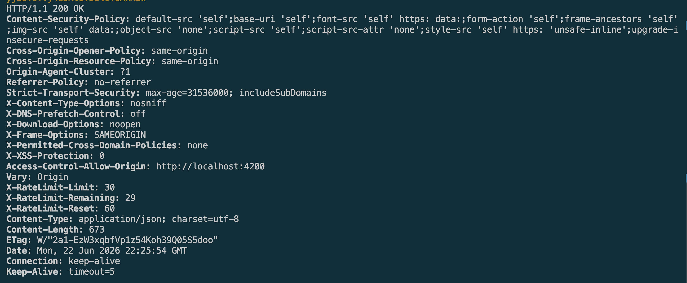
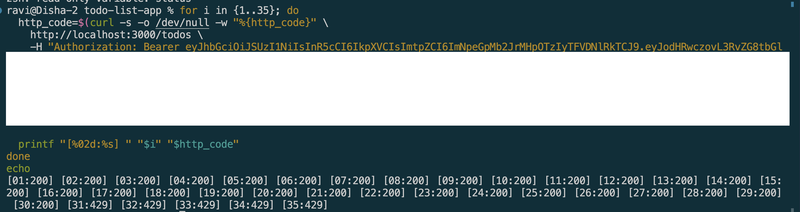
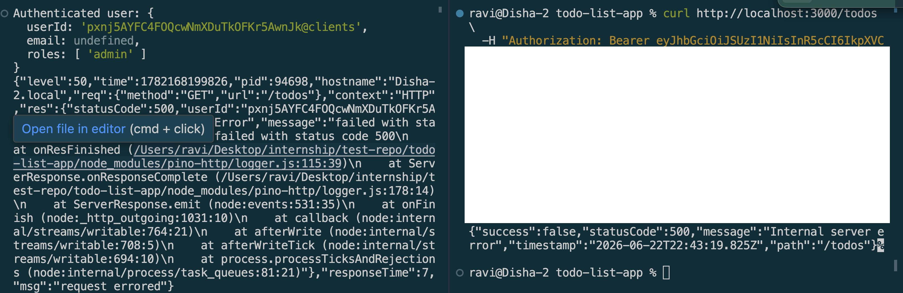

# Security Best Practices in NestJS

## Goal

Learn and apply security best practices to protect NestJS applications from common vulnerabilities.


## Reflections

### What are the most common security vulnerabilities in a NestJS backend?

* Injection attacks such as SQL Injection and NoSQL Injection can occur when user input is not properly validated.
* Cross-Site Scripting (XSS) can allow attackers to inject malicious scripts into web applications.
* Broken authentication and authorization can expose sensitive resources to unauthorized users.
* CORS misconfigurations may allow malicious websites to access protected APIs.
* Sensitive data exposure can occur if secrets, tokens, or passwords are improperly stored or transmitted.
* Denial-of-Service (DoS) attacks can overwhelm APIs if rate limiting is not implemented.


### How does @fastify/helmet improve application security?

* `@fastify/helmet` helps secure applications by setting important HTTP security headers.
* It reduces the risk of Cross-Site Scripting (XSS) attacks through Content Security Policy (CSP) headers.
* It prevents browsers from incorrectly interpreting file types using the `X-Content-Type-Options` header.
* It can restrict embedding pages inside iframes to prevent clickjacking attacks.
* It helps enforce secure HTTPS connections through security headers.
* It provides a simple way to apply multiple security protections with minimal configuration.


### Why is rate limiting important for preventing abuse?

* Rate limiting restricts the number of requests a client can make within a specified time period.
* It helps prevent brute-force attacks against login endpoints.
* It reduces the effectiveness of automated abuse and bot traffic.
* It protects server resources from excessive usage.
* It helps mitigate certain Denial-of-Service (DoS) attacks.
* It improves overall application stability and availability.

### How can sensitive configuration values be protected in a production environment?

* Secrets should be stored in environment variables rather than hardcoded in source code.
* Sensitive files such as .env should never be committed to version control.
* Secret management systems can be used to securely store credentials.
* Access to secrets should follow the principle of least privilege.
* Secrets should be rotated regularly to reduce the impact of potential leaks.
* Production systems should encrypt sensitive data both at rest and in transit.


## Tasks

### Env var 

```Typescript
AUTH0_DOMAIN: Joi.string().required(),
        AUTH0_AUDIENCE: Joi.string().required(),
        ALLOWED_ORIGIN: Joi.string().default('http://localhost:3000'),

        NODE_ENV: Joi.string()
        .valid('development', 'production', 'test')
        .default('development'),
```

### Helmet Headers



### Rate Limiting



### Env vars 

```env
# .env.example
DB_HOST=localhost
DB_PORT=5432
DB_USERNAME=your_db_username
DB_PASSWORD=
DB_NAME=todo_db

REDIS_HOST=localhost
REDIS_PORT=6379

AUTH0_DOMAIN=your-tenant.eu.auth0.com
AUTH0_AUDIENCE=https://your-api-identifier

ALLOWED_ORIGIN=http://localhost:4200

NODE_ENV=development
```

### Sanitized 500 error message

