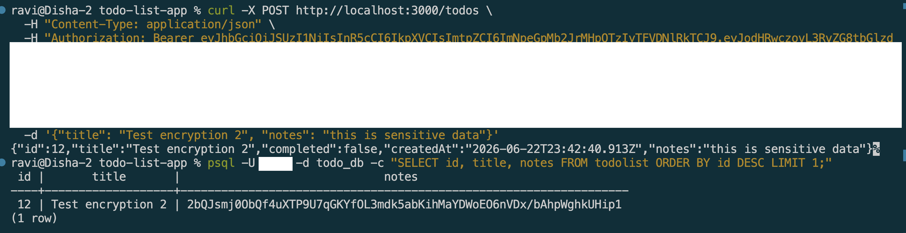

# Using typeorm-encrypted for Data Encryption

## Goal

Learn how to encrypt sensitive data in PostgreSQL using typeorm-encrypted, adding an extra layer of security on top of database encryption at rest.

## Reflections

### Why does Focus Bear double encrypt sensitive data instead of relying on database encryption alone?

* Database encryption at rest protects data when the database files are stored on disk.
* If an attacker gains direct access to the database contents, encrypted application fields provide an additional layer of protection.
* Field-level encryption ensures sensitive data remains encrypted even inside database backups and exports.
* Application-level encryption follows a defense-in-depth security strategy.
* It reduces the impact of database misconfigurations or infrastructure compromises.
* Double encryption helps protect highly sensitive user information beyond standard database security controls.

### How does typeorm-encrypted integrate with TypeORM entities?

* `typeorm-encrypted` uses TypeORM transformers to automatically encrypt and decrypt entity fields.
* Developers configure an encryption transformer for specific columns in an entity.
* Data is encrypted before being written to the database.
* Data is automatically decrypted when retrieved through TypeORM.
* Application code continues to work with normal plaintext values.
* The encryption process is transparent to most business logic.

### What are the best practices for securely managing encryption keys?

* Encryption keys should never be hardcoded in source code.
* Keys should be stored in environment variables or dedicated secret management systems.
* Access to encryption keys should follow the principle of least privilege.
* Keys should be rotated periodically to reduce long-term exposure.
* Different environments should use different encryption keys.
* Keys should be backed up securely while preventing unauthorized access.

### What are the trade-offs between encrypting at the database level vs. the application level?

* Database-level encryption is easier to manage and protects stored database files.
* Application-level encryption provides stronger protection for specific sensitive fields.
* Database encryption is generally transparent and has minimal application changes.
* Application-level encryption requires key management and additional implementation effort.
* Encrypted application fields are often difficult to search, sort, or index efficiently.
* Combining both approaches provides stronger security than using either one alone.

## Screenshots

