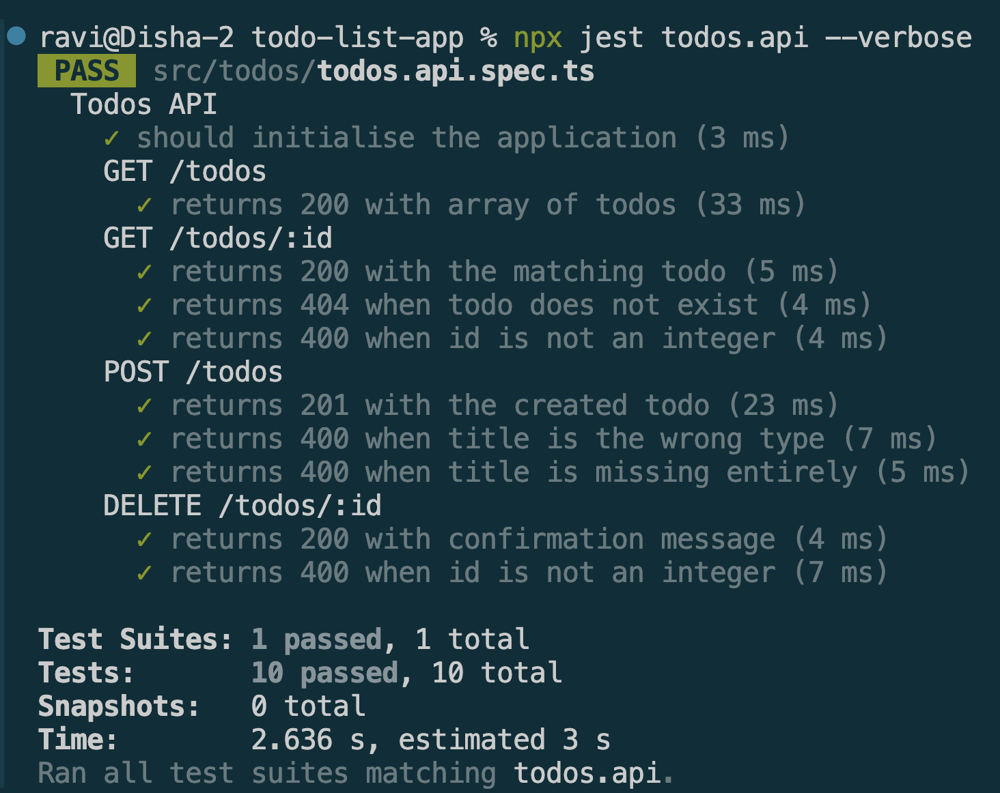

# Using Jest & Supertest for API Testing in NestJS

## Goal

Learn how to write integration tests for API endpoints using Jest and Supertest.


## Reflections

### How does Supertest help test API endpoints?

* Supertest allows developers to send HTTP requests directly to a NestJS application during testing.
* It can test API endpoints without manually running tools such as Postman.
* Supertest supports all common HTTP methods including GET, POST, PUT, PATCH, and DELETE.
* It allows verification of status codes, response headers, and response bodies.
* API behavior can be tested in an automated and repeatable way.
* Supertest integrates well with Jest, making it the standard choice for NestJS API testing.

### What is the difference between unit tests and API tests?

* Unit tests verify individual functions, services, or components in isolation.
* API tests verify the behavior of complete HTTP endpoints.
* Unit tests typically mock most dependencies.
* API tests exercise multiple layers of the application, including controllers, services, guards, and validation.
* Unit tests are generally faster and easier to debug.
* API tests provide greater confidence that real application workflows function correc

### Why should authentication be mocked in integration tests?

* Mocking authentication avoids reliance on external identity providers such as Auth0.
* Tests run faster because token generation and verification can be simplified.
* Test failures remain focused on API functionality rather than authentication infrastructure.
* Mocked authentication provides predictable and repeatable test behavior.
* Different user roles and permissions can be simulated easily.
* It reduces complexity while still verifying protected endpoint behavior.

### How can you structure API tests to cover both success and failure cases?

* Create separate test cases for successful requests and expected error conditions.
* Verify correct status codes for both valid and invalid requests.
* Test request validation failures using invalid input data.
* Test authentication and authorization failures where applicable.
* Verify error response formats and messages.
* Include edge cases such as missing resources, duplicate data, and malformed requests.

## Screenshots

### todos.api.spec.ts

```typescript

import {
    INestApplication,
    ValidationPipe,
    CanActivate,
    ExecutionContext,
    NotFoundException,
  } from '@nestjs/common';
  import { Test, TestingModule } from '@nestjs/testing';
  import request from 'supertest';
  import { TodosController } from './todos.controller';
  import { TodosService } from './todos.service';
  import { AuthGuard } from '@nestjs/passport';
  import { RolesGuard } from '../auth/roles.guard';
  
  // -------------------------------------------------------------------
  // Mock auth guard — always passes, injects a fake req.user
  // This replaces the real JwtAuthGuard so no Auth0 network call is made
  // -------------------------------------------------------------------
  class MockAuthGuard implements CanActivate {
    canActivate(context: ExecutionContext) {
      const req = context.switchToHttp().getRequest();
      req.user = { userId: 'test-user', roles: ['admin'] };
      return true;
    }
  }
  
  // Mock RolesGuard separately — DELETE /todos/:id uses both AuthGuard + RolesGuard
  class MockRolesGuard implements CanActivate {
    canActivate() {
      return true;
    }
  }
  
  // -------------------------------------------------------------------
  // Mock service — replaces all real DB/BullMQ interactions
  // -------------------------------------------------------------------
  const mockTodosService = {
    findAll: jest.fn(),
    findOne: jest.fn(),
    create: jest.fn(),
    update: jest.fn(),
    remove: jest.fn(),
  };
  
  // -------------------------------------------------------------------
  // Test suite
  // -------------------------------------------------------------------
  describe('Todos API', () => {
    let app: INestApplication;
  
    // Boot the app once before all tests in this file
    beforeAll(async () => {
      const moduleRef: TestingModule = await Test.createTestingModule({
        controllers: [TodosController],
        providers: [
          {
            provide: TodosService,
            useValue: mockTodosService,
          },
        ],
      })
        .overrideGuard(AuthGuard('jwt'))
        .useClass(MockAuthGuard)
        .overrideGuard(RolesGuard)   // ← needed for DELETE which has a second guard
        .useClass(MockRolesGuard)
        .compile();
  
      app = moduleRef.createNestApplication();
      app.useGlobalPipes(new ValidationPipe()); // enables class-validator on DTOs
      await app.init();
    });
  
    afterAll(async () => {
      await app.close();
    });
  
    // Clear mock call history between tests so counts don't bleed across
    beforeEach(() => {
      jest.clearAllMocks();
    });
  
    // -----------------------------------------------------------------
    // Sanity check
    // -----------------------------------------------------------------
    it('should initialise the application', () => {
      expect(app).toBeDefined();
    });
  
    // -----------------------------------------------------------------
    // GET /todos
    // -----------------------------------------------------------------
    describe('GET /todos', () => {
      it('returns 200 with array of todos', async () => {
        mockTodosService.findAll.mockResolvedValue([
          { id: 1, title: 'Learn Supertest', completed: false },
        ]);
  
        const response = await request(app.getHttpServer()).get('/todos');
  
        expect(response.status).toBe(200);
        expect(response.body).toEqual([
          { id: 1, title: 'Learn Supertest', completed: false },
        ]);
        expect(mockTodosService.findAll).toHaveBeenCalledTimes(1);
      });
    });
  
    // -----------------------------------------------------------------
    // GET /todos/:id
    // -----------------------------------------------------------------
    describe('GET /todos/:id', () => {
      it('returns 200 with the matching todo', async () => {
        mockTodosService.findOne.mockResolvedValue({
          id: 1,
          title: 'Learn Supertest',
          completed: false,
        });
  
        const response = await request(app.getHttpServer()).get('/todos/1');
  
        expect(response.status).toBe(200);
        expect(response.body).toEqual({
          id: 1,
          title: 'Learn Supertest',
          completed: false,
        });
        expect(mockTodosService.findOne).toHaveBeenCalledWith(1);
      });
  
      it('returns 404 when todo does not exist', async () => {
        // Service throws NotFoundException — NestJS maps this to 404
        mockTodosService.findOne.mockRejectedValue(
            new NotFoundException('Todo not found'),
          );
  
        const response = await request(app.getHttpServer()).get('/todos/999');
  
        expect(response.status).toBe(404);
      });
  
      it('returns 400 when id is not an integer', async () => {
        // ParseIntPipe rejects non-numeric params before the service is called
        const response = await request(app.getHttpServer()).get('/todos/abc');
  
        expect(response.status).toBe(400);
        expect(mockTodosService.findOne).not.toHaveBeenCalled();
      });
    });
  
    // -----------------------------------------------------------------
    // POST /todos
    // -----------------------------------------------------------------
    describe('POST /todos', () => {
      it('returns 201 with the created todo', async () => {
        mockTodosService.create.mockResolvedValue({
          id: 1,
          title: 'Learn Supertest',
          completed: false,
        });
  
        const response = await request(app.getHttpServer())
          .post('/todos')
          .send({ title: 'Learn Supertest' });
  
        expect(response.status).toBe(201);
        expect(response.body).toEqual({
          id: 1,
          title: 'Learn Supertest',
          completed: false,
        });
        expect(mockTodosService.create).toHaveBeenCalledTimes(1);
      });
  
      it('returns 400 when title is the wrong type', async () => {
        // @IsString() on CreateTodoDto rejects numeric title
        const response = await request(app.getHttpServer())
          .post('/todos')
          .send({ title: 123 });
  
        expect(response.status).toBe(400);
        expect(mockTodosService.create).not.toHaveBeenCalled();
      });
  
      it('returns 400 when title is missing entirely', async () => {
        // @IsString() also fails when the field is absent
        const response = await request(app.getHttpServer())
          .post('/todos')
          .send({ completed: false }); // no title field
  
        expect(response.status).toBe(400);
        expect(mockTodosService.create).not.toHaveBeenCalled();
      });
    });
  
    // -----------------------------------------------------------------
    // DELETE /todos/:id
    // -----------------------------------------------------------------
    describe('DELETE /todos/:id', () => {
      it('returns 200 with confirmation message', async () => {
        mockTodosService.remove.mockResolvedValue(undefined);
  
        const response = await request(app.getHttpServer()).delete('/todos/1');
  
        expect(response.status).toBe(200);
        expect(response.body).toEqual({ message: 'Todo #1 removed' });
        expect(mockTodosService.remove).toHaveBeenCalledWith(1);
      });
  
      it('returns 400 when id is not an integer', async () => {
        const response = await request(app.getHttpServer()).delete('/todos/abc');
  
        expect(response.status).toBe(400);
        expect(mockTodosService.remove).not.toHaveBeenCalled();
      });
    });
  });
```
### Test result 

