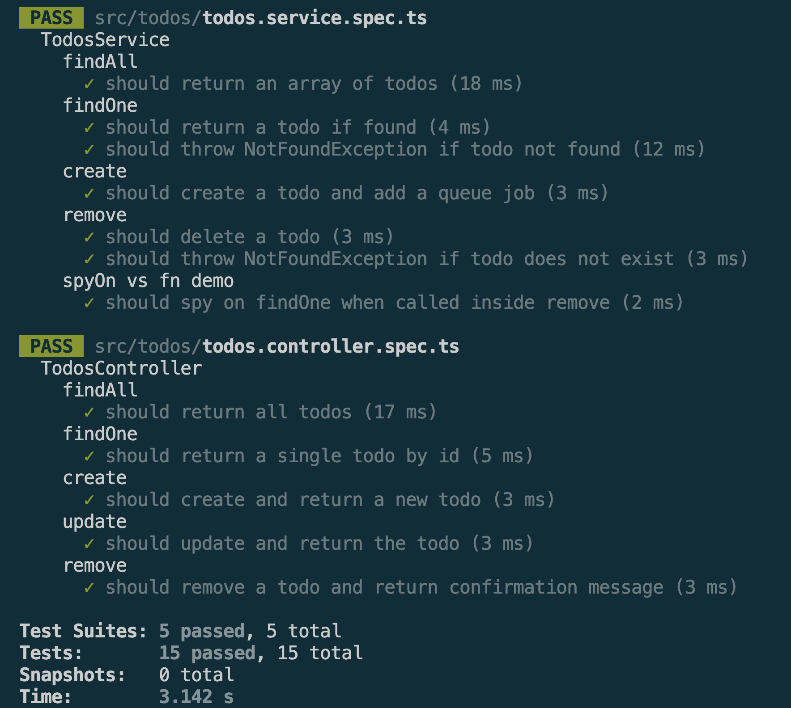

# Mocking Dependencies & Database Interactions in NestJS

## Goal

Learn how to mock dependencies and database interactions in NestJS tests.


## Reflections

### Why is mocking important in unit tests?

* Mocking allows components to be tested in isolation without relying on external systems.
* It improves test speed by avoiding database queries, network requests, and file operations.
* Mocked dependencies provide predictable and repeatable test results.
* Developers can simulate success, failure, and edge-case scenarios easily.
* Mocking reduces test flakiness caused by unavailable services or changing external data.
* It helps focus tests on the behavior of the specific unit being tested.

### How do you mock a NestJS provider (e.g., a service in a controller test)?

* Create a mock implementation of the provider using Jest mock functions.
* Use NestJS's `Test.createTestingModule()` to configure the testing module.
* Replace the real provider with the mock using `useValue`.
* Inject the mocked provider into the controller during testing.
* Configure mock return values using `mockResolvedValue()` or `mockReturnValue()`.
* Verify that the controller interacts with the mocked provider correctly.


### What are the benefits of mocking the database instead of using a real one?

* Tests run significantly faster because no database connection is required.
* Tests are independent of database availability and configuration.
* Mocking prevents accidental modification of real data.
* Test results remain consistent regardless of database state.
* Edge cases and error scenarios can be simulated easily.
* Unit tests remain focused on business logic rather than database behavior.


### How do you decide what to mock vs. what to test directly?

* Mock external dependencies such as databases, APIs, file systems, and third-party services.
* Test the component's own business logic directly.
* Mock dependencies that are slow, unreliable, or outside the test's scope.
* Avoid mocking the code that is actually being tested.
* Use unit tests for isolated logic and integration tests for interactions between components.
* The goal is to verify the unit's behavior while minimizing external influences.


## Tasks

### Mocking a service in a controller test

```typescript
const mockTodosService = {
  findAll: jest.fn(),
  findOne: jest.fn(),
  create: jest.fn(),
  update: jest.fn(),
  remove: jest.fn(),
};

{ provide: TodosService, useValue: mockTodosService }
```


### Mocking TypeORM repository 

```typescript
const mockRepository = {
  find: jest.fn(),
  findOneBy: jest.fn(),
  create: jest.fn(),
  save: jest.fn(),
  delete: jest.fn(),
};

{ provide: getRepositoryToken(Todo), useValue: mockRepository }
```


### jest.spyOn() demo

```typescript
describe('spyOn vs fn demo', () => {
  it('should spy on findOne when called inside remove', async () => {
    const todo = { id: 1, title: 'Test', completed: false };
    mockRepository.findOneBy.mockResolvedValue(todo);
    mockRepository.delete.mockResolvedValue({ affected: 1 });

    // spy on the service's own findOne method
    const findOneSpy = jest.spyOn(service, 'findOne');

    await service.remove(1);

    // verify remove internally called findOne with the right id
    expect(findOneSpy).toHaveBeenCalledWith(1);
  });
});
```

