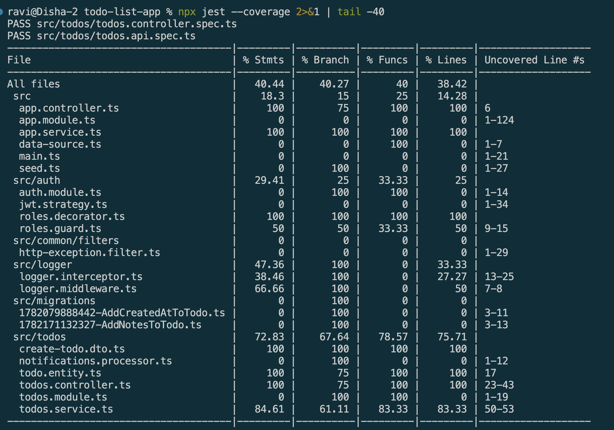
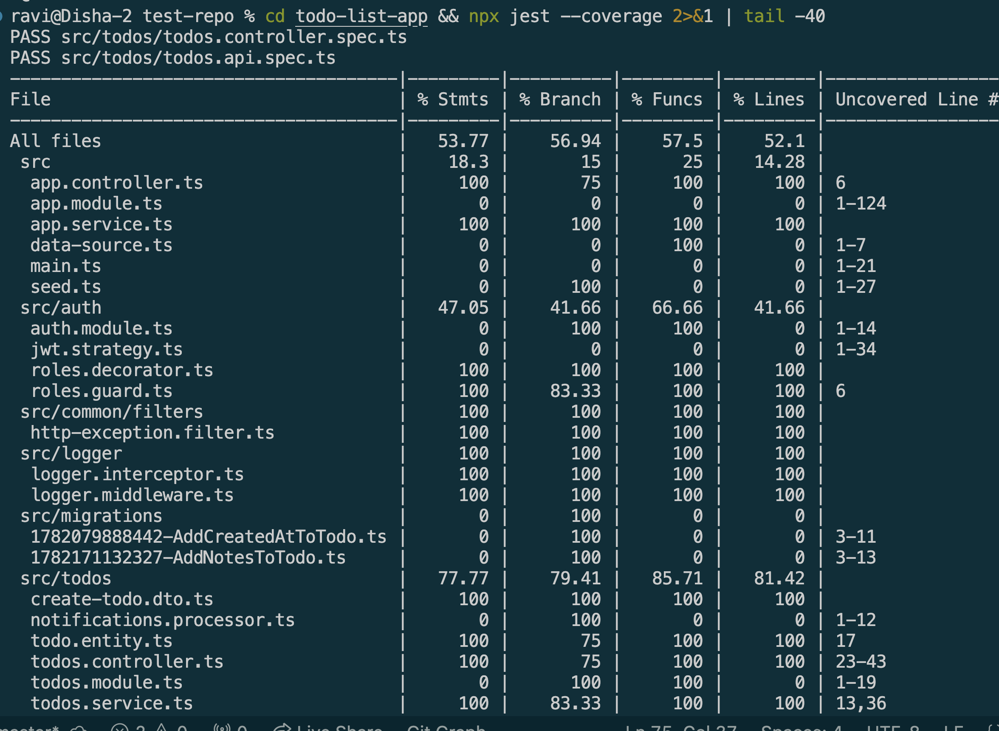

# Understanding the Focus Bear Coverage Bar & Writing Meaningful Tests

## Goal

Learn how to measure and improve test coverage in Focus Bear’s NestJS backend using the coverage bar while ensuring tests have meaningful assertions.


## Reflections

### Research how Jest generates test coverage reports in NestJS

* The coverage bar measures how much of the application's code is executed during automated tests.
* It typically tracks statement coverage, branch coverage, function coverage, and line coverage.
* Coverage reports help identify parts of the codebase that lack tests.
* Higher coverage generally reduces the likelihood of undetected bugs.
* Coverage metrics encourage developers to test new code before deployment.
* The coverage bar provides visibility into overall test quality and application reliability.

### Why does Focus Bear enforce a minimum test coverage threshold?

* A minimum coverage threshold helps ensure critical code paths are tested.
* It reduces the risk of introducing regressions when new features are added.
* Consistent coverage standards improve overall code quality across the team.
* Coverage requirements encourage developers to write tests alongside their code.
* The threshold acts as a safeguard before code reaches production.
* While coverage is not a guarantee of quality, it establishes a baseline level of testing.

### How can high test coverage still lead to untested functionality?

* Coverage only measures whether code was executed, not whether it was verified correctly.
* Tests may run code without making meaningful assertions about the results.
* Important edge cases and failure scenarios may be omitted despite high coverage.
* Developers can achieve high coverage by testing implementation details instead of behavior.
* A test that only calls a function contributes to coverage even if it checks nothing useful.
* High coverage percentages can create a false sense of confidence if test quality is poor.

### What are examples of weak vs. strong test assertions?

* The coverage bar measures how much of the application's code is executed during automated tests.
* It typically tracks statement coverage, branch coverage, function coverage, and line coverage.
* Coverage reports help identify parts of the codebase that lack tests.
* Higher coverage generally reduces the likelihood of undetected bugs.
* Coverage metrics encourage developers to test new code before deployment.
* The coverage bar provides visibility into overall test quality and application reliability.

### How can you balance increasing coverage with writing effective tests?

* Weak assertions verify little or no meaningful behavior.
* Strong assertions validate expected outputs, side effects, and error handling.
* Weak tests may only check that a function executes without throwing an error.
* Strong tests verify that business rules are correctly implemented.
* Strong assertions often test both successful and failure scenarios.
* The goal is to confirm observable behavior rather than internal implementation details.

### How can you balance increasing coverage with writing effective tests?

* Prioritize testing important business logic before chasing coverage percentages.
* Focus on testing behavior, edge cases, and failure scenarios.
* Use coverage reports to identify gaps, not as the sole measure of quality.
* Avoid writing trivial tests solely to increase coverage numbers.
* Combine coverage analysis with code reviews and thoughtful test design.
* Aim for both high coverage and meaningful assertions that validate real functionality.

## Screenshots

### Initial test coverage



### After improving test coverage



### Refactor test assertion

#### The Weak Test (Before)

* This was the original logger.interceptor.spec.ts from module 15:
```typescript
// WEAK — only checks the class was instantiated
it('should be defined', () => {
  expect(interceptor).toBeDefined();
});
```
Why it's weak:
* `toBeDefined()` only checks the value isn't undefined
* `intercept()` is never called — the actual logging logic has 0% coverage
* The test would pass even if the entire method body was deleted


#### The Strong Test (After)
```typescript
// STRONG — calls `intercept()` and verifies actual behaviour
it('should log before and after the request', (done) => {
  const ctx = mockContext();
  const next: CallHandler = { handle: () => of({ id: 1 }) };

  interceptor.intercept(ctx, next).subscribe({
    next: (data) => {
      expect(data).toEqual({ id: 1 });                          // data passes through unchanged
      expect(console.log).toHaveBeenCalledWith(
        expect.stringContaining('[Interceptor - Before]'),      // before log fired
      );
      expect(console.log).toHaveBeenCalledWith(
        expect.stringContaining('[Interceptor - After]'),       // after log fired
      );
    },
    complete: done,
  });
});
```
Why it's strong:
* Actually calls `intercept()` — executes the real method body
* Asserts the Observable passes data through unchanged
* Asserts both log lines fire with correct content
