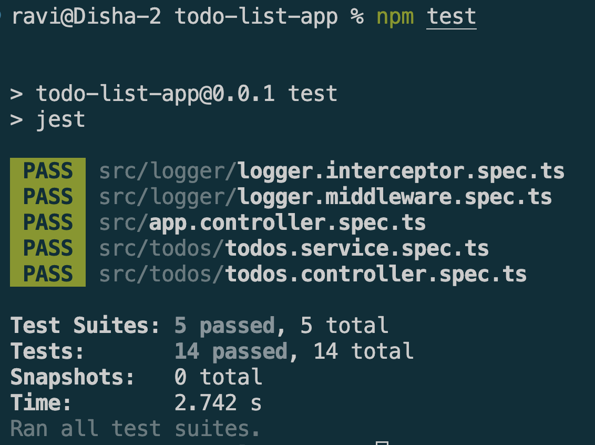

# Writing Unit Tests for Services & Controllers in NestJS

## Goal

Learn how to write unit tests for NestJS services and controllers using Jest.


## Reflections

### Why is it important to test services separately from controllers?

* Services contain business logic and should be tested independently to verify their functionality.
* Controllers primarily handle HTTP requests and responses, delegating work to services.
* Testing services separately helps isolate failures and identify the exact source of bugs.
* Independent tests reduce complexity by focusing on a single component at a time.
* Services can often be reused by multiple controllers, making their correctness especially important.
* Separating tests improves maintainability and follows the principle of testing components in isolation.

### How does mocking dependencies improve unit testing?

* Mocking removes reliance on external systems such as databases, APIs, and third-party services.
* Tests run faster because they avoid network and database operations.
* Mocked dependencies produce predictable results, making tests more reliable.
* Mocks allow developers to simulate success, failure, and edge-case scenarios.
* Unit tests can focus on the behavior of the component being tested rather than its dependencies.
* Mocking reduces test flakiness caused by unavailable external services.


### What are common pitfalls when writing unit tests in NestJS?

* Testing multiple components at once instead of isolating a single unit.
* Forgetting to mock external dependencies such as repositories or APIs.
* Not properly handling asynchronous operations with async/await.
* Writing tests that depend on implementation details rather than observable behavior.
* Ignoring error scenarios and only testing successful outcomes.
* Failing to reset mocks between tests, causing interference across test cases.

### How can you ensure that unit tests cover all edge cases?

* Test both successful and failure scenarios.
* Include boundary values, empty inputs, and invalid inputs.
* Verify exception handling and error responses.
* Consider unusual but valid inputs that users may provide.
* Review requirements and business rules to identify special cases.
* Measure test coverage and regularly update tests as features evolve.


## Screenshots



### todos.service.spec.ts

```typescript
import { Test, TestingModule } from '@nestjs/testing';
import { TodosService } from './todos.service';
import { getRepositoryToken } from '@nestjs/typeorm';
import { Todo } from './todo.entity';
import { getQueueToken } from '@nestjs/bullmq';
import { NotFoundException } from '@nestjs/common';

// Mock repository — replaces TypeORM's real DB calls
const mockRepository = {
  find: jest.fn(),
  findOneBy: jest.fn(),
  create: jest.fn(),
  save: jest.fn(),
  delete: jest.fn(),
};

// Mock queue — replaces BullMQ's real Redis calls
const mockQueue = {
  add: jest.fn(),
};

describe('TodosService', () => {
  let service: TodosService;

  beforeEach(async () => {
    const module: TestingModule = await Test.createTestingModule({
      providers: [
        TodosService,
        {
          provide: getRepositoryToken(Todo),
          useValue: mockRepository,
        },
        {
          provide: getQueueToken('notifications'),
          useValue: mockQueue,
        },
      ],
    }).compile();

    service = module.get<TodosService>(TodosService);
  });

  afterEach(() => {
    jest.clearAllMocks();
  });

  // --- findAll ---
  describe('findAll', () => {
    it('should return an array of todos', async () => {
      const todos = [{ id: 1, title: 'Test', completed: false }];
      mockRepository.find.mockResolvedValue(todos);

      const result = await service.findAll();

      expect(result).toEqual(todos);
      expect(mockRepository.find).toHaveBeenCalledTimes(1);
    });
  });

  // --- findOne ---
  describe('findOne', () => {
    it('should return a todo if found', async () => {
      const todo = { id: 1, title: 'Test', completed: false };
      mockRepository.findOneBy.mockResolvedValue(todo);

      const result = await service.findOne(1);

      expect(result).toEqual(todo);
      expect(mockRepository.findOneBy).toHaveBeenCalledWith({ id: 1 });
    });

    it('should throw NotFoundException if todo not found', async () => {
      mockRepository.findOneBy.mockResolvedValue(null);

      await expect(service.findOne(999)).rejects.toThrow(NotFoundException);
    });
  });

  // --- create ---
  describe('create', () => {
    it('should create a todo and add a queue job', async () => {
      const dto = { title: 'New Todo', completed: false };
      const savedTodo = { id: 1, ...dto };

      mockRepository.create.mockReturnValue(dto);
      mockRepository.save.mockResolvedValue(savedTodo);
      mockQueue.add.mockResolvedValue({});

      const result = await service.create(dto);

      expect(result).toEqual(savedTodo);
      expect(mockQueue.add).toHaveBeenCalledWith('todo-created', {
        title: savedTodo.title,
        id: savedTodo.id,
      });
    });
  });

  // --- remove ---
  describe('remove', () => {
    it('should delete a todo', async () => {
      const todo = { id: 1, title: 'Test', completed: false };
      mockRepository.findOneBy.mockResolvedValue(todo);
      mockRepository.delete.mockResolvedValue({ affected: 1 });

      await service.remove(1);

      expect(mockRepository.delete).toHaveBeenCalledWith(1);
    });

    it('should throw NotFoundException if todo does not exist', async () => {
      mockRepository.findOneBy.mockResolvedValue(null);

      await expect(service.remove(999)).rejects.toThrow(NotFoundException);
    });
  });
});


```


### todos.controller.spec.ts

```typescript
import { Test, TestingModule } from '@nestjs/testing';
import { TodosService } from './todos.service';
import { getRepositoryToken } from '@nestjs/typeorm';
import { Todo } from './todo.entity';
import { getQueueToken } from '@nestjs/bullmq';
import { NotFoundException } from '@nestjs/common';

// Mock repository — replaces TypeORM's real DB calls
const mockRepository = {
  find: jest.fn(),
  findOneBy: jest.fn(),
  create: jest.fn(),
  save: jest.fn(),
  delete: jest.fn(),
};

// Mock queue — replaces BullMQ's real Redis calls
const mockQueue = {
  add: jest.fn(),
};

describe('TodosService', () => {
  let service: TodosService;

  beforeEach(async () => {
    const module: TestingModule = await Test.createTestingModule({
      providers: [
        TodosService,
        {
          provide: getRepositoryToken(Todo),
          useValue: mockRepository,
        },
        {
          provide: getQueueToken('notifications'),
          useValue: mockQueue,
        },
      ],
    }).compile();

    service = module.get<TodosService>(TodosService);
  });

  afterEach(() => {
    jest.clearAllMocks();
  });

  // --- findAll ---
  describe('findAll', () => {
    it('should return an array of todos', async () => {
      const todos = [{ id: 1, title: 'Test', completed: false }];
      mockRepository.find.mockResolvedValue(todos);

      const result = await service.findAll();

      expect(result).toEqual(todos);
      expect(mockRepository.find).toHaveBeenCalledTimes(1);
    });
  });

  // --- findOne ---
  describe('findOne', () => {
    it('should return a todo if found', async () => {
      const todo = { id: 1, title: 'Test', completed: false };
      mockRepository.findOneBy.mockResolvedValue(todo);

      const result = await service.findOne(1);

      expect(result).toEqual(todo);
      expect(mockRepository.findOneBy).toHaveBeenCalledWith({ id: 1 });
    });

    it('should throw NotFoundException if todo not found', async () => {
      mockRepository.findOneBy.mockResolvedValue(null);

      await expect(service.findOne(999)).rejects.toThrow(NotFoundException);
    });
  });

  // --- create ---
  describe('create', () => {
    it('should create a todo and add a queue job', async () => {
      const dto = { title: 'New Todo', completed: false };
      const savedTodo = { id: 1, ...dto };

      mockRepository.create.mockReturnValue(dto);
      mockRepository.save.mockResolvedValue(savedTodo);
      mockQueue.add.mockResolvedValue({});

      const result = await service.create(dto);

      expect(result).toEqual(savedTodo);
      expect(mockQueue.add).toHaveBeenCalledWith('todo-created', {
        title: savedTodo.title,
        id: savedTodo.id,
      });
    });
  });

  // --- remove ---
  describe('remove', () => {
    it('should delete a todo', async () => {
      const todo = { id: 1, title: 'Test', completed: false };
      mockRepository.findOneBy.mockResolvedValue(todo);
      mockRepository.delete.mockResolvedValue({ affected: 1 });

      await service.remove(1);

      expect(mockRepository.delete).toHaveBeenCalledWith(1);
    });

    it('should throw NotFoundException if todo does not exist', async () => {
      mockRepository.findOneBy.mockResolvedValue(null);

      await expect(service.remove(999)).rejects.toThrow(NotFoundException);
    });
  });
});

```