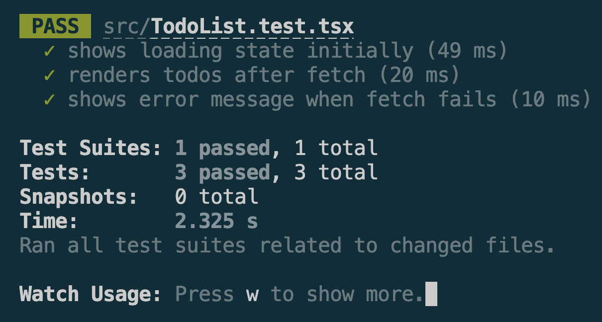

# Mocking API Calls in Jest
 
## Reflections 

### Why is it important to mock API calls in tests?

* Mocking API calls makes tests independent of external services and network availability.
* Tests run faster because no real HTTP requests are sent.
* Mocked responses provide predictable and consistent test results.
* It prevents accidental modification of real data in external systems.
* Tests can simulate different scenarios such as successful responses, errors, and timeouts.
* Mocking allows developers to focus on testing application logic rather than third-party APIs.

### What are some common pitfalls when testing asynchronous code?

* Forgetting to use async/await can cause assertions to run before asynchronous operations complete.
* Not waiting for promises to resolve can lead to flaky or inconsistent test results.
* Failing to handle rejected promises may hide errors during testing.
* Using incorrect timing assumptions can cause race conditions in tests.
* Forgetting to clean up mocks between tests can affect subsequent test cases.
* Testing implementation details instead of observable behavior can make tests fragile.

## Screenshots

### TodoList.tsx 

``` Typescript
import React, { useEffect, useState } from 'react';

interface Todo {
  id: number;
  title: string;
  completed: boolean;
  notes:string|null;
}

const TodoList: React.FC = () => {
  const [todos, setTodos] = useState<Todo[]>([]);
  const [loading, setLoading] = useState(true);
  const [error, setError] = useState<string | null>(null);

  useEffect(() => {
    fetch('https://jsonplaceholder.typicode.com/todos?_limit=5')
      .then(res => res.json())
      .then(data => {
        setTodos(data);
        setLoading(false);
      })
      .catch(() => {
        setError('Failed to fetch todos');
        setLoading(false);
      });
  }, []);

  if (loading) return <p>Loading...</p>;
  if (error) return <p>{error}</p>;

  return (
    <ul>
      {todos.map(todo => (
        <li key={todo.id}>{todo.title}</li>
      ))}
    </ul>
  );
};

export default TodoList;
```

### TodoList.test.tsx

```Typescript
import React from 'react';
import { render, screen, act } from '@testing-library/react';
import '@testing-library/jest-dom';
import TodoList from './TodoList';

const mockTodos = [
  { id: 1, title: 'Buy milk', completed: false },
  { id: 2, title: 'Walk the dog', completed: true },
];

beforeEach(() => {
  global.fetch = jest.fn().mockResolvedValue({
    json: jest.fn().mockResolvedValue(mockTodos),
  } as any);
});

afterEach(() => {
  jest.resetAllMocks();
});

it('shows loading state initially', async () => {
  await act(async () => {
    render(<TodoList />);
  });
  // Loading resolves instantly with mock, so just verify todos rendered
  expect(screen.getByText('Buy milk')).toBeInTheDocument();
});

it('renders todos after fetch', async () => {
  render(<TodoList />);
  expect(await screen.findByText('Buy milk')).toBeInTheDocument();
  expect(screen.getByText('Walk the dog')).toBeInTheDocument();
});

it('shows error message when fetch fails', async () => {
  (global.fetch as jest.Mock).mockRejectedValueOnce(new Error('Network error'));
  render(<TodoList />);
  expect(await screen.findByText('Failed to fetch todos')).toBeInTheDocument();
});

```

### Test result

